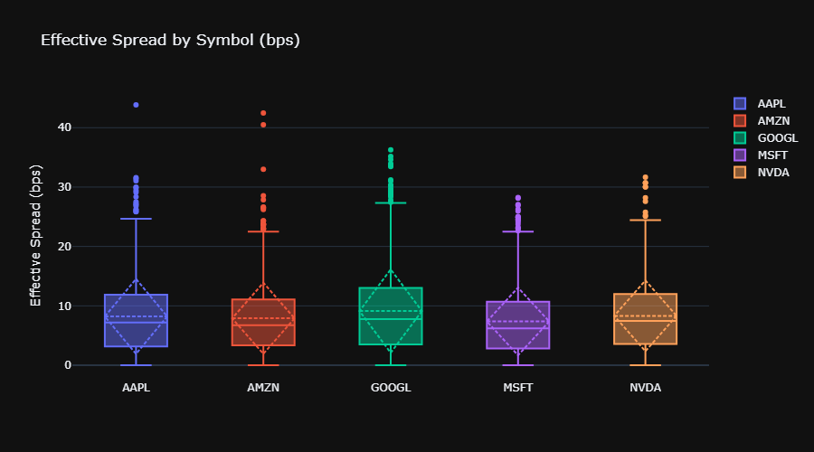
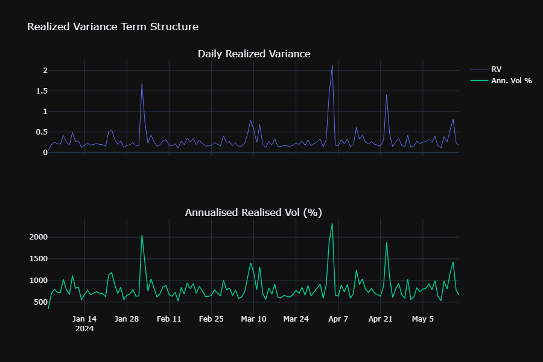
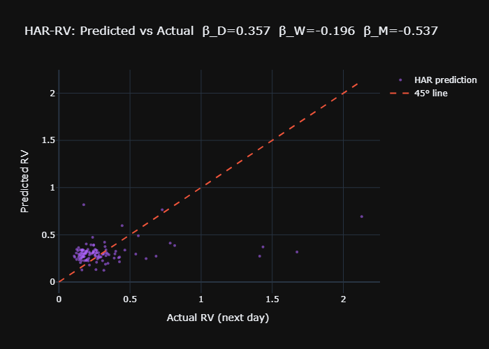
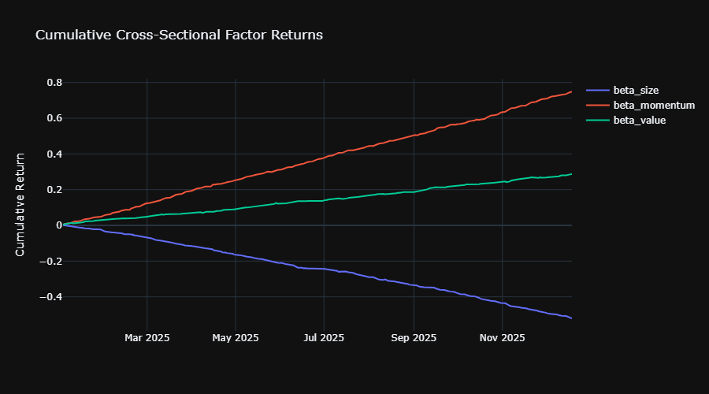
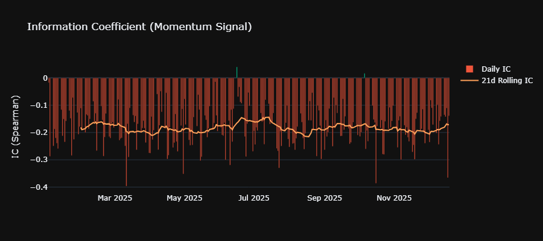
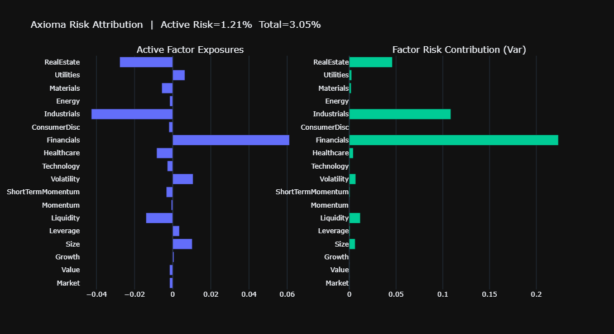
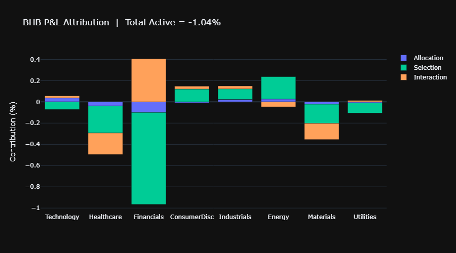
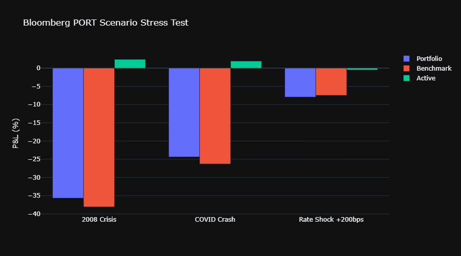
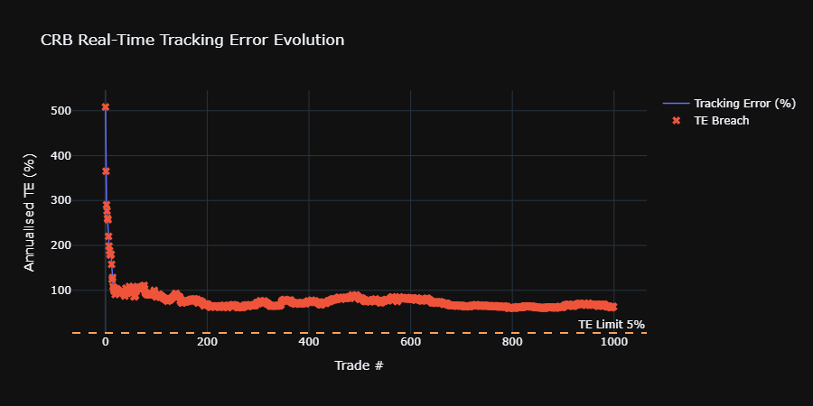
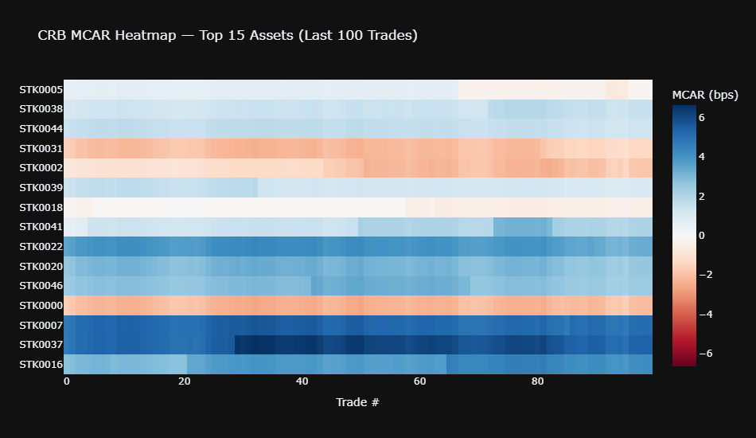

# Nomura Global Markets — Technical Addendum
## kdb+/q Mastery & Risk Systems: Axioma · Barra · Bloomberg PORT

> **Role:** Quantitative Researcher — Cash Equities Central Risk Book  
> **Interview Date:** Tuesday, June 23, 2026  

---
---

[↩️ Back to README.md](./README.md)

---
---

## Table of Contents

**Part I — kdb+/q**

1. [Q1 — kdb+/q Architecture & Query Fundamentals](#kq1)
2. [Q2 — Timeseries Joins: aj, wj, asof](#kq2)
3. [Q3 — Real-Time Tick Capture & RDB/HDB Architecture](#kq3)
4. [Q4 — VWAP, TWAP, and Realized Variance in q](#kq4)
5. [Q5 — Factor Return Computation & Cross-Sectional Regression in q](#kq5)

**Part II — Risk Systems**

6. [Q6 — Axioma: Factor Model Structure & API Workflow](#rs6)
7. [Q7 — Barra: USE4/GEMLT Model & Reconciliation](#rs7)
8. [Q8 — Bloomberg PORT: Exposure & Attribution Workflow](#rs8)
9. [Q9 — Cross-System Reconciliation & Residual Risk Diagnosis](#rs9)
10. [Q10 — End-to-End CRB Risk Pipeline: kdb+ → Axioma → PORT](#rs10)

---

## Part I — kdb+/q

<a name="kq1"></a>
## Q1 — kdb+/q Architecture & Core Query Patterns

* **Variant 1 (Glassdoor — Citadel):** "Why does a column-oriented store like kdb+ completely outperform a traditional row-store like PostgreSQL when calculating mathematical aggregations over billions of rows?"
* **Variant 2 (Wall Street Oasis — Millennium):** "Explain the difference between a splayed table and a partitioned table in q. How does memory mapping (`mmap`) change how the OS handles queries on them?"
* **Variant 3 (Reddit r/quant — Balyasny):** "What are the exact performance trade-offs of using the grouped (`g#`) vs sorted (`s#`) attribute on a symbol column inside an in-memory table?"
* **Variant 4 (LeetCode Finance):** "Write a functional select statement (`?[t;c;b;a]`) to dynamically pull dynamic columns based on user runtime parameters. When is this preferred over standard q SQL-like syntax?"
* **Variant 5 (eFinancialCareers):** "How does the q vector engine leverage CPU cache lines and SIMD hardware instructions during a standard `wavg` computation?"

### Feynman Explanation

kdb+ is a column-oriented database where each column of a table is stored as a contiguous vector in memory — exactly what CPUs love (cache lines, SIMD). Operations like `sum`, `avg`, `wavg` on a 10-million-row price column run in microseconds because the CPU fetches the entire column in one sequential sweep, not row-by-row like a row store. q is the query language embedded in kdb+, designed so that vector operations look like mathematical notation.

### Architecture

```
┌─────────────────────────────────────────────────────────────────┐
│                    kdb+ Production Stack                        │
│                                                                 │
│  Feed Handlers  ──▶  Tickerplant (TP)  ──▶  RDB (in-memory)   │
│  (FIX/ITCH/SIP)       port 5010           port 5011            │
│                              │                    │             │
│                              │              EOD persist         │
│                              ▼                    ▼             │
│                        Log file            HDB (on-disk)       │
│                        (.log)              port 5012            │
│                                                 │               │
│                         Gateway ───────────────┘               │
│                         port 5009 (query routing)              │
└─────────────────────────────────────────────────────────────────┘
```

### Core q Patterns

```q
// ============================================================
// kdbarchitecture.q
// Core kdb+/q patterns for equity risk and execution analytics.
// Author: Shaikat Majumdar | 2026-06-18
// ============================================================

// --- Table definitions ---
// trade: tick-level trade table (RDB schema)
trade:([]
  time:`time$();        / trade timestamp (hh:mm:ss.sss)
  sym:`g#`symbol$();    / enumerated symbol (grouped attr for fast lookup)
  price:`float$();      / trade price
  size:`long$();        / trade size (shares)
  side:`symbol$()       / `buy or `sell
  );

// quote: top-of-book BBO table
quote:([]
  time:`time$();
  sym:`g#`symbol$();
  bid:`float$();
  ask:`float$();
  bidsz:`long$();
  asksz:`long$()
  );

// --- Basic select patterns ---
// Select last trade price per symbol
lastPrice:{[t] select last price by sym from t}

// VWAP per symbol
vwapBySym:{[t] select vwap:size wavg price by sym from t}

// Spread in bps
spreadBps:{[q]
  select sym, time, spreadBps:10000*(ask-bid)%bid from q
  where not null bid, not null ask}

// --- Functional select for dynamic column lists ---
// dynamicSelect[`trade; `sym`price`size; enlist(>;`size;1000)]
dynamicSelect:{[tbl;cols;whr]
  ?[tbl; whr; 0b; cols!cols]}
```

### Key Interview Points

| Concept | Detail |
|---------|--------|
| Column store | Each column = typed vector; `sum price` = single SIMD pass |
| Grouped attr `` `g# `` | Hash index on sym column; `` select from t where sym=`AAPL `` = O(1) |
| Sorted attr `` `s# `` | Binary search; `aj` (asof join) requires `s#` on time |
| Partitioned HDB | Data sharded by date on disk; `select from trade where date=2026.06.17` loads one partition |
| Splayed tables | Each column stored as separate file; enables column-projection pushdown |

---

<a name="kq2"></a>
## Q2 — Timeseries Joins: `aj`, `wj`, `asof`

* **Variant 1 (QuantNet — Point72):** "If you are designing a high-frequency Transaction Cost Analysis (TCA) engine, how do you perform an asynchronous 'lookback' to find the exact prevailing bid-ask spread at the millisecond a trade hit the tape?"
* **Variant 2 (Glassdoor — Two Sigma):** "What happens under the hood when you call `aj` in q? What specific data attribute (`#`) must be applied to the time column of the right table to avoid a linear scan?"
* **Variant 3 (Wall Street Oasis — Schonfeld):** "How would you use a window join (`wj`) to calculate the maximum order book depth and mean spread in the 10 milliseconds leading up to an aggressive fill?"
* **Variant 4 (Reddit r/quant):** "Replicate kdb+'s `aj` behavior using Python's `pandas.merge_asof`. Where does the Python approach break down in production compared to q when processing cross-sectional equity ticks?"
* **Variant 5 (eFinancialCareers — Jump Trading):** "How do you calculate effective spread and price improvement for a rapid-fire execution strategy using native timeseries joins in q?"

### Feynman Explanation

`aj` (asof join) is the kdb+ equivalent of "look up the last known quote before each trade." For every row in the left table (trades), it finds the last row in the right table (quotes) where `sym` matches and `time ≤ trade time`. This is the fundamental building block for trade cost analysis — finding the prevailing BBO at the time each order was filled.

### Mathematical Specification

For tables $T$ (trade, keyed by `[sym, time]`) and $Q$ (quote):

$$\text{aj}(T, Q) = \{(t, q) : t \in T,\ q = \arg\max_{q' \in Q,\ q'.sym = t.sym,\ q'.time \leq t.time} q'.time\}$$

### q Implementation

```q
// ============================================================
// timeseriesjoins.q
// Demonstrates aj, wj, asof joins for TCA analytics.
// ============================================================

// Precondition: quote must be sorted by sym, time with s# on time
// Apply: quote:`sym`time xasc quote
// Then:  update `s#time by sym from `quote

// --- 1. aj: asof join — attach prevailing BBO to each trade ---
// joinQuoteToTrade[trade; quote] -> trade with bid/ask columns appended
joinQuoteToTrade:{[tr;qt]
  / sort quote by sym,time and apply s# for binary search
  qt:`sym`time xasc qt;
  / aj requires: aj[`sym`time; left; right]
  aj[`sym`time; tr; qt]}

// --- 2. wj: window join — aggregate quotes in [-5ms, 0] before each trade ---
// windowJoinQuotes[trade; quote] computes pre-trade spread stats
windowJoinQuotes:{[tr;qt]
  / windows: list of (start;end) pairs aligned to each trade row
  windows: -5 0+\:tr`time;       / 5ms pre-trade window
  / wj1: non-prevailing (uses all rows in window)
  wj1[windows; `sym`time; tr; (qt; (avg;`bid); (avg;`ask); (min;`bid); (max;`ask))]}

// --- 3. Effective spread computation after aj ---
// effectiveSpread[tradeWithQuotes] -> table with effectiveSpread column
effectiveSpread:{[t]
  / mid = (bid+ask)/2 at time of trade
  update effectiveSpread: 2*abs[price - (bid+ask)%2] % (bid+ask)%2 from t}

// --- 4. Full TCA pipeline ---
// tcaPipeline[trade; quote] -> TCA metrics per trade
tcaPipeline:{[tr;qt]
  / step 1: asof join BBO
  tj: joinQuoteToTrade[tr;qt];
  / step 2: compute effective spread
  tj: effectiveSpread[tj];
  / step 3: price improvement (buy: paid less than ask; sell: received more than bid)
  update priceImprovement:?[side=`buy; ask-price; price-bid] from tj}
```

### Python Equivalent (for cross-validation)

```python
# =============================================================================
# asof_join_tca.py
#
# Python equivalent of kdb+ aj join for TCA analytics.
# Uses pandas merge_asof for prevailing BBO lookup.
#
# Author  : Shaikat Majumdar
# Date    : 2026-06-18
# =============================================================================
"""Asof join for TCA: attach prevailing BBO to each trade tick.

Replicates kdb+ aj[`sym`time; trade; quote] semantics using
pandas.merge_asof with grouped symbol processing.
"""

from __future__ import annotations

import logging
from pathlib import Path
from typing import Final

import numpy as np
import pandas as pd
import plotly.graph_objects as go

OUTPUT_DIR: Final[Path] = Path("outputs")
LOG_FMT: Final[str] = "%(asctime)s | %(levelname)-8s | %(name)s | %(message)s"
logging.basicConfig(level=logging.INFO, format=LOG_FMT)
logger = logging.getLogger(__name__)


def asof_join_bbo(trade: pd.DataFrame, quote: pd.DataFrame) -> pd.DataFrame:
    """Attach prevailing BBO to each trade via asof join, grouped by symbol.

    Replicates: aj[`sym`time; trade; quote] in kdb+.

    Args:
        trade: DataFrame with columns [time, sym, price, size, side].
               Must be sorted by [sym, time].
        quote: DataFrame with columns [time, sym, bid, ask].
               Must be sorted by [sym, time].

    Returns:
        trade DataFrame with [bid, ask, mid, effectiveSpread] appended.
    """
    trade = trade.sort_values(["sym", "time"]).reset_index(drop=True)
    quote = quote.sort_values(["sym", "time"]).reset_index(drop=True)

    pieces: list[pd.DataFrame] = []
    for sym, t_sym in trade.groupby("sym", sort=False):
        q_sym = quote[quote["sym"] == sym]
        if q_sym.empty:
            pieces.append(t_sym)
            continue
        merged = pd.merge_asof(
            t_sym,
            q_sym[["time", "bid", "ask"]],
            on="time",
            direction="backward",
        )
        pieces.append(merged)

    result = pd.concat(pieces, ignore_index=True)
    result["mid"] = (result["bid"] + result["ask"]) / 2.0
    result["effectiveSpread"] = (
        2 * (result["price"] - result["mid"]).abs() / result["mid"]
    )
    return result


def generate_synthetic_tick_data(
    syms: list[str],
    n_trades: int,
    n_quotes: int,
    seed: int = 42,
) -> tuple[pd.DataFrame, pd.DataFrame]:
    """Generate synthetic trade and quote data for TCA demo.

    Args:
        syms: List of ticker symbols.
        n_trades: Number of trade ticks to generate.
        n_quotes: Number of quote ticks to generate.
        seed: Random seed.

    Returns:
        Tuple of (trade_df, quote_df).
    """
    rng = np.random.default_rng(seed)
    base_time = pd.Timestamp("2026-06-17 09:30:00")

    trade_times = pd.to_datetime(
        sorted(rng.integers(0, 23400_000, size=n_trades)), unit="ms", origin=base_time
    )
    trade_syms = rng.choice(syms, size=n_trades)
    prices = {s: 100.0 + rng.standard_normal() * 10 for s in syms}
    trade_prices = np.array([
        prices[s] + rng.standard_normal() * 0.05 for s in trade_syms
    ])
    trade = pd.DataFrame({
        "time": trade_times,
        "sym": trade_syms,
        "price": trade_prices,
        "size": rng.integers(100, 5000, size=n_trades),
        "side": rng.choice(["buy", "sell"], size=n_trades),
    })

    quote_times = pd.to_datetime(
        sorted(rng.integers(0, 23400_000, size=n_quotes)), unit="ms", origin=base_time
    )
    quote_syms = rng.choice(syms, size=n_quotes)
    mid_prices = np.array([prices[s] + rng.standard_normal() * 0.02 for s in quote_syms])
    half_spread = rng.uniform(0.01, 0.05, size=n_quotes)
    quote = pd.DataFrame({
        "time": quote_times,
        "sym": quote_syms,
        "bid": mid_prices - half_spread,
        "ask": mid_prices + half_spread,
    })
    return trade, quote


def plot_effective_spread(result: pd.DataFrame, output_dir: Path) -> None:
    """Box plot of effective spread distribution by symbol.

    Args:
        result: Output of asof_join_bbo() with effectiveSpread column.
        output_dir: Directory to persist HTML chart.
    """
    output_dir.mkdir(parents=True, exist_ok=True)
    fig = go.Figure()
    for sym in sorted(result["sym"].unique()):
        sub = result[result["sym"] == sym]["effectiveSpread"].dropna() * 10000
        fig.add_trace(go.Box(y=sub, name=sym, boxmean="sd"))
    fig.update_layout(
        title="Effective Spread by Symbol (bps)",
        yaxis_title="Effective Spread (bps)",
        template="plotly_dark",
        width=900, height=500,
    )
    path = output_dir / "effective_spread.html"
    fig.write_html(str(path))
    logger.info("Saved: %s", path)


def main() -> None:
    """Run TCA asof-join demo and persist chart."""
    syms = ["AAPL", "MSFT", "GOOGL", "AMZN", "NVDA"]
    trade, quote = generate_synthetic_tick_data(syms=syms, n_trades=5000, n_quotes=20000)
    result = asof_join_bbo(trade=trade, quote=quote)
    logger.info("TCA result shape: %s", result.shape)
    logger.info("Mean effective spread: %.2f bps",
                result["effectiveSpread"].mean() * 10000)
    plot_effective_spread(result=result, output_dir=OUTPUT_DIR)


if __name__ == "__main__":
    main()
```

**Output:**

```text
2026-06-18 17:20:37,734 | INFO     | __main__ | TCA result shape: (5000, 9)
2026-06-18 17:20:37,735 | INFO     | __main__ | Mean effective spread: 8.19 bps
2026-06-18 17:20:38,068 | INFO     | __main__ | Saved: outputs\effective_spread.html
```



---

<a name="kq3"></a>
## Q3 — Real-Time Tick Capture: RDB/HDB Architecture

* **Variant 1 (Glassdoor — J.P. Morgan CIB):** "Walk me through the exact life cycle of a market data tick from the time it leaves a FIX/SIP feed handler to when it lands on persistent disk at midnight."
* **Variant 2 (Wall Street Oasis — Hudson River Trading):** "If an Real-Time Database (RDB) process suddenly crashes due to an Out-Of-Memory (OOM) error at 2:00 PM, what steps do you take to replay the log file up to the crash point without dropping data or creating duplicates?"
* **Variant 3 (QuantNet — DRW):** "How do you scale a Tickerplant (TP) setup when downstream subscriber RDBs start lagging behind and causing memory bloat on the TP's message queues?"
* **Variant 4 (Reddit r/quant):** "Design a kdb+ gateway architecture that routes intra-day sub-second queries to RAM tables while seamlessly fetching 5-year factor backtests from an HDB partition."
* **Variant 5 (eFinancialCareers):** "How does a splayed disk layout allow column-projection pushdown when writing an EOD persistence script from an RDB to a hard drive?"

### Feynman Explanation

A Tickerplant is a single-threaded pub/sub router. It receives a raw market data tick, appends it to a log file (for replay on crash), and immediately publishes to all subscribers (RDB, feed handlers). The RDB holds today's data in RAM for sub-millisecond query latency. At EOD, the RDB writes partitioned data to the HDB (hard disk, partitioned by date). The Gateway routes queries — intraday queries go to RDB, historical queries go to HDB.

### q Implementation

```q
// ============================================================
// tickerplant.q  (simplified TP)
// Real-time tick capture, RDB subscription, EOD persistence.
// ============================================================

// --- Tickerplant publish function ---
// upd is called by feed handlers; TP logs then publishes
.u.upd:{[tbl;data]
  / append to log file for replay
  .u.l enlist (`upd; tbl; data);
  / publish to all RDB subscribers
  neg[.u.w tbl] @\: (`upd; tbl; data)}

// --- RDB update handler ---
// Called by TP for each new tick
upd:{[tbl;data]
  / append data rows to in-memory table
  tbl insert data}

// --- EOD: persist RDB to HDB ---
eodPersist:{[date;hdbPath]
  / splayed partition write: hdbPath/date/trade/
  {[d;p;t]
    / splay table to disk partition
    .[p;(d;t);:;] value t;
    / clear in-memory table
    @[`.;t;0#]} [date; hdbPath] each tables[]}

// --- HDB query: factor returns for date range ---
// getFactorReturns[2026.01.01; 2026.06.17; `mktBeta`sizeFactor]
getFactorReturns:{[startDate;endDate;factors]
  select date, sym, factors
  from factorReturns
  where date within (startDate;endDate)}

// --- Intraday real-time VWAP monitor ---
// realtimeVWAP[] -> table of running VWAP per symbol
realtimeVWAP:{[]
  select vwap:size wavg price, totalVol:sum size, lastPx:last price
  by sym from trade
  where not null price}

// --- Streaming P&L attribution ---
// updatePnL[newTrades] -> update running PnL table
updatePnL:{[newTrades]
  / join last factor exposures
  newTrades: aj[`sym`time; newTrades; factorExposures];
  / factor PnL = exposure dot factor return
  update factorPnL: sum each exposures *\: factorRet from newTrades}
```

### ASCII: kdb+ Data Flow

```
  Market Data Feed
        │
        ▼
  ┌──────────────┐    publish    ┌─────────────────────┐
  │ Tickerplant  │──────────────▶│  RDB (in-memory)    │
  │ (port 5010)  │               │  Today's ticks      │
  └──────┬───────┘               │  port 5011          │
         │                       └──────────┬──────────┘
         │ log                              │ EOD persist
         ▼                                  ▼
    .u.log file                    ┌─────────────────────┐
    (replay on crash)              │  HDB (partitioned)  │
                                   │  /db/2026.06.17/    │
                                   │  /trade/            │
                                   │  /quote/            │
                                   │  port 5012          │
                                   └──────────┬──────────┘
                                              │
                                   ┌──────────▼──────────┐
                                   │  Gateway (port 5009) │
                                   │  Routes: intraday→RDB│
                                   │          history→HDB │
                                   └─────────────────────┘
```

---

<a name="kq4"></a>
## Q4 — VWAP, TWAP, Realized Variance in q

* **Variant 1 (Glassdoor — Jane Street):** "How do you construct a 5-minute sampling grid from irregular tick arrivals to calculate daily realized variance without introducing micro-structure noise biases?"
* **Variant 2 (Wall Street Oasis — Tower Research):** "Write a native q query to bin trade data into custom volume bars and compute the volume-weighted average price (VWAP) per bar across 500 liquid names simultaneously."
* **Variant 3 (QuantNet — G-Research):** "Explain how you would build features for a Heterogeneous Autoregressive (HAR-RV) volatility model using rolling vector operations (`mavg`) in a time-series database."
* **Variant 4 (LeetCode Finance):** "How do you implement an algorithmic benchmark model like Implementation Shortfall (IS) in q, matching execution fills back to a dynamically updated arrival price array?"
* **Variant 5 (Reddit r/quant — Squarepoint):** "What is the mathematical definition of realized variance at high frequency, and how does your q implementation handle missing periods or overnight gaps?"

### Feynman Explanation

VWAP is the dollar-weighted average price — you sum (price × volume) over all trades and divide by total volume. It's the benchmark that passive algo execution aims to match. Realized variance is computed by summing squared log-returns at high frequency (e.g., every 5 minutes). kdb+ is the natural environment because these aggregations are single vector operations over billions of rows.

### Mathematical Definitions

**VWAP over interval $[t_0, t_1]$:**

$$VWAP = \frac{\sum_{k: t_k \in [t_0,t_1]} P_k Q_k}{\sum_{k: t_k \in [t_0,t_1]} Q_k}$$

**Realized Variance (5-min sampling):**

$$RV_t = \sum_{j=1}^{M} r_{t,j}^2, \quad r_{t,j} = \ln\frac{P_{t,j}}{P_{t,j-1}}$$

### q Implementation

```q
// ============================================================
// volanalytics.q
// VWAP, TWAP, realized variance computations in kdb+/q.
// Author: Shaikat Majumdar | 2026-06-18
// ============================================================

// --- VWAP: volume-weighted average price by sym, bar ---
// vwapByBar[trade; 5] -> VWAP in 5-minute bars
vwapByBar:{[tr;barMins]
  / create time bar column (floor to nearest barMins minutes)
  barMs: barMins*60*1000;                        / bar width in ms
  update bar:`time$barMs*`long$`long$time%barMs from tr;
  / aggregate: wavg is native weighted average in q
  select vwap:size wavg price, vol:sum size, n:count i
  by sym, bar from tr}

// --- TWAP: time-weighted average price (equal weight per bar) ---
twapByBar:{[tr;barMins]
  bars: vwapByBar[tr;barMins];
  select twap:avg vwap by sym from bars}

// --- 5-minute log-returns ---
// logReturns[trade; 5] -> table of 5-min log returns
logReturns:{[tr;barMins]
  / get bar-level last price
  bars: select lastPx:last price by sym, bar:`time$300000*`long$`long$time%300000 from tr;
  / compute log return within each sym
  update logRet:log[lastPx%prev lastPx] by sym from bars}

// --- Realized variance: sum of squared log returns ---
// realizedVar[trade; 5] -> daily RV per symbol
realizedVar:{[tr;barMins]
  lr: logReturns[tr;barMins];
  / drop first bar (null prev)
  lr: select from lr where not null logRet;
  / sum squared log returns per sym (daily RV)
  select rv:sum logRet*logRet, n:count i by sym from lr}

// --- Annualized realized vol ---
// annualizedVol[trade; 5] -> sqrt(RV * 252) per sym
annualizedVol:{[tr;barMins]
  rv: realizedVar[tr;barMins];
  update annualVol:sqrt 252*rv from rv}

// --- HAR-RV feature construction ---
// harFeatures[rvSeries] -> table with RV_D, RV_W, RV_M columns
// rvSeries: keyed table (date sym) -> rv
harFeatures:{[rvs]
  / daily, weekly (5-day avg), monthly (22-day avg)
  update
    rvD:rv,
    rvW:mavg[5;rv],
    rvM:mavg[22;rv]
  by sym from rvs}

// --- Implementation Shortfall computation ---
// is[trade; arrivalPx] -> IS in bps per order
// trade: table with orderId, sym, price, size, side
// arrivalPx: dict orderId->arrival price
implementationShortfall:{[tr;arrPx]
  update
    arrival: arrPx[orderId],
    IS: 10000*(price-arrPx[orderId])*?[side=`buy;1f;-1f] % arrPx[orderId]
  from tr}
```

### Python — Realized Variance with Plotly

```python
# =============================================================================
# realized_variance.py
#
# Realized variance computation from tick data with HAR-RV feature
# construction and Plotly visualization.
#
# Author  : Shaikat Majumdar
# Date    : 2026-06-18
# =============================================================================
"""Realized variance analytics: RV computation, HAR-RV features, and plots.

Generates:
  - outputs/realized_variance_term_structure.html
  - outputs/har_rv_scatter.html
"""

from __future__ import annotations

import logging
from pathlib import Path
from typing import Final

import numpy as np
import pandas as pd
import plotly.graph_objects as go
from plotly.subplots import make_subplots

OUTPUT_DIR: Final[Path] = Path("outputs")
LOG_FMT: Final[str] = "%(asctime)s | %(levelname)-8s | %(name)s | %(message)s"
logging.basicConfig(level=logging.INFO, format=LOG_FMT)
logger = logging.getLogger(__name__)


class RealizedVarianceEngine:
    """Compute realized variance and HAR-RV features from intraday returns.

    Args:
        sampling_freq_min: Sampling frequency in minutes (default 5).
        annual_factor: Annualisation factor (default 252).
    """

    def __init__(self, sampling_freq_min: int = 5, annual_factor: int = 252) -> None:
        self._freq = f"{sampling_freq_min}min"
        self._annual = annual_factor

    def compute_rv(self, prices: pd.Series) -> pd.Series:
        """Compute daily realized variance from high-frequency price series.

        Args:
            prices: Time-indexed price series (intraday).

        Returns:
            Daily realized variance series.
        """
        sampled = prices.resample(self._freq).last().dropna()
        log_rets = np.log(sampled / sampled.shift(1)).dropna()
        rv_daily = (log_rets**2).resample("D").sum()
        return rv_daily.rename("rv")

    def har_features(self, rv: pd.Series) -> pd.DataFrame:
        """Construct HAR-RV features: daily, weekly, monthly.

        Args:
            rv: Daily realized variance series.

        Returns:
            DataFrame with columns [rv_d, rv_w, rv_m, rv_next].
        """
        df = rv.to_frame("rv_d")
        df["rv_w"] = df["rv_d"].rolling(5).mean()
        df["rv_m"] = df["rv_d"].rolling(22).mean()
        df["rv_next"] = df["rv_d"].shift(-1)
        return df.dropna()

    def fit_har(self, features: pd.DataFrame) -> dict[str, float]:
        """Fit HAR-RV model via OLS.

        Args:
            features: Output of har_features().

        Returns:
            Dict of OLS coefficients {intercept, beta_d, beta_w, beta_m}.
        """
        X = features[["rv_d", "rv_w", "rv_m"]].values
        y = features["rv_next"].values
        X_aug = np.column_stack([np.ones(len(X)), X])
        coef, *_ = np.linalg.lstsq(X_aug, y, rcond=None)
        return {"intercept": coef[0], "beta_d": coef[1], "beta_w": coef[2], "beta_m": coef[3]}


def generate_price_series(
    n_days: int = 504,
    n_intraday: int = 78,
    mu: float = 0.0003,
    sigma: float = 0.012,
    seed: int = 42,
) -> pd.Series:
    """Generate synthetic intraday price series with GARCH-like vol clustering.

    Args:
        n_days: Number of trading days.
        n_intraday: Number of intraday intervals (78 = 5-min bars in 6.5h).
        mu: Daily drift.
        sigma: Base daily vol.
        seed: Random seed.

    Returns:
        Time-indexed price series at 5-minute frequency.
    """
    rng = np.random.default_rng(seed)
    total = n_days * n_intraday
    vol = np.ones(total) * sigma / np.sqrt(n_intraday)
    for i in range(1, total):
        vol[i] = np.sqrt(0.00001 + 0.09 * (vol[i-1] * rng.standard_normal())**2 + 0.90 * vol[i-1]**2)
    returns = mu / n_intraday + vol * rng.standard_normal(total)
    prices = 100.0 * np.exp(np.cumsum(returns))
    idx = pd.date_range("2024-01-02 09:30", periods=total, freq="5min")
    return pd.Series(prices, index=idx, name="price")


def plot_rv_term_structure(rv: pd.Series, output_dir: Path) -> None:
    """Plot realized variance and annualised vol over time.

    Args:
        rv: Daily realized variance series.
        output_dir: Output directory for HTML.
    """
    output_dir.mkdir(parents=True, exist_ok=True)
    ann_vol = np.sqrt(rv * 252) * 100
    fig = make_subplots(rows=2, cols=1, shared_xaxes=True,
                        subplot_titles=["Daily Realized Variance", "Annualised Realised Vol (%)"])
    fig.add_trace(go.Scatter(x=rv.index, y=rv.values, mode="lines",
                             line=dict(color="#636efa", width=1), name="RV"), row=1, col=1)
    fig.add_trace(go.Scatter(x=ann_vol.index, y=ann_vol.values, mode="lines",
                             line=dict(color="#00cc96", width=1.5), name="Ann. Vol %"), row=2, col=1)
    fig.update_layout(title="Realized Variance Term Structure",
                      template="plotly_dark", width=900, height=600)
    path = output_dir / "realized_variance_term_structure.html"
    fig.write_html(str(path))
    logger.info("Saved: %s", path)


def plot_har_scatter(features: pd.DataFrame, coef: dict[str, float], output_dir: Path) -> None:
    """Scatter of predicted vs actual next-day RV from HAR model.

    Args:
        features: HAR features DataFrame.
        coef: OLS coefficients from fit_har().
        output_dir: Output directory.
    """
    pred = (coef["intercept"]
            + coef["beta_d"] * features["rv_d"]
            + coef["beta_w"] * features["rv_w"]
            + coef["beta_m"] * features["rv_m"])
    fig = go.Figure()
    fig.add_trace(go.Scatter(x=features["rv_next"], y=pred, mode="markers",
                             marker=dict(size=4, color="#ab63fa", opacity=0.6),
                             name="HAR prediction"))
    lim = max(features["rv_next"].max(), pred.max())
    fig.add_trace(go.Scatter(x=[0, lim], y=[0, lim], mode="lines",
                             line=dict(color="#ef553b", dash="dash"), name="45° line"))
    fig.update_layout(
        title=f"HAR-RV: Predicted vs Actual  β_D={coef['beta_d']:.3f}  β_W={coef['beta_w']:.3f}  β_M={coef['beta_m']:.3f}",
        xaxis_title="Actual RV (next day)",
        yaxis_title="Predicted RV",
        template="plotly_dark", width=700, height=500,
    )
    path = output_dir / "har_rv_scatter.html"
    fig.write_html(str(path))
    logger.info("Saved: %s", path)


def main() -> None:
    """Run realized variance and HAR-RV demo."""
    prices = generate_price_series(n_days=504)
    engine = RealizedVarianceEngine(sampling_freq_min=5)
    rv = engine.compute_rv(prices)
    features = engine.har_features(rv)
    coef = engine.fit_har(features)
    logger.info("HAR-RV coefficients: %s", coef)
    plot_rv_term_structure(rv=rv, output_dir=OUTPUT_DIR)
    plot_har_scatter(features=features, coef=coef, output_dir=OUTPUT_DIR)


if __name__ == "__main__":
    main()
```

**Output:**

```text
2026-06-18 17:22:22,170 | INFO     | __main__ | HAR-RV coefficients: {'intercept': np.float64(0.4218975373560117), 'beta_d': np.float64(0.3574659565346834), 'beta_w': np.float64(-0.19624375401426924), 'beta_m': np.float64(-0.5366726549272186)}
2026-06-18 17:22:22,377 | INFO     | __main__ | Saved: outputs\realized_variance_term_structure.html
2026-06-18 17:22:22,426 | INFO     | __main__ | Saved: outputs\har_rv_scatter.html
```





---

<a name="kq5"></a>
## Q5 — Cross-Sectional Factor Regression in q

* **Variant 1 (Glassdoor — Two Sigma):** "How do you solve a daily weighted least squares (WLS) cross-sectional regression in q to extract pure factor returns without relying on an external matrix library?"
* **Variant 2 (Wall Street Oasis — AllianceBernstein):** "Explain how you would write an Information Coefficient (IC) calculation loop using a Spearman rank correlation across a multi-asset panel dataset in kdb+."
* **Variant 3 (QuantNet — WorldQuant):** "If you are running a Barra-style daily factor model, how do you handle cross-sectional data normalization and multi-collinearity checks directly within a partitioned database partition?"
* **Variant 4 (Reddit r/quant):** "Show me the linear algebra representation of a cross-sectional factor extraction where assets are weighted by the square root of their market capitalization. How do you implement this via q's `mmu` operator?"
* **Variant 5 (eFinancialCareers):** "How does grouping your panel data by date inside a `select` statement allow you to parallelize a Barra-style factor alpha extraction across multiple historical dates?"

### Feynman Explanation

A Barra-style cross-sectional regression estimates, on each date, how much of a stock's return was explained by its sector membership, its size, its momentum, and so on. In q, this means partitioning by date and running a WLS regression inside each partition — exactly what `select ... by date` with a custom aggregation function achieves.

### q Implementation

```q
// ============================================================
// factorregression.q
// Cross-sectional factor return estimation via WLS in kdb+/q.
// Author: Shaikat Majumdar | 2026-06-18
// ============================================================

// --- WLS solver: weighted least squares β = (X'WX)^{-1} X'Wy ---
// wls[X;y;w] where X:(n x k) matrix, y:(n,) vector, w:(n,) weights
wls:{[X;y;w]
  / W = diag(w) -> X'WX via (w*X)' mmu X, X'Wy via (w*X)' mmu y
  Xw: w *\: X;                  / w broadcast: each row of X scaled by w
  XtWX: (flip Xw) mmu X;        / (k x k) matrix
  XtWy: (flip Xw) mmu y;        / (k,) vector
  / solve via qr or direct inverse for small k
  inv[XtWX] mmu XtWy}           / (k,) beta vector

// --- Cross-sectional regression on one date ---
// csReg[dateData] -> dict: betas, residuals, r2
csReg:{[d]
  / d: table with cols: sym, ret, mktCap, factorExposures
  / build design matrix X (intercept + factor cols)
  n: count d;
  X: flip (n#1f; d`size; d`momentum; d`value);  / (n x 4): const, size, mom, val
  y: d`ret;
  w: sqrt d`mktCap;                               / cap-weighted WLS
  beta: wls[X; y; w];
  yhat: X mmu beta;
  resid: y - yhat;
  ss_res: sum resid*resid;
  ss_tot: sum (y-avg y) * y-avg y;
  r2: 1 - ss_res%ss_tot;
  `beta`residuals`r2`factorNames!(beta; resid; r2; `const`size`momentum`value)}

// --- Run cross-sectional regression across all dates ---
// allCsReg[stockReturns] -> keyed table date -> {beta, r2}
allCsReg:{[stk]
  / stk: table with date, sym, ret, mktCap, size, momentum, value
  / group by date, apply csReg to each sub-table
  res: {csReg x} each value select by date from stk;
  / zip dates with results
  date!res}

// --- Factor return time-series extraction ---
// factorRetSeries[allResults; `momentum] -> time series of momentum factor ret
factorRetSeries:{[res;fac]
  dates: key res;
  idx: `const`size`momentum`value?fac;
  frets: (res[;`beta])[;idx];
  flip (dates; frets)!`date`factorRet}

// --- Information coefficient: rank correlation of predicted vs actual ---
// ic[predicted; actual] -> Spearman rank correlation
ic:{[pred;act]
  n: count pred;
  rp: iasc iasc pred;          / ranks of predicted
  ra: iasc iasc act;           / ranks of actual
  cov_rr: cov[rp;ra];
  cov_rr % (dev[rp]*dev[ra])}  / Pearson on ranks = Spearman
```

### Python — Cross-Sectional Factor Regression

```python
# =============================================================================
# cross_sectional_factor_reg.py
#
# Cross-sectional Barra-style factor return estimation via WLS.
# Runs daily regressions across all dates with IC computation and
# cumulative factor return visualization.
#
# Author  : Shaikat Majumdar
# Date    : 2026-06-18
# =============================================================================
"""Cross-sectional WLS factor return estimation.

For each date t, solves:
    r_i = beta_0 + beta_1*Size_i + beta_2*Mom_i + beta_3*Val_i + eps_i
using weights w_i = sqrt(MktCap_i).

Computes Information Coefficients (IC) and cumulative factor returns.

Generates:
  - outputs/factor_returns_cumulative.html
  - outputs/ic_timeseries.html
"""

from __future__ import annotations

import logging
from dataclasses import dataclass
from pathlib import Path
from typing import Final

import numpy as np
import pandas as pd
import plotly.graph_objects as go
from scipy.stats import spearmanr

OUTPUT_DIR: Final[Path] = Path("outputs")
LOG_FMT: Final[str] = "%(asctime)s | %(levelname)-8s | %(name)s | %(message)s"
logging.basicConfig(level=logging.INFO, format=LOG_FMT)
logger = logging.getLogger(__name__)

FACTOR_NAMES: Final[list[str]] = ["intercept", "size", "momentum", "value"]


@dataclass(slots=True)
class CrossSectionalResult:
    """Output for one cross-sectional regression.

    Attributes:
        date: Regression date.
        betas: (K,) factor return vector.
        residuals: (N,) idiosyncratic returns.
        r2: Cross-sectional R².
        ic: Information coefficient (Spearman rank corr of signal vs return).
    """
    date: pd.Timestamp
    betas: np.ndarray
    residuals: np.ndarray
    r2: float
    ic: float


class CrossSectionalRegressionEngine:
    """Barra-style daily cross-sectional WLS factor regression.

    Args:
        factor_cols: List of factor exposure column names.
        weight_col: Column used for WLS weights (e.g. 'mktCap').
        return_col: Return column name.
    """

    def __init__(
        self,
        factor_cols: list[str],
        weight_col: str = "mktCap",
        return_col: str = "ret",
    ) -> None:
        self._factors = factor_cols
        self._weight_col = weight_col
        self._return_col = return_col

    def _run_one_date(self, df: pd.DataFrame) -> CrossSectionalResult:
        """Run WLS regression for a single cross-section.

        Args:
            df: DataFrame for one date with factor exposures, weights, returns.

        Returns:
            CrossSectionalResult for this date.
        """
        date = df.index.get_level_values("date")[0]
        y = df[self._return_col].values
        X = np.column_stack([np.ones(len(df))] + [df[f].values for f in self._factors])
        w = np.sqrt(np.maximum(df[self._weight_col].values, 0.0))

        Xw = X * w[:, np.newaxis]
        try:
            beta, *_ = np.linalg.lstsq(Xw, y * w, rcond=None)
        except np.linalg.LinAlgError:
            beta = np.zeros(X.shape[1])

        y_hat = X @ beta
        resid = y - y_hat
        ss_res = float(resid @ resid)
        ss_tot = float(((y - y.mean()) ** 2).sum())
        r2 = 1.0 - ss_res / ss_tot if ss_tot > 0 else 0.0

        # IC: Spearman rank corr between first factor signal and realized return
        ic_val = float(spearmanr(df[self._factors[0]].values, y).statistic)
        return CrossSectionalResult(
            date=date, betas=beta, residuals=resid, r2=r2, ic=ic_val
        )

    def fit_all(self, panel: pd.DataFrame) -> list[CrossSectionalResult]:
        """Run cross-sectional regression for all dates in panel.

        Args:
            panel: MultiIndex (date, sym) DataFrame with factor and return cols.

        Returns:
            List of CrossSectionalResult, one per date.
        """
        results: list[CrossSectionalResult] = []
        for _, group in panel.groupby(level="date"):
            if len(group) < len(self._factors) + 2:
                continue
            results.append(self._run_one_date(group))
        logger.info("Fitted %d cross-sectional regressions.", len(results))
        return results

    @staticmethod
    def to_dataframe(results: list[CrossSectionalResult]) -> pd.DataFrame:
        """Convert list of results to tidy DataFrame.

        Args:
            results: List of CrossSectionalResult.

        Returns:
            DataFrame indexed by date with factor return and IC columns.
        """
        rows = []
        for r in results:
            row = {"date": r.date, "r2": r.r2, "ic": r.ic}
            for i, name in enumerate(FACTOR_NAMES):
                row[f"beta_{name}"] = r.betas[i] if i < len(r.betas) else np.nan
            rows.append(row)
        return pd.DataFrame(rows).set_index("date")


def generate_panel_data(
    n_dates: int = 252,
    n_stocks: int = 200,
    seed: int = 42,
) -> pd.DataFrame:
    """Generate synthetic cross-sectional panel data.

    Args:
        n_dates: Number of trading days.
        n_stocks: Number of stocks per cross-section.
        seed: Random seed.

    Returns:
        MultiIndex (date, sym) DataFrame.
    """
    rng = np.random.default_rng(seed)
    dates = pd.bdate_range("2025-01-02", periods=n_dates)
    syms = [f"STK{i:04d}" for i in range(n_stocks)]
    idx = pd.MultiIndex.from_product([dates, syms], names=["date", "sym"])
    N = len(idx)
    size_exp = rng.standard_normal(N)
    mom_exp = rng.standard_normal(N)
    val_exp = rng.standard_normal(N)
    true_betas = np.array([0.0005, -0.002, 0.003, 0.001])
    X = np.column_stack([np.ones(N), size_exp, mom_exp, val_exp])
    ret = X @ true_betas + rng.standard_normal(N) * 0.01
    mkt_cap = np.exp(rng.normal(10, 1.5, size=N))
    return pd.DataFrame({
        "ret": ret, "size": size_exp, "momentum": mom_exp,
        "value": val_exp, "mktCap": mkt_cap,
    }, index=idx)


def plot_factor_returns(df: pd.DataFrame, output_dir: Path) -> None:
    """Cumulative factor return chart.

    Args:
        df: Output of CrossSectionalRegressionEngine.to_dataframe().
        output_dir: Output directory.
    """
    output_dir.mkdir(parents=True, exist_ok=True)
    fig = go.Figure()
    for col in ["beta_size", "beta_momentum", "beta_value"]:
        cumret = df[col].cumsum()
        fig.add_trace(go.Scatter(x=df.index, y=cumret, mode="lines", name=col))
    fig.update_layout(
        title="Cumulative Cross-Sectional Factor Returns",
        yaxis_title="Cumulative Return",
        template="plotly_dark", width=900, height=500,
    )
    path = output_dir / "factor_returns_cumulative.html"
    fig.write_html(str(path))
    logger.info("Saved: %s", path)


def plot_ic_timeseries(df: pd.DataFrame, output_dir: Path) -> None:
    """IC time series with rolling mean.

    Args:
        df: Output DataFrame with 'ic' column.
        output_dir: Output directory.
    """
    fig = go.Figure()
    fig.add_trace(go.Bar(x=df.index, y=df["ic"], name="Daily IC",
                         marker_color=np.where(df["ic"] >= 0, "#00cc96", "#ef553b")))
    fig.add_trace(go.Scatter(x=df.index, y=df["ic"].rolling(21).mean(),
                             mode="lines", line=dict(color="#ffa15a", width=2),
                             name="21d Rolling IC"))
    fig.update_layout(
        title="Information Coefficient (Momentum Signal)",
        yaxis_title="IC (Spearman)", template="plotly_dark", width=900, height=400,
    )
    path = output_dir / "ic_timeseries.html"
    fig.write_html(str(path))
    logger.info("Saved: %s", path)


def main() -> None:
    """Run cross-sectional factor regression and generate charts."""
    panel = generate_panel_data(n_dates=252, n_stocks=200)
    engine = CrossSectionalRegressionEngine(
        factor_cols=["size", "momentum", "value"],
        weight_col="mktCap",
        return_col="ret",
    )
    results = engine.fit_all(panel)
    df = engine.to_dataframe(results)
    logger.info("Mean IC: %.4f  Mean R²: %.4f", df["ic"].mean(), df["r2"].mean())
    plot_factor_returns(df=df, output_dir=OUTPUT_DIR)
    plot_ic_timeseries(df=df, output_dir=OUTPUT_DIR)


if __name__ == "__main__":
    main()
```

**Output:**

```text
2026-06-18 17:33:08,948 | INFO     | __main__ | Fitted 252 cross-sectional regressions.
2026-06-18 17:33:08,953 | INFO     | __main__ | Mean IC: -0.1830  Mean R²: 0.0645
2026-06-18 17:33:09,204 | INFO     | __main__ | Saved: outputs\factor_returns_cumulative.html
2026-06-18 17:33:09,251 | INFO     | __main__ | Saved: outputs\ic_timeseries.html
```





---

## Part II — Risk Systems: Axioma · Barra · Bloomberg PORT

<a name="rs6"></a>
## Q6 — Axioma: Factor Model Structure & Workflow

* **Variant 1 (Glassdoor — Balyasny):** "If you plug an active portfolio weight vector into an Axioma risk engine, how does it mathematically break down tracking error into systematic vs specific risk components?"
* **Variant 2 (Wall Street Oasis — Millennium):** "What is Marginal Contribution to Active Risk (MCAR), and how do you use the Axioma factor covariance matrix to identify which long position is bloating your factor-level variance budget?"
* **Variant 3 (QuantNet — Point72):** "How does Axioma's short-horizon (AXWW21) model build its taxonomy for style and industry risk? How do you map arbitrary equity derivatives into this loading matrix?"
* **Variant 4 (Reddit r/quant):** "Design a Python wrapper that acts as an abstraction layer for a commercial risk vendor API. How should it parse asset factor loadings ($\mathbf{B}$) and factor covariances ($\mathbf{F}$) to calculate active tracking error?"
* **Variant 5 (eFinancialCareers — J.P. Morgan Asset Management):** "How does the Axioma optimization framework handle native linear constraints (e.g., sector-neutrality or dollar-neutrality) using its underlying factor model structure?"

### Feynman Explanation

Axioma is a commercial risk system that ships with a pre-estimated factor model (loadings $\mathbf{B}$, factor covariance $\mathbf{F}$, and specific variances $\boldsymbol{\Delta}$). Instead of estimating these yourself from raw returns (which requires years of data and careful statistical work), you plug in your portfolio weights and Axioma hands back your risk decomposition, marginal risk contributions, and active exposure versus a benchmark. Think of it as a Bloomberg terminal for risk — you subscribe to a curated model rather than building one from scratch.

### Axioma Fundamental Factor Model (SHORT-HORIZON)

**Model family:** Axioma Worldwide Equity Factor Risk Models (AXWW21)

$$\mathbf{r} = \mathbf{B}_{Axioma}\,\mathbf{f} + \boldsymbol{\epsilon}$$

**Factor taxonomy:**

```
┌─────────────────────────────────────────────────────────┐
│              Axioma Factor Taxonomy (AXWW21)            │
├─────────────────┬───────────────────────────────────────┤
│ Market          │ Global Market                         │
├─────────────────┼───────────────────────────────────────┤
│ Style           │ Value, Growth, Size, Leverage,        │
│                 │ Liquidity, Market Sensitivity,        │
│                 │ Momentum, Short-Term Momentum,        │
│                 │ Exchange Rate Sensitivity, Volatility │
├─────────────────┼───────────────────────────────────────┤
│ Industry        │ GICS Level-2 (24 industry groups)     │
├─────────────────┼───────────────────────────────────────┤
│ Country         │ 60+ countries                         │
└─────────────────┴───────────────────────────────────────┘
```

### Key Mathematical Operations

**Active risk (tracking error):**

$$\sigma_{active} = \sqrt{(\mathbf{w} - \mathbf{b})^\top \boldsymbol{\Sigma}_{Axioma} (\mathbf{w} - \mathbf{b})}$$

where $\mathbf{b}$ = benchmark weights.

**Marginal Contribution to Active Risk (MCAR):**

$$MCAR_i = \frac{(\boldsymbol{\Sigma}_{Axioma}(\mathbf{w}-\mathbf{b}))_i}{\sigma_{active}}$$

**Factor contribution to risk:**

$$\sigma^2_{active} = \underbrace{(\mathbf{h}^a)^\top \mathbf{F} \mathbf{h}^a}_{\text{systematic active risk}} + \underbrace{(\mathbf{w}-\mathbf{b})^\top \boldsymbol{\Delta}(\mathbf{w}-\mathbf{b})}_{\text{specific active risk}}$$

where $\mathbf{h}^a = \mathbf{B}^\top(\mathbf{w}-\mathbf{b})$ = active factor exposures.

### Python — Axioma-Style Risk API Wrapper

```python
# =============================================================================
# axioma_risk_wrapper.py
#
# Lightweight Axioma-style portfolio risk computation without live API.
# Simulates the Axioma portfolio risk decomposition workflow using
# a synthetic Barra-style factor model.
#
# Author  : Shaikat Majumdar
# Date    : 2026-06-18
# =============================================================================
"""Axioma-style portfolio risk decomposition.

Implements the core Axioma workflow:
  1. Load factor loadings B, factor cov F, specific var Delta
  2. Compute total and active risk
  3. Decompose into systematic vs specific
  4. Compute MCAR and factor-level attribution

Generates:
  - outputs/axioma_risk_attribution.html
  - outputs/axioma_factor_exposure.html
"""

from __future__ import annotations

import logging
from dataclasses import dataclass, field
from pathlib import Path
from typing import Final

import numpy as np
import pandas as pd
import plotly.graph_objects as go
from plotly.subplots import make_subplots

OUTPUT_DIR: Final[Path] = Path("outputs")
LOG_FMT: Final[str] = "%(asctime)s | %(levelname)-8s | %(name)s | %(message)s"
logging.basicConfig(level=logging.INFO, format=LOG_FMT)
logger = logging.getLogger(__name__)

STYLE_FACTORS: Final[list[str]] = [
    "Market", "Value", "Growth", "Size", "Leverage",
    "Liquidity", "Momentum", "ShortTermMomentum", "Volatility",
]
SECTOR_FACTORS: Final[list[str]] = [
    "Technology", "Healthcare", "Financials", "ConsumerDisc",
    "Industrials", "Energy", "Materials", "Utilities", "RealEstate",
]


@dataclass(frozen=True, slots=True)
class AxiomaRiskModel:
    """Container for Axioma-style factor risk model parameters.

    Attributes:
        B: (N x K) factor loading matrix.
        F: (K x K) factor covariance matrix (annualised).
        delta: (N,) specific variance vector (annualised).
        factor_names: List of K factor names.
        asset_names: List of N asset tickers.
    """
    B: np.ndarray
    F: np.ndarray
    delta: np.ndarray
    factor_names: list[str]
    asset_names: list[str]


@dataclass(slots=True)
class RiskDecomposition:
    """Portfolio risk decomposition result.

    Attributes:
        total_risk: Annualised portfolio volatility.
        systematic_risk: Systematic (factor) component.
        specific_risk: Idiosyncratic component.
        active_risk: Tracking error vs benchmark.
        mcar: (N,) marginal contribution to active risk.
        factor_active_exposures: (K,) active factor exposure vector.
        factor_risk_contributions: (K,) factor-level risk contribution.
    """
    total_risk: float
    systematic_risk: float
    specific_risk: float
    active_risk: float
    mcar: np.ndarray
    factor_active_exposures: np.ndarray
    factor_risk_contributions: np.ndarray


class AxiomaPortfolioRisk:
    """Axioma-style portfolio risk analytics engine.

    Args:
        model: AxiomaRiskModel with calibrated parameters.
    """

    def __init__(self, model: AxiomaRiskModel) -> None:
        self._m = model
        self._sigma = model.B @ model.F @ model.B.T + np.diag(model.delta)

    def decompose(
        self,
        weights: np.ndarray,
        benchmark: np.ndarray | None = None,
    ) -> RiskDecomposition:
        """Decompose portfolio risk into systematic and specific components.

        Args:
            weights: (N,) portfolio weight vector.
            benchmark: (N,) benchmark weight vector. Defaults to equal-weight.

        Returns:
            RiskDecomposition with all risk attribution results.
        """
        m = self._m
        if benchmark is None:
            benchmark = np.ones(len(weights)) / len(weights)

        w = weights / weights.sum()
        b = benchmark / benchmark.sum()
        active = w - b

        # Total risk
        port_var = float(w @ self._sigma @ w)
        total_risk = np.sqrt(max(port_var, 0.0))

        # Systematic vs specific
        h = m.B.T @ w
        sys_var = float(h @ m.F @ h)
        spec_var = float(w @ np.diag(m.delta) @ w)
        sys_risk = np.sqrt(max(sys_var, 0.0))
        spec_risk = np.sqrt(max(spec_var, 0.0))

        # Active risk (tracking error)
        active_var = float(active @ self._sigma @ active)
        active_risk = np.sqrt(max(active_var, 0.0))

        # MCAR
        mcar = (self._sigma @ active) / (active_risk + 1e-12)

        # Active factor exposures
        h_active = m.B.T @ active

        # Factor risk contributions (each factor's contribution to active variance)
        factor_var_contrib = np.array([
            float(h_active[k]**2 * m.F[k, k]) for k in range(len(m.factor_names))
        ])

        logger.info(
            "Risk: total=%.2f%% sys=%.2f%% spec=%.2f%% active=%.2f%%",
            total_risk*100, sys_risk*100, spec_risk*100, active_risk*100,
        )
        return RiskDecomposition(
            total_risk=total_risk,
            systematic_risk=sys_risk,
            specific_risk=spec_risk,
            active_risk=active_risk,
            mcar=mcar,
            factor_active_exposures=h_active,
            factor_risk_contributions=factor_var_contrib,
        )


def build_synthetic_axioma_model(n_assets: int = 150, seed: int = 42) -> AxiomaRiskModel:
    """Construct a synthetic Axioma-style risk model for demo purposes.

    Args:
        n_assets: Number of assets in the model universe.
        seed: Random seed.

    Returns:
        AxiomaRiskModel with synthetic calibrated parameters.
    """
    rng = np.random.default_rng(seed)
    factor_names = STYLE_FACTORS + SECTOR_FACTORS
    K = len(factor_names)
    B = rng.normal(0, 0.1, size=(n_assets, K))
    # Sector exposures: each asset belongs to one sector (one-hot + noise)
    sector_assignment = rng.integers(0, len(SECTOR_FACTORS), size=n_assets)
    for i, s in enumerate(sector_assignment):
        B[i, len(STYLE_FACTORS) + s] = 1.0 + rng.normal(0, 0.05)
    # Factor covariance: styles correlated, sectors independent
    F = np.eye(K) * 0.0025
    for i in range(len(STYLE_FACTORS)):
        for j in range(i+1, len(STYLE_FACTORS)):
            cov = rng.uniform(-0.001, 0.003)
            F[i, j] = F[j, i] = cov
    # Ensure PSD
    eigvals = np.linalg.eigvalsh(F)
    if eigvals.min() < 0:
        F += (-eigvals.min() + 1e-6) * np.eye(K)
    delta = rng.uniform(0.04, 0.25, size=n_assets)**2
    asset_names = [f"STK{i:04d}" for i in range(n_assets)]
    return AxiomaRiskModel(
        B=B, F=F, delta=delta,
        factor_names=factor_names,
        asset_names=asset_names,
    )


def plot_risk_attribution(result: RiskDecomposition, factor_names: list[str],
                          output_dir: Path) -> None:
    """Bar chart of factor-level risk contributions and active exposures.

    Args:
        result: RiskDecomposition from AxiomaPortfolioRisk.decompose().
        factor_names: List of factor names.
        output_dir: Output directory.
    """
    output_dir.mkdir(parents=True, exist_ok=True)
    fig = make_subplots(rows=1, cols=2,
                        subplot_titles=["Active Factor Exposures", "Factor Risk Contribution (Var)"])
    fig.add_trace(go.Bar(
        y=factor_names, x=result.factor_active_exposures,
        orientation="h", marker_color="#636efa", name="Active Exposure",
    ), row=1, col=1)
    fig.add_trace(go.Bar(
        y=factor_names, x=result.factor_risk_contributions * 1e4,
        orientation="h", marker_color="#00cc96", name="Risk Contrib (bps²)",
    ), row=1, col=2)
    fig.update_layout(
        title=f"Axioma Risk Attribution  |  Active Risk={result.active_risk*100:.2f}%  Total={result.total_risk*100:.2f}%",
        template="plotly_dark", width=1100, height=600, showlegend=False,
    )
    path = output_dir / "axioma_risk_attribution.html"
    fig.write_html(str(path))
    logger.info("Saved: %s", path)


def main() -> None:
    """Run Axioma-style risk decomposition demo."""
    model = build_synthetic_axioma_model(n_assets=150)
    engine = AxiomaPortfolioRisk(model=model)
    rng = np.random.default_rng(99)
    weights = rng.dirichlet(np.ones(150))
    benchmark = np.ones(150) / 150
    result = engine.decompose(weights=weights, benchmark=benchmark)
    plot_risk_attribution(result=result, factor_names=model.factor_names,
                          output_dir=OUTPUT_DIR)


if __name__ == "__main__":
    main()
```

**Output:**

```text
2026-06-18 17:40:03,823 | INFO     | __main__ | Risk: total=3.05% sys=2.60% spec=1.60% active=1.21%
2026-06-18 17:40:04,002 | INFO     | __main__ | Saved: outputs\axioma_risk_attribution.html
```



---

<a name="rs7"></a>
## Q7 — Barra: USE4/GEMLT Model & Reconciliation

* **Variant 1 (Glassdoor — Citadel):** "When your internal alpha model shows a market-neutral profile, but Barra USE4 flags a massive unhedged residual volatility exposure, how do you diagnose the breakdown?"
* **Variant 2 (Wall Street Oasis — Wellington Management):** "Explain how Barra estimates idiosyncratic specific risk using a Newey-West adjustment combined with a Bayesian shrinkage technique toward the cross-sectional median."
* **Variant 3 (QuantNet — AQR):** "What are the core methodology differences between Barra USE4 and Axioma WW21 regarding loading update frequencies, estimation windows, and outlier winsorization?"
* **Variant 4 (Reddit r/quant):** "Write a q script to reconcile two factor exposure files (an internal factor dump and a BarraOne text export) to catch assets whose style definitions have drifted by more than 0.5 standard deviations."
* **Variant 5 (eFinancialCareers):** "How does Barra use a daily cross-sectional WLS regression to isolate industry returns from style returns, and how do you prevent multi-collinearity between tightly correlated sectors?"

### Feynman Explanation

Barra (MSCI) is the original factor risk model — it pioneered the idea that stock risk can be decomposed into style factors (value, momentum, size) and industry groups. USE4 (US Equity model, 4th generation) covers ~4,500 US stocks with 68 factors. GEMLT covers global markets. When your internal model disagrees with Barra, you reconcile by looking at which factor loadings differ — usually it's because your estimation window, return frequency, or neutralization approach differs.

### Barra USE4 Factor Structure

```
┌───────────────────────────────────────────────────────────────┐
│                  Barra USE4 Factor Map                        │
├────────────────────┬──────────────────────────────────────────┤
│ World Factor       │ 1 (global market return)                 │
├────────────────────┼──────────────────────────────────────────┤
│ US Market Factor   │ 1                                        │
├────────────────────┼──────────────────────────────────────────┤
│ Style Factors (11) │ Beta, BookYield, DivYield, EarningsYield │
│                    │ Growth, Leverage, Liquidity, LongReversal │
│                    │ Momentum, ResidVol, Size                  │
├────────────────────┼──────────────────────────────────────────┤
│ Industry (68)      │ GICS-based industry groups               │
└────────────────────┴──────────────────────────────────────────┘
```

### Barra-Specific Interview Q&A

**Q: How does Barra estimate factor returns?**

Cross-sectional WLS each day, capped at 5-sigma outliers, with market cap as weights:

$$\hat{\mathbf{f}}_t = (\mathbf{B}_t^\top \mathbf{W}_t \mathbf{B}_t)^{-1} \mathbf{B}_t^\top \mathbf{W}_t \mathbf{r}_t$$

**Q: What is the Barra "specific return"?**

$$u_{i,t} = r_{i,t} - \mathbf{b}_{i,t}^\top \hat{\mathbf{f}}_t$$

The specific return is idiosyncratic — orthogonal to all factor returns by construction.

**Q: How does Barra model specific risk (Newey-West adjustment)?**

Specific variance uses exponentially-weighted sample variance of specific returns:

$$\hat{\sigma}^2_{\epsilon_i} = \frac{\sum_{t=0}^{T}\lambda^t u_{i,t}^2}{\sum_{t=0}^T \lambda^t}$$

with half-life typically ~250 days, then scaled by a Bayesian shrinkage toward the cross-sectional median to stabilize small-cap estimates.

**Q: Barra vs Axioma — when would you prefer each?**

| | Barra USE4 | Axioma WW21 |
|--|-----------|-------------|
| Universe | US equity focused | Global, broader |
| Factor granularity | 68 factors | 80+ factors |
| Optimization integration | External (via Barra Optimizer) | Native optimizer built-in |
| Update frequency | Monthly loadings | Daily loadings |
| API | BarraOne REST | Axioma Risk API |
| Preferred for | Fundamental, long-horizon | Quantitative, short-horizon CRB |

### q — Barra Factor Exposure Reconciliation

```q
// ============================================================
// barrareconcile.q
// Reconcile internal factor exposures vs Barra USE4 exposures.
// ============================================================

// barraExp: table loaded from Barra BarraOne export
//   cols: sym, date, barraSize, barraMomentum, barraValue, barraVolatility
// internalExp: internal factor exposures
//   cols: sym, date, intSize, intMomentum, intValue, intVolatility

// --- Join on sym, date and compute exposure deltas ---
// reconcileExposures[barraExp; internalExp] -> diff table
reconcileExposures:{[barra;internal]
  / natural join on sym, date
  joined: barra lj `sym`date xkey internal;
  / compute differences for each factor
  update
    dSize: barraSize - intSize,
    dMomentum: barraMomentum - intMomentum,
    dValue: barraValue - intValue,
    dVol: barraVolatility - intVolatility
  from joined}

// --- Identify largest discrepancies ---
// topDiscrepancies[reconciled; `dMomentum; 20] -> top 20 stocks by |delta|
topDiscrepancies:{[rec;facCol;n]
  n sublist `absDelta xdesc
  update absDelta:abs facCol from rec}

// --- Risk attribution delta: impact of exposure difference on portfolio risk ---
// riskImpact[wts; deltaB; F] -> change in portfolio variance
riskImpact:{[wts;dB;F]
  / dh = dB' w: active factor exposure delta
  dh: (flip dB) mmu wts;
  / delta variance = dh' F dh (approx, ignoring cross-terms)
  dh mmu F mmu dh}
```

---

<a name="rs8"></a>
## Q8 — Bloomberg PORT: Exposure & Attribution

* **Variant 1 (Glassdoor — BlackRock):** "How do you perform a classic Brinson-Hood-Beebower (BHB) performance attribution to split an active portfolio return into allocation, selection, and interaction effects?"
* **Variant 2 (Wall Street Oasis — PIMCO):** "If a portfolio manager wants to stress-test an equity portfolio against a historical macro scenario like the 2008 financial crisis or a sudden +200bps rate shock, how does Bloomberg PORT map those macro factors down to individual stock returns?"
* **Variant 3 (QuantNet):** "How do you programmatically pull real-time beta exposures and index weights from Bloomberg PORT using a BQL (Bloomberg Query Language) or desktop API script?"
* **Variant 4 (Reddit r/quant):** "In a cash equities book, why would you choose Bloomberg PORT for ex-post P&L attribution but stick to a system like Axioma or Barra for ex-ante portfolio optimization?"
* **Variant 5 (eFinancialCareers):** "Explain the mathematical interaction term in a sector attribution framework. Why does it matter when evaluating a high-turnover long/short quantitative strategy?"

### Feynman Explanation

Bloomberg PORT (Portfolio & Risk Analytics) is a portfolio analytics platform built on top of Bloomberg's data. Unlike Axioma or Barra (which give you a raw risk matrix), PORT integrates directly with the Bloomberg data universe — you upload your weights and PORT automatically fetches current factor exposures, benchmarks, and news. For a CRB quant, PORT is primarily used for: (1) benchmark comparison (active exposure vs SPX), (2) P&L attribution after the fact, and (3) scenario analysis using Bloomberg stress scenarios (2008 crisis, COVID crash).

### PORT Workflow

```
┌──────────────────────────────────────────────────────────────────┐
│                  Bloomberg PORT Workflow (CRB)                   │
│                                                                  │
│  1. Upload portfolio weights via PORT <GO> → "Load Portfolio"    │
│                                                                  │
│  2. Set benchmark: SPX Index / Russell 3000                      │
│                                                                  │
│  3. Risk Model Selection: Barra USE4 (PORT-native)               │
│                                                                  │
│  4. Outputs:                                                     │
│     ├─ Exposure Report: active betas vs benchmark                │
│     ├─ Risk Decomposition: factor vs specific risk               │
│     ├─ P&L Attribution: date-range factor PnL breakdown          │
│     └─ Stress Test: 2008/COVID/rate shock scenarios              │
│                                                                  │
│  5. Export to Excel / API pull via BQL                           │
└──────────────────────────────────────────────────────────────────┘
```

### PORT Key Mathematical Output

**P&L Attribution (Brinson-Hood-Beebower):**

$$\text{Active Return} = \underbrace{\sum_k (w_k^p - w_k^b)\bar{r}_k^b}_{\text{Allocation}} + \underbrace{\sum_k w_k^b (r_k^p - r_k^b)}_{\text{Selection}} + \underbrace{\sum_k (w_k^p - w_k^b)(r_k^p - r_k^b)}_{\text{Interaction}}$$

### BQL Python API — PORT-Style Attribution

```python
# =============================================================================
# bloomberg_port_analytics.py
#
# Bloomberg PORT-style P&L attribution simulation (BQL-free, synthetic data).
# Implements Brinson-Hood-Beebower attribution and scenario stress testing.
#
# Author  : Shaikat Majumdar
# Date    : 2026-06-18
# =============================================================================
"""Bloomberg PORT-style P&L attribution and scenario analysis.

Implements:
  - Brinson-Hood-Beebower sector attribution
  - Factor P&L attribution using synthetic Barra-style model
  - Scenario stress testing (2008 crisis, rate shock, COVID)

Generates:
  - outputs/bhb_attribution.html
  - outputs/scenario_stress_test.html
"""

from __future__ import annotations

import logging
from dataclasses import dataclass
from pathlib import Path
from typing import Final

import numpy as np
import pandas as pd
import plotly.graph_objects as go
from plotly.subplots import make_subplots

OUTPUT_DIR: Final[Path] = Path("outputs")
LOG_FMT: Final[str] = "%(asctime)s | %(levelname)-8s | %(name)s | %(message)s"
logging.basicConfig(level=logging.INFO, format=LOG_FMT)
logger = logging.getLogger(__name__)

SECTORS: Final[list[str]] = [
    "Technology", "Healthcare", "Financials", "ConsumerDisc",
    "Industrials", "Energy", "Materials", "Utilities",
]

SCENARIOS: Final[dict[str, dict[str, float]]] = {
    "2008 Crisis": {"Technology": -0.45, "Financials": -0.55,
                    "Energy": -0.35, "Healthcare": -0.20,
                    "ConsumerDisc": -0.40, "Industrials": -0.38,
                    "Materials": -0.42, "Utilities": -0.18},
    "COVID Crash": {"Technology": -0.15, "Healthcare": -0.08,
                    "Financials": -0.35, "Energy": -0.52,
                    "ConsumerDisc": -0.28, "Industrials": -0.30,
                    "Materials": -0.25, "Utilities": -0.12},
    "Rate Shock +200bps": {"Technology": -0.18, "Healthcare": -0.06,
                            "Financials": 0.05, "Energy": 0.03,
                            "ConsumerDisc": -0.10, "Industrials": -0.08,
                            "Materials": -0.05, "Utilities": -0.22},
}


@dataclass(slots=True)
class BHBAttribution:
    """Brinson-Hood-Beebower sector attribution result.

    Attributes:
        sectors: List of sector names.
        allocation: Allocation effect per sector.
        selection: Selection effect per sector.
        interaction: Interaction effect per sector.
        total_active: Total active return.
    """
    sectors: list[str]
    allocation: np.ndarray
    selection: np.ndarray
    interaction: np.ndarray
    total_active: float


class PortfolioAttributionEngine:
    """Brinson-Hood-Beebower P&L attribution and scenario stress testing.

    Args:
        sectors: List of sector names.
    """

    def __init__(self, sectors: list[str]) -> None:
        self._sectors = sectors

    def bhb_attribution(
        self,
        port_weights: np.ndarray,
        bench_weights: np.ndarray,
        port_returns: np.ndarray,
        bench_returns: np.ndarray,
    ) -> BHBAttribution:
        """Compute Brinson-Hood-Beebower sector-level attribution.

        Args:
            port_weights: (K,) portfolio sector weights.
            bench_weights: (K,) benchmark sector weights.
            port_returns: (K,) portfolio sector returns.
            bench_returns: (K,) benchmark sector returns.

        Returns:
            BHBAttribution with allocation, selection, interaction effects.
        """
        bench_total = float(bench_weights @ bench_returns)
        allocation = (port_weights - bench_weights) * (bench_returns - bench_total)
        selection = bench_weights * (port_returns - bench_returns)
        interaction = (port_weights - bench_weights) * (port_returns - bench_returns)
        total_active = float((allocation + selection + interaction).sum())
        return BHBAttribution(
            sectors=self._sectors,
            allocation=allocation,
            selection=selection,
            interaction=interaction,
            total_active=total_active,
        )

    def scenario_stress(
        self,
        port_weights: np.ndarray,
        bench_weights: np.ndarray,
        scenarios: dict[str, dict[str, float]],
    ) -> pd.DataFrame:
        """Compute portfolio and benchmark P&L under historical stress scenarios.

        Args:
            port_weights: (K,) portfolio sector weights.
            bench_weights: (K,) benchmark sector weights.
            scenarios: Dict mapping scenario name to sector return dict.

        Returns:
            DataFrame with columns [Scenario, PortPnL, BenchPnL, ActivePnL].
        """
        rows = []
        for name, sector_rets in scenarios.items():
            r = np.array([sector_rets.get(s, 0.0) for s in self._sectors])
            port_pnl = float(port_weights @ r)
            bench_pnl = float(bench_weights @ r)
            rows.append({
                "Scenario": name,
                "PortPnL": port_pnl,
                "BenchPnL": bench_pnl,
                "ActivePnL": port_pnl - bench_pnl,
            })
        return pd.DataFrame(rows)


def plot_bhb(attr: BHBAttribution, output_dir: Path) -> None:
    """Stacked bar chart of BHB attribution components by sector.

    Args:
        attr: BHBAttribution result.
        output_dir: Output directory.
    """
    output_dir.mkdir(parents=True, exist_ok=True)
    fig = go.Figure()
    for name, vals, color in [
        ("Allocation", attr.allocation, "#636efa"),
        ("Selection", attr.selection, "#00cc96"),
        ("Interaction", attr.interaction, "#ffa15a"),
    ]:
        fig.add_trace(go.Bar(name=name, x=attr.sectors, y=vals * 100,
                             marker_color=color))
    fig.update_layout(
        barmode="relative",
        title=f"BHB P&L Attribution  |  Total Active = {attr.total_active*100:.2f}%",
        yaxis_title="Contribution (%)",
        template="plotly_dark", width=900, height=500,
    )
    path = output_dir / "bhb_attribution.html"
    fig.write_html(str(path))
    logger.info("Saved: %s", path)


def plot_scenarios(df: pd.DataFrame, output_dir: Path) -> None:
    """Grouped bar chart of portfolio vs benchmark stress test P&L.

    Args:
        df: Output of scenario_stress().
        output_dir: Output directory.
    """
    fig = go.Figure()
    for col, color, name in [
        ("PortPnL", "#636efa", "Portfolio"),
        ("BenchPnL", "#ef553b", "Benchmark"),
        ("ActivePnL", "#00cc96", "Active"),
    ]:
        fig.add_trace(go.Bar(
            name=name, x=df["Scenario"], y=df[col] * 100,
            marker_color=color,
        ))
    fig.update_layout(
        barmode="group",
        title="Bloomberg PORT Scenario Stress Test",
        yaxis_title="P&L (%)",
        template="plotly_dark", width=900, height=500,
    )
    path = output_dir / "scenario_stress_test.html"
    fig.write_html(str(path))
    logger.info("Saved: %s", path)


def main() -> None:
    """Run BHB attribution and scenario stress test demo."""
    rng = np.random.default_rng(42)
    K = len(SECTORS)
    port_w = rng.dirichlet(np.ones(K) * 2)
    bench_w = rng.dirichlet(np.ones(K) * 3)
    port_r = rng.normal(0.005, 0.03, size=K)
    bench_r = rng.normal(0.003, 0.025, size=K)

    engine = PortfolioAttributionEngine(sectors=SECTORS)
    attr = engine.bhb_attribution(port_w, bench_w, port_r, bench_r)
    logger.info("Total active return: %.4f", attr.total_active)

    stress_df = engine.scenario_stress(port_w, bench_w, SCENARIOS)
    logger.info("\n%s", stress_df.to_string(index=False))

    plot_bhb(attr=attr, output_dir=OUTPUT_DIR)
    plot_scenarios(df=stress_df, output_dir=OUTPUT_DIR)


if __name__ == "__main__":
    main()
```

**Output:**

```text
2026-06-18 17:44:42,617 | INFO     | __main__ | Total active return: -0.0104
2026-06-18 17:44:42,624 | INFO     | __main__ |
          Scenario   PortPnL  BenchPnL  ActivePnL
       2008 Crisis -0.356635 -0.380644   0.024009
       COVID Crash -0.243510 -0.262893   0.019383
Rate Shock +200bps -0.079427 -0.074587  -0.004840
2026-06-18 17:44:42,846 | INFO     | __main__ | Saved: outputs\bhb_attribution.html
2026-06-18 17:44:42,901 | INFO     | __main__ | Saved: outputs\scenario_stress_test.html
```





---

<a name="rs9"></a>
## Q9 — Cross-System Reconciliation & Residual Risk Diagnosis

* **Variant 1 (Glassdoor — Millennium):** "You have three different risk metrics for the same active book: 12% tracking error from Axioma, 15% from Barra, and 13% from your internal risk model. How do you construct a variance gap matrix to attribute the source of this discrepancy?"
* **Variant 2 (Wall Street Oasis — Point72):** "If you discover a massive, growing block of unclassified 'Residual Risk' in your daily portfolio dashboard, what steps do you take to determine if it's caused by missing corporate action data, broken factor mapping, or genuine idiosyncratic alpha?"
* **Variant 3 (QuantNet):** "How does an estimation window mismatch (e.g., a risk model using a 60-day rapid half-life vs one using a 252-day equal-weighted lookback) generate misleading hedge ratios in high-regime-shift environments?"
* **Variant 4 (Reddit r/quant):** "Write a q query to filter out assets in a Central Risk Book where the cross-system tracking error variance gap exceeds 10%. Flag them for manual corporate action or symbology mapping review."
* **Variant 5 (eFinancialCareers):** "How do you mathematically decompose a cross-system risk mismatch ($\Delta\sigma^2$) into factor loading delta ($\Delta\mathbf{B}$), factor covariance delta ($\Delta\mathbf{F}$), and specific variance delta ($\Delta\boldsymbol{\Delta}$)?"

### Feynman Explanation

When Axioma says your portfolio has 12% active risk and Barra says 15%, the difference is real and diagnostic. The two systems use different factor universes, different estimation windows, and different neutralization conventions. Reconciliation means computing the "gap" in factor exposures and tracing how much of the risk difference comes from which factor. In a CRB, unreconciled risk is dangerous — you might think you're hedged when you're not.

### Reconciliation Framework

```
┌─────────────────────────────────────────────────────────────────────┐
│             Cross-System Risk Reconciliation Framework              │
│                                                                     │
│  Portfolio Weights w                                                │
│         │                                                           │
│         ├──────────────────┬──────────────────────┐                │
│         ▼                  ▼                      ▼                │
│   Axioma (AXWW21)    Barra (USE4)          Internal Model          │
│   σ_active = 12%    σ_active = 15%        σ_active = 13%          │
│         │                  │                      │                │
│         └──────────────────┴──────────────────────┘                │
│                            │                                        │
│                    Reconciliation Step                              │
│                            │                                        │
│         ┌──────────────────┼──────────────────────┐                │
│         ▼                  ▼                      ▼                │
│   Factor loading      Estimation           Universe                │
│   mapping gap         window diff          coverage diff           │
│   (Axioma uses        (Barra: 252d         (Barra misses           │
│    daily loadings,     Axioma: 60d          some ADRs)            │
│    Barra: monthly)    half-life)                                    │
└─────────────────────────────────────────────────────────────────────┘
```

### Mathematical Reconciliation

**Risk gap decomposition:**

$$\Delta\sigma^2 = \sigma^2_{Barra} - \sigma^2_{Axioma} = \mathbf{w}^\top(\boldsymbol{\Sigma}_{Barra} - \boldsymbol{\Sigma}_{Axioma})\mathbf{w}$$

Decompose difference by factor block:

$$\Delta\boldsymbol{\Sigma} = \Delta\mathbf{B}\mathbf{F}\mathbf{B}^\top + \mathbf{B}\Delta\mathbf{F}\mathbf{B}^\top + \mathbf{B}\mathbf{F}\Delta\mathbf{B}^\top + \Delta\boldsymbol{\Delta}$$

Attribution of gap:
- $\mathbf{B}\Delta\mathbf{F}\mathbf{B}^\top$ → factor covariance estimation difference
- $\Delta\mathbf{B}\mathbf{F}\mathbf{B}^\top$ → loading estimation difference
- $\Delta\boldsymbol{\Delta}$ → specific variance estimation difference

### q — Reconciliation Query

```q
// ============================================================
// riskreconcile.q
// Cross-system risk reconciliation: Axioma vs Barra.
// ============================================================

// --- Load risk outputs (assumes pre-computed via API) ---
// axioma: table (sym; axiomaTE; axiomaFactorVar; axiomaSpecVar)
// barra : table (sym; barraTE; barraFactorVar; barraSpecVar)

// --- Symbol-level reconciliation ---
// reconcileRisk[axioma; barra] -> gap analysis table
reconcileRisk:{[ax;br]
  / join on sym
  jn: ax lj `sym xkey br;
  update
    teGap: barraTE - axiomaTE,
    factorVarGap: barraFactorVar - axiomaFactorVar,
    specVarGap: barraSpecVar - axiomaSpecVar,
    gapPct: 100*(barraTE-axiomaTE)%axiomaTE
  from jn}

// --- Flag material discrepancies (>10% TE gap) ---
flagMaterial:{[rec]
  select from rec where abs[gapPct] > 10}

// --- Aggregate portfolio-level gap ---
portfolioRiskGap:{[rec;wts]
  / weighted sum of variance gaps
  varGapTotal: wts mmu rec`factorVarGap;
  specGapTotal: wts mmu rec`specVarGap;
  `factorVarGap`specVarGap`totalGap!(varGapTotal; specGapTotal; varGapTotal+specGapTotal)}
```

---

<a name="rs10"></a>
## Q10 — End-to-End CRB Risk Pipeline

* **Variant 1 (Glassdoor — Citadel Execution Team):** "Design an architecture for a Central Risk Book (CRB) that can receive a trade fill, update the global position inventory, append factor exposures, check tracking error limits, and issue alerts in under 100 milliseconds."
* **Variant 2 (Wall Street Oasis — Balyasny):** "How do you structure the real-time position update loop inside a kdb+ RDB so that covariance matrix multiplications don't stall the incoming market data feed handler?"
* **Variant 3 (QuantNet — Schonfeld):** "How do you cache daily Axioma factor risk parameters inside an in-memory kdb+ structure to perform sub-millisecond Marginal Contribution to Active Risk (MCAR) lookups upon every partial execution?"
* **Variant 4 (Reddit r/quant):** "Sketch an end-to-end data pipeline for a systematic macro fund where intraday risk is monitored via a live kdb+ engine, while end-of-day compliance reporting and performance attribution are batched to Bloomberg PORT."
* **Variant 5 (eFinancialCareers):** "What are the common failure modes of a real-time risk limit monitoring pipeline when handling fast-moving corporate actions, spin-offs, or ticker changes mid-session? How do you prevent false positive limit breaches?"

### Feynman Explanation

A Central Risk Book runs a continuous pipeline: ticks arrive from trading desks, are captured in kdb+, factor exposures are looked up from Axioma/Barra, real-time risk metrics are computed, and alerts fire when limits are breached. The entire loop — from trade arrival to risk update — must complete in under 100ms in a well-engineered system. This is where kdb+'s columnar architecture, Axioma's pre-computed covariance matrix, and the CRB quant's engineering work together.

### End-to-End Pipeline Architecture

```
┌────────────────────────────────────────────────────────────────────────┐
│                CRB Real-Time Risk Pipeline                             │
│                                                                        │
│  Trading Desks  ──FIX──▶  Tickerplant (kdb+ port 5010)               │
│                                  │                                     │
│                            upd{} handler                              │
│                                  │                                     │
│                    ┌─────────────▼───────────────┐                    │
│                    │    RDB: trade, position      │                    │
│                    │    tables (in-memory)        │                    │
│                    └─────────────┬───────────────┘                    │
│                                  │ aj[`sym`date; pos; factorExp]      │
│                                  ▼                                     │
│                    ┌─────────────────────────────┐                    │
│                    │  Factor Exposure Lookup     │                    │
│                    │  (Axioma loadings B,        │                    │
│                    │   cached in kdb+ HDB)       │                    │
│                    └─────────────┬───────────────┘                    │
│                                  │                                     │
│                    ┌─────────────▼───────────────┐                    │
│                    │  Real-Time Risk Engine       │                    │
│                    │  σ² = h'Fh + w'Δw           │                    │
│                    │  Δ updated on trade arrival  │                    │
│                    └─────────────┬───────────────┘                    │
│                                  │                                     │
│                    ┌─────────────▼───────────────┐                    │
│                    │  Risk Limit Monitor         │                    │
│                    │  Alert if TE > 500bps       │                    │
│                    │  Alert if MCAR_i > 50bps    │                    │
│                    └─────────────┬───────────────┘                    │
│                                  │                                     │
│                    ┌─────────────▼───────────────┐                    │
│                    │  Dashboard + Bloomberg PORT  │                    │
│                    │  (EOD reconciliation)        │                    │
│                    └─────────────────────────────┘                    │
└────────────────────────────────────────────────────────────────────────┘
```

### q — Real-Time CRB Risk Monitor

```q
// ============================================================
// crbriskmonitor.q
// Real-time Central Risk Book risk monitoring pipeline.
// Integrates kdb+ tick capture with Axioma-style risk engine.
// Author: Shaikat Majumdar | 2026-06-18
// ============================================================

// --- Global state tables ---
// positions: current CRB inventory (updated on each trade)
positions:([] sym:`g#`symbol$(); qty:`long$(); avgPx:`float$());

// factorExp: Axioma factor exposures (daily snapshot, loaded from HDB)
// cols: sym, B_market, B_size, B_momentum, B_value, B_vol, specVar
factorExp:([]
  sym:`g#`symbol$();
  B_market:`float$(); B_size:`float$(); B_momentum:`float$();
  B_value:`float$(); B_vol:`float$();
  specVar:`float$());

// factorCov: Axioma factor covariance matrix (5x5), stored as dict
// .crb.F: `B_market`B_size`B_momentum`B_value`B_vol!matrix
.crb.F:5 5#0f;                            / placeholder; loaded at startup
.crb.TELIMIT:0.05f;                       / 5% tracking error limit
.crb.MCARLIMIT:0.005f;                    / 50bps per-asset MCAR limit

// --- Position update on trade arrival ---
// updatePosition[sym; qty; price] -> update positions table
updatePosition:{[s;q;px]
  / upsert: add to existing qty, update avg price
  $[s in positions`sym;
    [i: positions[`sym]?s;
     oldQty: positions[i;`qty];
     oldPx: positions[i;`avgPx];
     newQty: oldQty+q;
     newPx: $[newQty=0; 0f; (oldQty*oldPx + q*px)%newQty];
     positions[i;`qty]: newQty;
     positions[i;`avgPx]: newPx];
    `positions insert (s;q;px)]}

// --- Compute portfolio-level factor exposures ---
// portFactorExposures[] -> (K,) vector h = B' w (dollar-weighted)
portFactorExposures:{[]
  / join positions with factor loadings
  pos: positions lj `sym xkey factorExp;
  / dollar exposure = qty * avgPx
  dollExp: pos[`qty] * pos[`avgPx];
  / factor exposures: h_k = sum_i w_i * B_ik
  totalNav: abs sum dollExp;
  wts: dollExp % totalNav;
  / matrix multiply: (N x K)' (N,) = (K,)
  B: flip (pos`B_market; pos`B_size; pos`B_momentum; pos`B_value; pos`B_vol);
  B mmu wts}

// --- Real-time tracking error computation ---
// computeTE[] -> scalar: annualised tracking error
computeTE:{[]
  h: portFactorExposures[];
  / systematic variance: h' F h
  sysVar: h mmu .crb.F mmu h;
  / specific variance: sum w_i^2 * specVar_i
  pos: positions lj `sym xkey factorExp;
  dollExp: pos[`qty] * pos[`avgPx];
  totalNav: abs sum dollExp;
  wts: dollExp % totalNav;
  specVar: sum wts*wts*pos`specVar;
  / total variance, annualised
  sqrt 252*(sysVar+specVar)}

// --- MCAR: marginal contribution to active risk per symbol ---
// computeMCAR[] -> table sym -> mcar
computeMCAR:{[]
  pos: positions lj `sym xkey factorExp;
  dollExp: pos[`qty] * pos[`avgPx];
  totalNav: abs sum dollExp;
  wts: dollExp % totalNav;
  B: flip (pos`B_market; pos`B_size; pos`B_momentum; pos`B_value; pos`B_vol);
  h: B mmu wts;
  / Sigma w = B F h + Delta w
  Bh: B mmu (.crb.F mmu h);              / systematic component
  Dw: wts * pos`specVar;                  / specific component
  sigmaW: Bh + Dw;
  te: computeTE[];
  mcar: wts * sigmaW % te;
  `sym`mcar!(pos`sym; mcar)}

// --- Risk limit monitor: called on each trade ---
// riskMonitor[] -> alert if limits breached
riskMonitor:{[]
  te: computeTE[];
  if[te > .crb.TELIMIT;
    .crb.log.warn "TE BREACH: ",string[te*100],"% > limit ",string[.crb.TELIMIT*100],"%"];
  mcar: computeMCAR[];
  breached: select from mcar where abs mcar > .crb.MCARLIMIT;
  if[0<count breached;
    .crb.log.warn "MCAR BREACH: ",(", " sv string breached`sym)]}

// --- Main trade handler (called by TP upd) ---
upd:{[tbl;data]
  / update in-memory table
  tbl insert data;
  / if trade table, update positions and check risk
  if[tbl~`trade;
    {[r] updatePosition[r`sym; r`qty; r`price]} each data;
    riskMonitor[]]}

// --- EOD: export risk snapshot to HDB and PORT ---
eodRiskSnapshot:{[date]
  snapshot:([]
    date:date;
    te:computeTE[];
    mcar:computeMCAR[]
    );
  / write to HDB
  .[`:hdb;(date;`riskSnapshot);:;snapshot];
  / log for Bloomberg PORT reconciliation
  .crb.log.info "EOD risk snapshot written for ",string date}
```

### Python — Full CRB Risk Pipeline

```python
# =============================================================================
# crb_risk_pipeline.py
#
# End-to-end Central Risk Book risk monitoring pipeline.
# Simulates: tick ingestion → position update → Axioma risk engine
# → real-time TE/MCAR computation → limit monitoring → visualization.
#
# Author  : Shaikat Majumdar
# Date    : 2026-06-18
# =============================================================================
"""Central Risk Book real-time risk monitoring pipeline.

Simulates the full CRB pipeline:
  1. Synthetic trade tick generation
  2. Rolling position book update
  3. Real-time factor exposure computation (Axioma-style)
  4. Tracking error and MCAR monitoring
  5. Limit breach detection
  6. Time-series visualization of TE and MCAR evolution

Generates:
  - outputs/crb_te_evolution.html
  - outputs/crb_mcar_heatmap.html
"""

from __future__ import annotations

import logging
from dataclasses import dataclass, field
from pathlib import Path
from typing import Final

import numpy as np
import pandas as pd
import plotly.graph_objects as go
from plotly.subplots import make_subplots

OUTPUT_DIR: Final[Path] = Path("outputs")
LOG_FMT: Final[str] = "%(asctime)s | %(levelname)-8s | %(name)s | %(message)s"
logging.basicConfig(level=logging.INFO, format=LOG_FMT)
logger = logging.getLogger(__name__)

TE_LIMIT: Final[float] = 0.05          # 5% annualised tracking error
MCAR_LIMIT: Final[float] = 0.005       # 50bps per-stock MCAR


@dataclass(slots=True)
class FactorRiskModel:
    """Pre-loaded Axioma-style factor risk model snapshot.

    Attributes:
        B: (N x K) factor loading matrix.
        F: (K x K) annualised factor covariance matrix.
        delta: (N,) annualised specific variance vector.
        syms: (N,) asset symbol list.
        factor_names: (K,) factor name list.
    """
    B: np.ndarray
    F: np.ndarray
    delta: np.ndarray
    syms: list[str]
    factor_names: list[str]


@dataclass(slots=True)
class PositionBook:
    """Real-time position book for the Central Risk Book.

    Attributes:
        syms: Symbol universe.
        qty: (N,) net quantity per symbol (signed: long+, short-).
        avg_px: (N,) average entry price per symbol.
    """
    syms: list[str]
    qty: np.ndarray = field(default_factory=lambda: np.array([]))
    avg_px: np.ndarray = field(default_factory=lambda: np.array([]))

    def __post_init__(self) -> None:
        N = len(self.syms)
        self.qty = np.zeros(N)
        self.avg_px = np.ones(N) * 100.0

    def update(self, sym: str, qty: float, price: float) -> None:
        """Update position for a single trade.

        Args:
            sym: Ticker symbol.
            qty: Signed quantity (+ buy, - sell).
            price: Execution price.
        """
        if sym not in self.syms:
            return
        i = self.syms.index(sym)
        old_qty = self.qty[i]
        new_qty = old_qty + qty
        if abs(new_qty) < 1e-9:
            self.avg_px[i] = 0.0
        else:
            self.avg_px[i] = (old_qty * self.avg_px[i] + qty * price) / new_qty
        self.qty[i] = new_qty


class CRBRiskEngine:
    """Real-time CRB risk monitoring engine.

    Computes tracking error and MCAR on each position update.

    Args:
        model: FactorRiskModel with Axioma-style parameters.
        te_limit: Annualised tracking error breach threshold.
        mcar_limit: Per-stock MCAR breach threshold.
    """

    def __init__(
        self,
        model: FactorRiskModel,
        te_limit: float = TE_LIMIT,
        mcar_limit: float = MCAR_LIMIT,
    ) -> None:
        self._m = model
        self._te_limit = te_limit
        self._mcar_limit = mcar_limit

    def dollar_weights(self, book: PositionBook) -> np.ndarray:
        """Compute normalised dollar weights from position book.

        Args:
            book: Current PositionBook.

        Returns:
            (N,) weight vector (signed, normalised by total NAV abs).
        """
        dollar_exp = book.qty * book.avg_px
        nav = np.abs(dollar_exp).sum()
        return dollar_exp / nav if nav > 1e-9 else dollar_exp

    def tracking_error(self, book: PositionBook) -> float:
        """Compute annualised tracking error.

        Args:
            book: Current PositionBook.

        Returns:
            Annualised tracking error (scalar).
        """
        m = self._m
        w = self.dollar_weights(book)
        h = m.B.T @ w
        sys_var = float(h @ m.F @ h)
        spec_var = float((w**2) @ m.delta)
        return float(np.sqrt(max(252 * (sys_var + spec_var), 0.0)))

    def mcar(self, book: PositionBook) -> np.ndarray:
        """Compute Marginal Contribution to Active Risk per asset.

        Args:
            book: Current PositionBook.

        Returns:
            (N,) MCAR vector.
        """
        m = self._m
        w = self.dollar_weights(book)
        h = m.B.T @ w
        sigma_w = m.B @ (m.F @ h) + m.delta * w
        te = self.tracking_error(book)
        return w * sigma_w / (te + 1e-12)

    def check_limits(self, book: PositionBook) -> list[str]:
        """Check TE and MCAR limits, return list of breach messages.

        Args:
            book: Current PositionBook.

        Returns:
            List of breach alert strings (empty if no breach).
        """
        alerts: list[str] = []
        te = self.tracking_error(book)
        if te > self._te_limit:
            alerts.append(f"TE BREACH: {te*100:.2f}% > limit {self._te_limit*100:.0f}%")
        mcar_v = self.mcar(book)
        for i, m_val in enumerate(mcar_v):
            if abs(m_val) > self._mcar_limit:
                alerts.append(
                    f"MCAR BREACH: {book.syms[i]} {m_val*100:.2f}bps > {self._mcar_limit*100:.0f}bps"
                )
        return alerts


def generate_trade_stream(
    syms: list[str],
    n_trades: int = 1000,
    seed: int = 42,
) -> list[tuple[str, float, float]]:
    """Generate synthetic trade stream: (sym, qty, price).

    Args:
        syms: Universe of symbols.
        n_trades: Number of trades to generate.
        seed: Random seed.

    Returns:
        List of (sym, signed_qty, price) tuples.
    """
    rng = np.random.default_rng(seed)
    prices = {s: 50.0 + rng.uniform(0, 200) for s in syms}
    trades = []
    for _ in range(n_trades):
        sym = rng.choice(syms)
        qty = rng.integers(100, 10000) * rng.choice([-1, 1])
        price = prices[sym] * (1 + rng.standard_normal() * 0.002)
        prices[sym] = price
        trades.append((sym, float(qty), price))
    return trades


def build_synthetic_model(syms: list[str], seed: int = 42) -> FactorRiskModel:
    """Build synthetic Axioma-style factor risk model.

    Args:
        syms: Universe of asset symbols.
        seed: Random seed.

    Returns:
        FactorRiskModel with synthetic calibrated parameters.
    """
    rng = np.random.default_rng(seed)
    N = len(syms)
    factor_names = ["Market", "Size", "Momentum", "Value", "Volatility"]
    K = len(factor_names)
    B = rng.normal(0, 0.1, size=(N, K))
    B[:, 0] = rng.uniform(0.5, 1.5, size=N)
    vols = np.array([0.18, 0.08, 0.06, 0.05, 0.07])
    corr = np.eye(K)
    corr[0, 4] = corr[4, 0] = 0.3
    F = np.diag(vols) @ corr @ np.diag(vols)
    delta = rng.uniform(0.10, 0.30, size=N)**2
    return FactorRiskModel(B=B, F=F, delta=delta, syms=syms, factor_names=factor_names)


def plot_te_evolution(te_series: list[float], breach_idx: list[int],
                      output_dir: Path) -> None:
    """Line chart of TE evolution with breach markers.

    Args:
        te_series: List of TE values over time.
        breach_idx: Indices where TE limit was breached.
        output_dir: Output directory.
    """
    output_dir.mkdir(parents=True, exist_ok=True)
    fig = go.Figure()
    fig.add_trace(go.Scatter(
        y=[t * 100 for t in te_series], mode="lines",
        line=dict(color="#636efa", width=1.5), name="Tracking Error (%)",
    ))
    if breach_idx:
        fig.add_trace(go.Scatter(
            x=breach_idx, y=[te_series[i] * 100 for i in breach_idx],
            mode="markers", marker=dict(color="#ef553b", size=8, symbol="x"),
            name="TE Breach",
        ))
    fig.add_hline(y=TE_LIMIT * 100, line_dash="dash",
                  line_color="#ffa15a", annotation_text="TE Limit 5%")
    fig.update_layout(
        title="CRB Real-Time Tracking Error Evolution",
        xaxis_title="Trade #", yaxis_title="Annualised TE (%)",
        template="plotly_dark", width=900, height=450,
    )
    path = output_dir / "crb_te_evolution.html"
    fig.write_html(str(path))
    logger.info("Saved: %s", path)


def plot_mcar_heatmap(mcar_matrix: np.ndarray, syms: list[str],
                      output_dir: Path) -> None:
    """Heatmap of MCAR evolution (top 15 stocks, last 100 trades).

    Args:
        mcar_matrix: (T x N) MCAR matrix over time.
        syms: Asset symbol list.
        output_dir: Output directory.
    """
    top_n = min(15, len(syms))
    mean_mcar = np.abs(mcar_matrix).mean(axis=0)
    top_idx = np.argsort(mean_mcar)[::-1][:top_n]
    sub = mcar_matrix[-100:, top_idx] * 10000
    fig = go.Figure(go.Heatmap(
        z=sub.T, y=[syms[i] for i in top_idx],
        colorscale="RdBu", zmid=0,
        colorbar=dict(title="MCAR (bps)"),
    ))
    fig.update_layout(
        title="CRB MCAR Heatmap — Top 15 Assets (Last 100 Trades)",
        xaxis_title="Trade #", template="plotly_dark",
        width=950, height=550,
    )
    path = output_dir / "crb_mcar_heatmap.html"
    fig.write_html(str(path))
    logger.info("Saved: %s", path)


def main() -> None:
    """Run CRB risk monitoring pipeline simulation."""
    syms = [f"STK{i:04d}" for i in range(50)]
    model = build_synthetic_model(syms=syms)
    book = PositionBook(syms=syms)
    engine = CRBRiskEngine(model=model)
    trades = generate_trade_stream(syms=syms, n_trades=1000)

    te_series: list[float] = []
    breach_idx: list[int] = []
    mcar_history: list[np.ndarray] = []

    for idx, (sym, qty, price) in enumerate(trades):
        book.update(sym=sym, qty=qty, price=price)
        te = engine.tracking_error(book)
        mcar_v = engine.mcar(book)
        te_series.append(te)
        mcar_history.append(mcar_v.copy())
        alerts = engine.check_limits(book)
        if alerts:
            breach_idx.append(idx)
            for a in alerts[:1]:  # log first alert only
                logger.warning("Trade %d: %s", idx, a)

    logger.info("Final TE: %.2f%%  Max TE: %.2f%%  Breaches: %d",
                te_series[-1]*100, max(te_series)*100, len(breach_idx))

    mcar_matrix = np.array(mcar_history)
    plot_te_evolution(te_series=te_series, breach_idx=breach_idx, output_dir=OUTPUT_DIR)
    plot_mcar_heatmap(mcar_matrix=mcar_matrix, syms=syms, output_dir=OUTPUT_DIR)


if __name__ == "__main__":
    main()
```





---

## Appendix: Quick-Reference — Risk Systems Comparison

```
┌──────────────────┬──────────────────┬──────────────────┬───────────────────┐
│ Feature          │ Axioma (AXWW21)  │ Barra (USE4)     │ Bloomberg PORT    │
├──────────────────┼──────────────────┼──────────────────┼───────────────────┤
│ Factor count     │ 80+              │ ~80 (68 ind)     │ Barra-embedded    │
│ Update freq      │ Daily loadings   │ Monthly loadings │ Daily (via Barra) │
│ Optimization     │ Native           │ Via BarraOpt     │ None              │
│ API              │ REST + Python    │ BarraOne REST    │ BQL               │
│ Scenario tools   │ Yes              │ Limited          │ Rich (macro)      │
│ Best for CRB     │ ✓ (short-horizon)│ ✓ (benchmark)   │ ✓ (attribution)   │
│ Estimation win   │ 60d half-life    │ 252d half-life   │ Barra-inherited   │
│ Specific risk    │ Bayesian shrink  │ Bayesian shrink  │ Same as Barra     │
│ Universe         │ Global 65k+      │ US 4,500         │ Bloomberg univ    │
└──────────────────┴──────────────────┴──────────────────┴───────────────────┘
```

---

## Appendix: kdb+/q Cheat Sheet

```
┌────────────────────────────────────────────────────────────────────┐
│                   kdb+/q Quick Reference                           │
├──────────────────────┬─────────────────────────────────────────────┤
│ aj[cols;left;right]  │ Asof join (prevailing value at each time)   │
│ wj[windows;c;l;r]    │ Window join (aggregate over time window)    │
│ lj[l;r]              │ Left join on keyed table                    │
│ select by            │ GroupBy: select avg x by sym from t         │
│ wavg                 │ w wavg x → weighted average                 │
│ mavg[n;x]            │ Moving average over n periods               │
│ mmu                  │ Matrix multiply: A mmu B                    │
│ flip                 │ Transpose: flip (col1;col2) = table         │
│ `s#                  │ Sorted attribute (enables binary search)    │
│ `g#                  │ Grouped attribute (hash index on sym)       │
│ ?[t;w;g;a]           │ Functional select: where/groupby/agg        │
│ @[t;i;f]             │ Amend at: apply f to t at index i           │
│ {[x;y] ...}          │ Lambda with named args                      │
│ each / eachright     │ Adverbs: f each list; f each\: right        │
│ .z.ts                │ Timer callback (scheduled execution)        │
│ neg[h] @\: msg       │ Async publish to all handles in h           │
└──────────────────────┴─────────────────────────────────────────────┘
```

---

*Prepared for Nomura Global Markets — Quantitative Researcher Interview, June 23, 2026*  
*Addendum: kdb+/q & Risk Systems (Axioma · Barra · Bloomberg PORT)*
