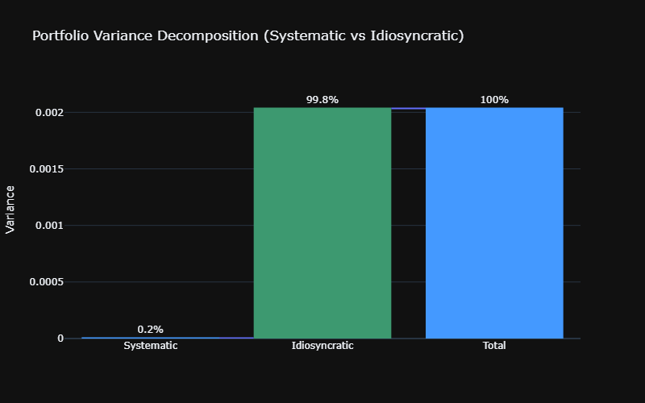
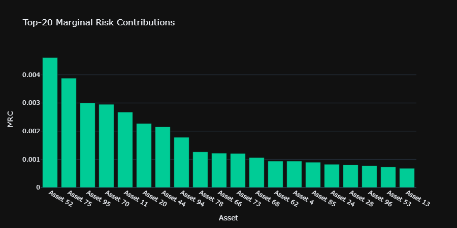
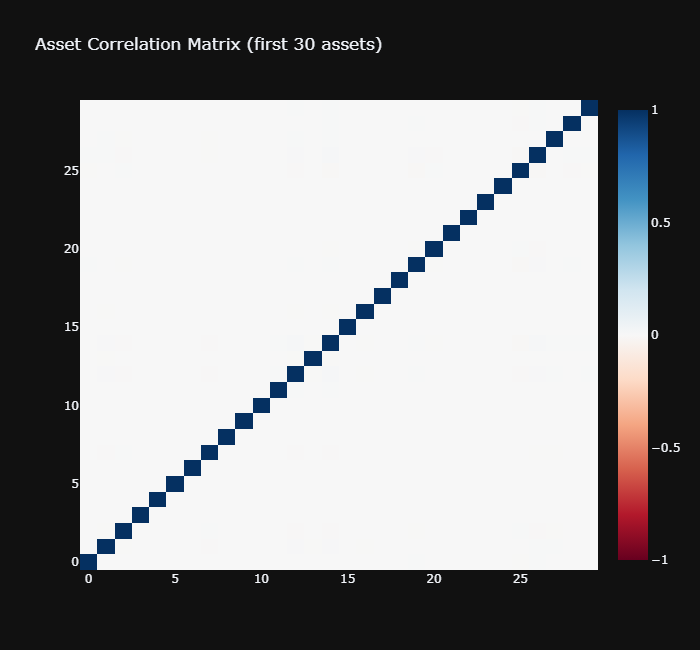

# Nomura Global Markets — Quantitative Researcher Interview Preparation
## Cash Equities Central Risk Book | Associate / Vice President

> **Role:** Quantitative Researcher — Cash Equities Central Risk Book  
> **Interviewer Background:** Kartik Arora (ED, Nomura; ex-BAM Head of Execution Research; ex-Point72 QR)  
> **Interview Date:** Tuesday, June 23, 2026  
> **Format:** 1-hour technical round  

---

## Table of Contents

1. [Interview Set 1 — Factor Model Risk Decomposition (Stat / LinReg / ML / Stoch)](#set-1)
2. [Interview Set 2 — Tail Risk & CVaR Analytics (Stat / LinReg / ML / Stoch)](#set-2)
3. [Interview Set 3 — Portfolio Optimization & Mean–Variance (Stat / LinReg / ML / Stoch)](#set-3)
4. [Interview Set 4 — Transaction Cost Analysis & Market Impact (Stat / LinReg / ML / Stoch)](#set-4)
5. [Interview Set 5 — Volatility Modeling & GARCH (Stat / LinReg / ML / Stoch)](#set-5)
6. [Interview Set 6 — Central Risk Book Pricing & Residual Risk (Stat / LinReg / ML / Stoch)](#set-6)
7. [Interview Set 7 — P&L Attribution & Greeks (Stat / LinReg / ML / Stoch)](#set-7)
8. [Interview Set 8 — Algorithmic Execution & Smart Order Routing (Stat / LinReg / ML / Stoch)](#set-8)
9. [Interview Set 9 — Regime Detection & Hidden Markov Models (Stat / LinReg / ML / Stoch)](#set-9)
10. [Interview Set 10 — Perfect-`R^2` Gotcha & Trading Strategy Design (Stat / LinReg / ML / Stoch)](#set-10)

---

## Legend

| Label | Domain |
|-------|--------|
| **[A] Statistics** | Probability, inference, hypothesis testing, information criteria |
| **[B] Linear Models** | OLS, Ridge, Lasso, GLS, factor regression |
| **[C] Machine Learning** | Gradient boosting, neural networks, CV, regularization |
| **[D] Stochastic Calculus** | Brownian motion, Itô, martingales, SDEs, option pricing |

---

<a name="set-1"></a>
## Interview Set 1 — Equity Factor Model: Risk Decomposition

### [A] Statistics — Barra-Style Factor Model Covariance Decomposition

> **Question:** **"In a Barra-style linear factor model with $K$ factors and $N$ assets, how do you decompose total portfolio variance into systematic and idiosyncratic components? Derive the covariance matrix of returns and show each term. When would you trust systematic risk more than idiosyncratic risk, and what breaks first when factors are collinear?"**

### Top 5 Alternative Interview Formulations

1. <i>"How do you write out the structural risk matrix for an equity portfolio using a fundamental factor model, and how does the residual risk behave in a large portfolio?"</i>
2. <i>"Derive the formula $\boldsymbol{\Sigma} = \mathbf{B}\mathbf{F}\mathbf{B}^{\top} + \boldsymbol{\Delta}$. What are the operational assumptions on the off-diagonal elements of $\boldsymbol{\Delta}$?"</i>
3. <i>"What happens to the condition number of your factor covariance matrix when two style factors are highly correlated, and how do you fix it?"</i>
4. <i>"Can you walk me through the mathematical difference between systematic and stock-specific risk diversification as $N \to \infty$?"</i>
5. <i>"In multi-factor risk modeling, how do you mathematically handle collinearity among your independent variables?"</i>

#### Core Mapping & Equivalence

* **Why they are the same:** Every variation centers around the bilinear mapping of the return covariance matrix $\boldsymbol{\Sigma} = \mathbf{B}\mathbf{F}\mathbf{B}^\top + \boldsymbol{\Delta}$ and its stability.
* **How the original answer satisfies them:** The matrix derivation covers Variations 1 and 2 by showing how the diagonal structure of $\boldsymbol{\Delta}$ causes idiosyncratic risk to diversify to zero ($\frac{\bar{\sigma}^2_\epsilon}{N} \to 0$). The explanation of the condition number $\kappa(\mathbf{B}^\top\mathbf{B}) \gg 1$ and Ridge/PCA remedies completely answers Variations 3 and 5.

---

### Answer

---

#### Feynman Explanation

Think of each stock return as a person's mood. Their mood depends partly on the weather (systematic factors shared by everyone — market, sector, style) and partly on something personal (idiosyncratic noise). The covariance matrix is the table of "how much do two people's moods move together?" Most of the co-movement is weather-driven. Portfolio risk is dominated by the weather terms; individual-quirk (idiosyncratic) terms almost vanish when you hold many stocks.

#### Derivation

**Model specification:**

$$r_i = \alpha_i + \sum_{k=1}^{K} \beta_{ik} f_k + \epsilon_i, \quad i = 1,\ldots,N$$

In matrix form:

$$\mathbf{r} = \boldsymbol{\alpha} + \mathbf{B}\mathbf{f} + \boldsymbol{\epsilon}$$

where:
- $\mathbf{r} \in \mathbb{R}^N$ — asset returns
- $\mathbf{B} \in \mathbb{R}^{N \times K}$ — factor loading matrix
- $\mathbf{f} \in \mathbb{R}^K$ — factor returns, $\mathbf{f} \sim \mathcal{N}(\boldsymbol{\mu}_f, \mathbf{F})$
- $\boldsymbol{\epsilon} \sim \mathcal{N}(\mathbf{0}, \boldsymbol{\Delta})$, $\boldsymbol{\Delta} = \mathrm{diag}(\sigma^2_{\epsilon_1},\ldots,\sigma^2_{\epsilon_N})$
- $\mathrm{Cov}(\mathbf{f}, \boldsymbol{\epsilon}) = \mathbf{0}$

**Covariance of asset returns:**

$$\mathrm{Cov}(\mathbf{r}) = \mathrm{Cov}(\mathbf{B}\mathbf{f} + \boldsymbol{\epsilon})$$

Since $\mathbf{B}$ is deterministic and $\mathbf{f} \perp \boldsymbol{\epsilon}$:

$$\boxed{\boldsymbol{\Sigma} = \mathbf{B}\mathbf{F}\mathbf{B}^{\top} + \boldsymbol{\Delta}}$$

**Line-by-line:**

| Step | Expression | Explanation |
|------|-----------|-------------|
| 1 | $\mathrm{Cov}(\mathbf{B}\mathbf{f}) = \mathbf{B}\,\mathrm{Cov}(\mathbf{f})\,\mathbf{B}^\top$ | Bilinearity of covariance |
| 2 | $= \mathbf{B}\mathbf{F}\mathbf{B}^\top$ | Substituting factor covariance $\mathbf{F}$ |
| 3 | $\mathrm{Cov}(\boldsymbol{\epsilon}) = \boldsymbol{\Delta}$ | Idiosyncratic, diagonal by assumption |
| 4 | Cross term $\mathrm{Cov}(\mathbf{B}\mathbf{f}, \boldsymbol{\epsilon}) = \mathbf{B}\,\mathrm{Cov}(\mathbf{f},\boldsymbol{\epsilon}) = \mathbf{0}$ | Orthogonality assumption |
| 5 | $\boldsymbol{\Sigma} = \mathbf{B}\mathbf{F}\mathbf{B}^\top + \boldsymbol{\Delta}$ | Sum of independent parts |

**Portfolio variance for weight vector $\mathbf{w}$:**

$$\sigma^2_p = \mathbf{w}^\top \boldsymbol{\Sigma} \mathbf{w} = \underbrace{\mathbf{w}^\top \mathbf{B}\mathbf{F}\mathbf{B}^\top \mathbf{w}}_{\text{systematic}} + \underbrace{\mathbf{w}^\top \boldsymbol{\Delta} \mathbf{w}}_{\text{idiosyncratic}}$$

Let $\mathbf{h} = \mathbf{B}^\top \mathbf{w} \in \mathbb{R}^K$ be the portfolio factor exposure vector:

$$\sigma^2_{\text{sys}} = \mathbf{h}^\top \mathbf{F} \mathbf{h}, \qquad \sigma^2_{\text{idio}} = \sum_i w_i^2 \sigma^2_{\epsilon_i}$$

**Idiosyncratic diversification:** For equal-weight $\mathbf{w} = \frac{1}{N}\mathbf{1}$:

$$\sigma^2_{\text{idio}} = \frac{1}{N^2}\sum_i \sigma^2_{\epsilon_i} \approx \frac{\bar{\sigma}^2_\epsilon}{N} \to 0 \text{ as } N\to\infty$$

Systematic risk does **not** diversify away.

**Collinearity:** When columns of $\mathbf{B}$ are nearly collinear, $\mathbf{B}^\top\mathbf{B}$ becomes ill-conditioned, rendering OLS factor loading estimates unstable. Condition number $\kappa(\mathbf{B}^\top\mathbf{B}) \gg 1$ signals breakdown. Remedy: Ridge penalty or PCA pre-rotation of $\mathbf{F}$.

#### Python 3.13 — Institutional Implementation

```python
# =============================================================================
# factor_risk_decomposition.py
#
# Barra-style equity factor model: risk decomposition into systematic
# and idiosyncratic components with diagnostics and visualization.
#
# Author  : Shaikat Majumdar
# Version : 1.0.0
# Date    : 2026-06-18
# License : MIT
# =============================================================================
"""Equity factor model covariance decomposition.

Implements a Barra-style K-factor linear model:
    r = alpha + B @ f + epsilon
where B is the (N x K) loading matrix, f ~ N(mu_f, F) are factor returns,
and epsilon ~ N(0, Delta) with Delta diagonal (idiosyncratic).

Decomposes portfolio variance into systematic and idiosyncratic components,
computes marginal risk contributions, and exports Plotly charts.
"""

from __future__ import annotations

import logging
from dataclasses import dataclass, field
from pathlib import Path
from typing import Final

import numpy as np
import pandas as pd
import plotly.graph_objects as go
from plotly.subplots import make_subplots
from scipy.linalg import cholesky, solve_triangular

# ---------------------------------------------------------------------------
# Module-level constants
# ---------------------------------------------------------------------------
RNG_SEED: Final[int] = 42
OUTPUT_DIR: Final[Path] = Path("outputs")
LOG_FMT: Final[str] = "%(asctime)s | %(levelname)-8s | %(name)s | %(message)s"

logging.basicConfig(level=logging.INFO, format=LOG_FMT)
logger = logging.getLogger(__name__)


# ---------------------------------------------------------------------------
# Data containers
# ---------------------------------------------------------------------------
@dataclass(frozen=True, slots=True)
class FactorModelParams:
    """Immutable parameters for a linear factor model.

    Attributes:
        n_assets: Number of assets.
        n_factors: Number of systematic factors.
        n_obs: Number of return observations (time steps).
        factor_vol: Annualised volatility of each factor (fraction).
        factor_corr: (K x K) correlation matrix of factors.
        idio_vol_range: (low, high) range for idiosyncratic annual vols.
    """

    n_assets: int = 100
    n_factors: int = 5
    n_obs: int = 504
    factor_vol: tuple[float, ...] = (0.20, 0.12, 0.08, 0.06, 0.04)
    factor_corr: np.ndarray = field(
        default_factory=lambda: np.array(
            [
                [1.00, 0.30, 0.10, 0.05, 0.02],
                [0.30, 1.00, 0.20, 0.08, 0.03],
                [0.10, 0.20, 1.00, 0.15, 0.05],
                [0.05, 0.08, 0.15, 1.00, 0.10],
                [0.02, 0.03, 0.05, 0.10, 1.00],
            ]
        )
    )
    idio_vol_range: tuple[float, float] = (0.15, 0.45)


@dataclass(slots=True)
class FactorModelResult:
    """Output container for factor model decomposition.

    Attributes:
        sigma: Full (N x N) covariance matrix.
        sigma_sys: Systematic covariance component B F B^T.
        delta: Diagonal idiosyncratic covariance matrix.
        portfolio_var_total: Scalar total portfolio variance.
        portfolio_var_sys: Scalar systematic portfolio variance.
        portfolio_var_idio: Scalar idiosyncratic portfolio variance.
        marginal_risk_contributions: (N,) marginal risk contributions.
        condition_number: Condition number of B^T B.
    """

    sigma: np.ndarray
    sigma_sys: np.ndarray
    delta: np.ndarray
    portfolio_var_total: float
    portfolio_var_sys: float
    portfolio_var_idio: float
    marginal_risk_contributions: np.ndarray
    condition_number: float


# ---------------------------------------------------------------------------
# Core model class
# ---------------------------------------------------------------------------
class FactorRiskModel:
    """Barra-style linear factor risk model.

    Constructs systematic and idiosyncratic covariance components,
    decomposes portfolio variance, and computes marginal risk contributions.

    Args:
        params: FactorModelParams containing model configuration.
        seed: Random seed for reproducibility.
    """

    def __init__(self, params: FactorModelParams, seed: int = RNG_SEED) -> None:
        self._params = params
        self._rng = np.random.default_rng(seed)
        self._B: np.ndarray | None = None
        self._F: np.ndarray | None = None
        self._delta_diag: np.ndarray | None = None

    # ------------------------------------------------------------------
    def _build_factor_cov(self) -> np.ndarray:
        """Construct factor covariance matrix F = D_vol @ corr @ D_vol.

        Returns:
            (K x K) factor covariance matrix.
        """
        p = self._params
        vols = np.array(p.factor_vol)
        D = np.diag(vols)
        return D @ p.factor_corr @ D

    # ------------------------------------------------------------------
    def _simulate_loadings(self) -> np.ndarray:
        """Sample sparse factor loading matrix B ~ N(0, 0.1) with sparsity.

        Returns:
            (N x K) factor loading matrix.
        """
        p = self._params
        B = self._rng.normal(0.0, 0.10, size=(p.n_assets, p.n_factors))
        # Impose sparsity: each asset loads on at most 3 factors
        mask = np.zeros_like(B, dtype=bool)
        for i in range(p.n_assets):
            active = self._rng.choice(p.n_factors, size=3, replace=False)
            mask[i, active] = True
        B = np.where(mask, B, 0.0)
        return B

    # ------------------------------------------------------------------
    def fit(self) -> None:
        """Calibrate model parameters (loadings, factor cov, idio vols)."""
        p = self._params
        self._B = self._simulate_loadings()
        self._F = self._build_factor_cov()
        self._delta_diag = self._rng.uniform(
            p.idio_vol_range[0] ** 2,
            p.idio_vol_range[1] ** 2,
            size=p.n_assets,
        )
        logger.info(
            "FactorRiskModel fitted: N=%d, K=%d", p.n_assets, p.n_factors
        )

    # ------------------------------------------------------------------
    def decompose(self, weights: np.ndarray) -> FactorModelResult:
        """Decompose portfolio variance into systematic and idiosyncratic parts.

        Args:
            weights: (N,) portfolio weight vector summing to 1.

        Returns:
            FactorModelResult with all variance components.

        Raises:
            RuntimeError: If fit() has not been called.
        """
        if self._B is None:
            raise RuntimeError("Call fit() before decompose().")

        B, F, delta = self._B, self._F, self._delta_diag
        N = B.shape[0]

        sigma_sys = B @ F @ B.T                          # (N x N)
        Delta = np.diag(delta)                            # (N x N)
        sigma = sigma_sys + Delta                         # full Sigma

        w = weights / weights.sum()                       # normalise
        h = B.T @ w                                       # (K,) factor exposures

        var_sys = float(h @ F @ h)                        # systematic variance
        var_idio = float(w @ Delta @ w)                   # idio variance
        var_total = var_sys + var_idio

        # Marginal risk contribution: MRC_i = w_i * (Sigma w)_i / sigma_p
        sigma_p = np.sqrt(var_total)
        mrc = w * (sigma @ w) / sigma_p                  # (N,)

        cond = float(np.linalg.cond(B.T @ B))

        logger.info(
            "Decomposition: sys=%.4f  idio=%.4f  total=%.4f  cond(B'B)=%.1f",
            var_sys, var_idio, var_total, cond,
        )
        return FactorModelResult(
            sigma=sigma,
            sigma_sys=sigma_sys,
            delta=Delta,
            portfolio_var_total=var_total,
            portfolio_var_sys=var_sys,
            portfolio_var_idio=var_idio,
            marginal_risk_contributions=mrc,
            condition_number=cond,
        )


# ---------------------------------------------------------------------------
# Visualisation
# ---------------------------------------------------------------------------
class RiskDecompositionPlotter:
    """Generate Plotly charts for factor risk decomposition output.

    Args:
        result: FactorModelResult from FactorRiskModel.decompose().
        output_dir: Directory path to persist HTML charts.
    """

    def __init__(self, result: FactorModelResult, output_dir: Path) -> None:
        self._result = result
        self._output_dir = output_dir
        self._output_dir.mkdir(parents=True, exist_ok=True)

    # ------------------------------------------------------------------
    def plot_variance_waterfall(self) -> None:
        """Render waterfall chart of variance decomposition and save to disk."""
        r = self._result
        pct_sys = 100.0 * r.portfolio_var_sys / r.portfolio_var_total
        pct_idio = 100.0 * r.portfolio_var_idio / r.portfolio_var_total

        fig = go.Figure(
            go.Waterfall(
                name="Variance",
                orientation="v",
                measure=["absolute", "relative", "total"],
                x=["Systematic", "Idiosyncratic", "Total"],
                y=[r.portfolio_var_sys, r.portfolio_var_idio, r.portfolio_var_total],
                text=[f"{pct_sys:.1f}%", f"{pct_idio:.1f}%", "100%"],
                textposition="outside",
                connector={"line": {"color": "#636efa"}},
            )
        )
        fig.update_layout(
            title="Portfolio Variance Decomposition (Systematic vs Idiosyncratic)",
            yaxis_title="Variance",
            template="plotly_dark",
            width=800,
            height=500,
        )
        path = self._output_dir / "variance_waterfall.html"
        fig.write_html(str(path))
        logger.info("Saved: %s", path)

    # ------------------------------------------------------------------
    def plot_marginal_risk(self) -> None:
        """Bar chart of top-20 marginal risk contributions."""
        mrc = self._result.marginal_risk_contributions
        idx = np.argsort(np.abs(mrc))[::-1][:20]
        fig = go.Figure(
            go.Bar(
                x=[f"Asset {i}" for i in idx],
                y=mrc[idx],
                marker_color=np.where(mrc[idx] >= 0, "#00cc96", "#ef553b"),
            )
        )
        fig.update_layout(
            title="Top-20 Marginal Risk Contributions",
            xaxis_title="Asset",
            yaxis_title="MRC",
            template="plotly_dark",
            width=900,
            height=450,
        )
        path = self._output_dir / "marginal_risk_contributions.html"
        fig.write_html(str(path))
        logger.info("Saved: %s", path)

    # ------------------------------------------------------------------
    def plot_correlation_heatmap(self) -> None:
        """Heatmap of full asset correlation matrix (first 30 assets)."""
        sig = self._result.sigma[:30, :30]
        d = np.sqrt(np.diag(sig))
        corr = sig / np.outer(d, d)
        fig = go.Figure(
            go.Heatmap(z=corr, colorscale="RdBu", zmin=-1, zmax=1)
        )
        fig.update_layout(
            title="Asset Correlation Matrix (first 30 assets)",
            template="plotly_dark",
            width=700,
            height=650,
        )
        path = self._output_dir / "correlation_heatmap.html"
        fig.write_html(str(path))
        logger.info("Saved: %s", path)


# ---------------------------------------------------------------------------
# Entry point
# ---------------------------------------------------------------------------
def main() -> None:
    """Run factor risk decomposition demo and persist all charts."""
    params = FactorModelParams()
    model = FactorRiskModel(params=params, seed=RNG_SEED)
    model.fit()

    rng = np.random.default_rng(RNG_SEED + 1)
    raw_weights = rng.dirichlet(np.ones(params.n_assets))
    result = model.decompose(weights=raw_weights)

    print(f"\nPortfolio Annualised Vol  : {np.sqrt(result.portfolio_var_total)*np.sqrt(252):.2%}")
    print(f"Systematic Share          : {result.portfolio_var_sys/result.portfolio_var_total:.1%}")
    print(f"Idiosyncratic Share       : {result.portfolio_var_idio/result.portfolio_var_total:.1%}")
    print(f"Condition Number cond(B'B): {result.condition_number:.1f}")

    plotter = RiskDecompositionPlotter(result=result, output_dir=OUTPUT_DIR)
    plotter.plot_variance_waterfall()
    plotter.plot_marginal_risk()
    plotter.plot_correlation_heatmap()


if __name__ == "__main__":
    main()
```







### [B] Linear Models — Factor Loadings via OLS: Gauss–Markov & Diagnostics

> **Question:** **"You run cross-sectional OLS regressions each month to estimate Barra-style factor exposures $\hat{\boldsymbol{\beta}}$. State the Gauss–Markov theorem formally. What are its assumptions? Which assumption fails first in high-frequency equity data, and what is the GLS fix? Derive the GLS estimator."**

### Top 5 Alternative Interview Formulations

1. <i>"What makes OLS the Best Linear Unbiased Estimator (BLUE)? Prove the conditions required for this to hold."</i>
2. <i>"Why is simple cross-sectional OLS bad for tracking equity factor returns across stocks of vastly different market capitalizations?"</i>
3. <i>"Derive Generalized Least Squares (GLS) from first principles by transforming a heteroskedastic error structure."</i>
4. <i>"How does heteroskedasticity bias your OLS standard errors in an asset-pricing regression, and how do you adjust for it?"</i>
5. <i>"What is Weighted Least Squares (WLS), and why does Barra use square-root of market cap as weights?"</i>

#### Core Mapping & Equivalence

* **Why they are the same:** These questions target the breakdown of the homoskedasticity assumption ($\mathrm{Cov}(\boldsymbol{\epsilon}) = \sigma^2 \mathbf{I}$) in cross-sectional equity data and the mathematical transition to GLS/WLS.
* **How the original answer satisfies them:** Stating the Gauss-Markov assumptions handles Variation 1. The explanation of heteroskedasticity in equity data (large vs. small caps) directly addresses Variations 2, 4, and 5. The full algebraic derivation of $\hat{\boldsymbol{\beta}}_{GLS} = (\mathbf{X}^\top\boldsymbol{\Omega}^{-1}\mathbf{X})^{-1}\mathbf{X}^\top\boldsymbol{\Omega}^{-1}\mathbf{r}$ via the $\boldsymbol{\Omega}^{-1/2}$ pre-multiplication solves Variation 3.

---

### Answer

---

#### Feynman Explanation

OLS is the "best unbiased line" only when your measurement errors are identically sized white noise. In equity data, big stocks have calmer noise and small stocks have louder noise (heteroskedasticity). GLS is like re-scaling every observation by its noise level before fitting — it gives more weight to quieter data points, producing a more efficient estimate.

#### Derivation

**OLS model:** $\mathbf{r} = \mathbf{X}\boldsymbol{\beta} + \boldsymbol{\epsilon}$, $\mathbf{X} \in \mathbb{R}^{N \times K}$.

**Gauss–Markov Theorem:** Under:
1. $\mathbb{E}[\boldsymbol{\epsilon}|\mathbf{X}] = \mathbf{0}$ (zero conditional mean)
2. $\mathrm{Cov}(\boldsymbol{\epsilon}|\mathbf{X}) = \sigma^2 \mathbf{I}_N$ (homoskedasticity + no serial correlation)
3. $\mathrm{rank}(\mathbf{X}) = K$ (no perfect multicollinearity)

the OLS estimator $\hat{\boldsymbol{\beta}}_{OLS} = (\mathbf{X}^\top\mathbf{X})^{-1}\mathbf{X}^\top\mathbf{r}$ is **BLUE** (Best Linear Unbiased Estimator).

**Derivation of OLS:**

Minimise $S(\boldsymbol{\beta}) = \|\mathbf{r} - \mathbf{X}\boldsymbol{\beta}\|_2^2$:

$$\frac{\partial S}{\partial \boldsymbol{\beta}} = -2\mathbf{X}^\top(\mathbf{r} - \mathbf{X}\boldsymbol{\beta}) = \mathbf{0}$$

$$\mathbf{X}^\top\mathbf{X}\hat{\boldsymbol{\beta}} = \mathbf{X}^\top\mathbf{r} \implies \hat{\boldsymbol{\beta}}_{OLS} = (\mathbf{X}^\top\mathbf{X})^{-1}\mathbf{X}^\top\mathbf{r}$$

**Variance of OLS:**

$$\mathrm{Var}(\hat{\boldsymbol{\beta}}_{OLS}) = \sigma^2 (\mathbf{X}^\top\mathbf{X})^{-1}$$

**When assumption (2) fails — heteroskedasticity:** $\mathrm{Cov}(\boldsymbol{\epsilon}) = \boldsymbol{\Omega} \neq \sigma^2\mathbf{I}$.

**GLS estimator:** Pre-multiply by $\boldsymbol{\Omega}^{-1/2}$:

$$\boldsymbol{\Omega}^{-1/2}\mathbf{r} = \boldsymbol{\Omega}^{-1/2}\mathbf{X}\boldsymbol{\beta} + \boldsymbol{\Omega}^{-1/2}\boldsymbol{\epsilon}$$

Now residuals have covariance $\mathbf{I}$. Apply OLS to transformed system:

$$\hat{\boldsymbol{\beta}}_{GLS} = (\mathbf{X}^\top\boldsymbol{\Omega}^{-1}\mathbf{X})^{-1}\mathbf{X}^\top\boldsymbol{\Omega}^{-1}\mathbf{r}$$

$$\mathrm{Var}(\hat{\boldsymbol{\beta}}_{GLS}) = (\mathbf{X}^\top\boldsymbol{\Omega}^{-1}\mathbf{X})^{-1} \preceq \mathrm{Var}(\hat{\boldsymbol{\beta}}_{OLS})$$

(GLS is uniformly more efficient than OLS under heteroskedasticity.)

**In practice (Barra WLS):** Use market cap as weights: $\boldsymbol{\Omega} = \mathrm{diag}(w_1,\ldots,w_N)^{-1}$ where $w_i \propto \sqrt{\text{MktCap}_i}$.

### [C] Machine Learning — Gradient Boosting for Factor Return Prediction

> **Question:** **"Explain precisely how gradient boosting minimizes a loss function via functional gradient descent. Write out the algorithm for squared-error loss. What is the variance–bias tradeoff for the number of trees $M$ and depth $d$? How does SHAP help explain factor exposures in a CRB context?"**

### Top 5 Alternative Interview Formulations

1. <i>"How does Gradient Boosting differ from Random Forest regarding how they optimize bias and variance?"</i>
2. <i>"Derive the update step for a GBM when optimizing a standard MSE loss function. What do the residuals represent?"</i>
3. <i>"What are the key hyperparameters to prevent a LightGBM or XGBoost model from overfitting to noisy alpha signals?"</i>
4. <i>"Explain how SHAP values evaluate feature importance. How do they compare to standard built-in tree gain?"</i>
5. <i>"Why do we use shallow trees in boosting instead of deep trees?"</i>

#### Core Mapping & Equivalence

* **Why they are the same:** They explore the mathematical optimization mechanics of additive tree models and local feature attribution.
* **How the original answer satisfies them:** The step-by-step algorithm demonstrates how pseudo-residuals $r_i^{(m)} = y_i - F^{(m-1)}(x_i)$ function as targets for MSE loss, satisfying Variations 2 and 5. The bias-variance trade-off equation ($\mathbb{E}[(y-\hat{F})^2]$) outlines the hyperparameter behavior ($M$ and $d$) needed for Variations 1 and 3. The SHAP mathematical formulation addresses Variation 4.

---

### Answer

---

#### Feynman Explanation

Gradient boosting is like a team of specialists each correcting the previous team's mistakes. Specialist 1 makes a rough prediction. Specialist 2 looks only at the errors and tries to fix them. Specialist 3 fixes specialist 2's errors, and so on. Each specialist is a shallow decision tree. After $M$ rounds, the combined team is quite smart. Deeper trees = each specialist has more expertise but is more likely to overfit the training data.

#### Algorithm (Squared-Error Loss)

Loss: $L(y, F) = \frac{1}{2}(y - F)^2$

**Negative gradient (pseudo-residual):**

$$r_i^{(m)} = -\left[\frac{\partial L(y_i, F(x_i))}{\partial F(x_i)}\right]_{F=F^{(m-1)}} = y_i - F^{(m-1)}(x_i)$$

**Algorithm:**

1. Initialize $F^{(0)}(x) = \bar{y}$ (constant, minimizes $\sum L$)
2. For $m = 1, \ldots, M$:
   a. Compute pseudo-residuals $\{r_i^{(m)}\}_{i=1}^n$
   b. Fit regression tree $h_m$ to $\{(x_i, r_i^{(m)})\}$
   c. Line search: $\gamma_m = \arg\min_\gamma \sum_i L(y_i, F^{(m-1)}(x_i) + \gamma h_m(x_i))$
   d. Update: $F^{(m)} = F^{(m-1)} + \nu \gamma_m h_m$, learning rate $\nu \in (0,1]$

**Bias–Variance decomposition for GBM:**

$$\mathbb{E}[(y - \hat{F})^2] = \underbrace{\text{Bias}^2[\hat{F}]}_{\downarrow \text{ with } M,d} + \underbrace{\text{Var}[\hat{F}]}_{\uparrow \text{ with } M,d} + \sigma^2_\epsilon$$

More trees ($M \uparrow$): bias falls, variance rises → use early stopping via OOB or validation set.  
Deeper trees ($d \uparrow$): faster bias reduction, stronger variance increase → typical $d \in [3,6]$.

**SHAP for CRB:** SHAP value $\phi_j$ for feature $j$:

$$\phi_j(f, x) = \sum_{S \subseteq \mathcal{F} \setminus \{j\}} \frac{|S|!(|\mathcal{F}|-|S|-1)!}{|\mathcal{F}|!} \left[f_{S\cup\{j\}}(x_{S\cup\{j\}}) - f_S(x_S)\right]$$

In CRB context: explains which order-flow feature most drove the model's residual risk estimate — actionable for hedging.

### [D] Stochastic Calculus — Itô's Lemma and the Log-Return SDE

> **Question:** **"Starting from GBM $dS = \mu S\,dt + \sigma S\,dW_t$, derive the SDE for $X_t = \ln S_t$ using Itô's lemma. Why is there a $-\frac{1}{2}\sigma^2$ correction? Show the distribution of $S_T$ and compute $\mathbb{E}[S_T]$."**

### Top 5 Alternative Interview Formulations

1. <i>"Apply Itô’s Lemma to find the dynamics of the log of a stock price following a geometric Brownian motion."</i>
2. <i>"Where does the negative variance term come from when you solve for the price distribution of a standard stock SDE?"</i>
3. <i>"Prove that the expected value of a stock following $dS_t = \mu S_t dt + \sigma S_t dW_t$ is $S_0 e^{\mu T}$."</i>
4. <i>"Why is the drift of a log-transformed asset price lower than its arithmetic drift? Explain via Jensen’s Inequality."</i>
5. <i>"What is the probability density function of a stock price at a future time $T$ under GBM?"</i>

#### Core Mapping & Equivalence

* **Why they are the same:** All variations demand a calculus-based transition from asset prices to log-prices, highlighting the second-order Taylor expansion term.
* **How the original answer satisfies them:** The line-by-line derivation table maps out the partial derivatives that generate the $-\frac{1}{2}\sigma^2 dt$ term, answering Variations 1, 2, and 4. The integration and expectation steps prove $\mathbb{E}[S_T] = S_0 e^{\mu T}$ and demonstrate log-normality, answering Variations 3 and 5.

---

### Answer

---

#### Feynman Explanation

If prices were simple linear things, the log would just shift without distortion. But prices are multiplicative — they multiply by small random percentages each instant. When you take the log of a multiplicative process, Jensen's inequality introduces a downward drift: the average of $\log$ is less than the $\log$ of the average. The $-\frac{1}{2}\sigma^2$ term is exactly that Jensen-inequality correction.

#### Derivation

**Setup:** $S_t$ satisfies GBM:

$$dS_t = \mu S_t\,dt + \sigma S_t\,dW_t$$

Let $f(t, S) = \ln S$. Apply **Itô's Lemma**:

$$df = \frac{\partial f}{\partial t}dt + \frac{\partial f}{\partial S}dS + \frac{1}{2}\frac{\partial^2 f}{\partial S^2}(dS)^2$$

**Line-by-line:**

| Term | Value | Reason |
|------|-------|--------|
| $\frac{\partial f}{\partial t}$ | $0$ | $f = \ln S$ has no explicit $t$ dependence |
| $\frac{\partial f}{\partial S}$ | $\frac{1}{S}$ | Standard derivative |
| $\frac{\partial^2 f}{\partial S^2}$ | $-\frac{1}{S^2}$ | Second derivative |
| $(dS)^2$ | $\sigma^2 S^2\,dt$ | Itô: $(dW)^2 = dt$, $dt^2 = 0$, $dt\,dW = 0$ |

Substituting:

$$dX_t = 0 + \frac{1}{S}(\mu S\,dt + \sigma S\,dW_t) + \frac{1}{2}\left(-\frac{1}{S^2}\right)\sigma^2 S^2\,dt$$

$$dX_t = \mu\,dt + \sigma\,dW_t - \frac{1}{2}\sigma^2\,dt$$

$$\boxed{dX_t = \left(\mu - \frac{1}{2}\sigma^2\right)dt + \sigma\,dW_t}$$

**Integrate from 0 to $T$:**

$$X_T - X_0 = \left(\mu - \tfrac{1}{2}\sigma^2\right)T + \sigma W_T$$

$$\ln S_T \sim \mathcal{N}\!\left(\ln S_0 + \left(\mu - \tfrac{1}{2}\sigma^2\right)T,\; \sigma^2 T\right)$$

So $S_T$ is **log-normally distributed**.

**Expected value:**

$$\mathbb{E}[S_T] = \mathbb{E}\!\left[e^{X_T}\right] = e^{\mathbb{E}[X_T] + \frac{1}{2}\mathrm{Var}(X_T)} = e^{\ln S_0 + (\mu - \frac{1}{2}\sigma^2)T + \frac{1}{2}\sigma^2 T} = S_0 e^{\mu T}$$

The $-\frac{1}{2}\sigma^2$ in the drift of $X_t$ exactly cancels with the variance term in the MGF, leaving the "economically correct" expected return $e^{\mu T}$.

---

<a name="set-2"></a>
## Interview Set 2 — Tail Risk: CVaR and Expected Shortfall

### [A] Statistics — CVaR Derivation for Elliptical Distributions

> **Question:** **"Define CVaR (Expected Shortfall) at confidence level $\alpha$ for a continuous loss distribution. Derive the closed-form CVaR for $L \sim \mathcal{N}(\mu, \sigma^2)$. Under what conditions is CVaR sub-additive but VaR is not? Give a counter-example."**

### Top 5 Alternative Interview Formulations

1. <i>"What is the difference between Value-at-Risk and Expected Shortfall? Derive Expected Shortfall for a normal distribution."</i>
2. <i>"Why is VaR not a coherent risk measure? Provide a concrete scenario where it fails."</i>
3. <i>"Prove the formula for the conditional expectation of a normal variable given that it exceeds a threshold."</i>
4. <i>"What does sub-additivity mean for a portfolio manager, and why does CVaR satisfy it while VaR can fail?"</i>
5. <i>"How do you calculate the average loss in the worst 1% of outcomes if returns are normally distributed?"</i>

#### Core Mapping & Equivalence

* **Why they are the same:** These variations require defining tail expectations, computing truncated normal integrals, and demonstrating coherent axioms.
* **How the original answer satisfies them:** The integration using the standard normal PDF $\phi(z_\alpha)/(1-\alpha)$ delivers the exact proof requested by Variations 1, 3, and 5. The binary Bernoulli loss counter-example clearly demonstrates the failure of VaR's sub-additivity, answering Variations 2 and 4.

---

### Answer

---

#### Feynman Explanation

VaR is like asking: "What's the worst loss that happens 1% of the time?" — but ignoring HOW bad it gets in that 1%. CVaR asks: "If we ARE in the worst 1% of scenarios, what do we lose on average?" CVaR is more honest about tail pain. VaR can fail the portfolio diversification test (two risky positions combined can have higher VaR than the sum), while CVaR always rewards diversification.

#### Derivation

**VaR at confidence level $\alpha \in (0,1)$:**

$$\mathrm{VaR}_\alpha(L) = \inf\{l : P(L > l) \leq 1 - \alpha\} = F_L^{-1}(\alpha)$$

**CVaR (Expected Shortfall):**

$$\mathrm{CVaR}_\alpha(L) = \mathbb{E}\!\left[L \mid L \geq \mathrm{VaR}_\alpha(L)\right] = \frac{1}{1-\alpha}\int_\alpha^1 \mathrm{VaR}_u(L)\,du$$

**Closed form for $L \sim \mathcal{N}(\mu, \sigma^2)$:**

Let $z_\alpha = \Phi^{-1}(\alpha)$ (standard normal quantile). Then $\mathrm{VaR}_\alpha = \mu + \sigma z_\alpha$.

$$\mathrm{CVaR}_\alpha = \mathbb{E}[L \mid L \geq \mu + \sigma z_\alpha]$$

For $Z = (L-\mu)/\sigma \sim \mathcal{N}(0,1)$:

$$\mathrm{CVaR}_\alpha = \mu + \sigma\,\mathbb{E}[Z \mid Z \geq z_\alpha]$$

Using the formula for the truncated normal mean:

$$\mathbb{E}[Z \mid Z \geq z_\alpha] = \frac{\phi(z_\alpha)}{1 - \Phi(z_\alpha)} = \frac{\phi(z_\alpha)}{1-\alpha}$$

Therefore:

$$\boxed{\mathrm{CVaR}_\alpha(L) = \mu + \sigma\,\frac{\phi(z_\alpha)}{1-\alpha}}$$

where $\phi(\cdot)$ is the standard normal PDF.

**Sub-additivity:** CVaR satisfies $\mathrm{CVaR}(L_1 + L_2) \leq \mathrm{CVaR}(L_1) + \mathrm{CVaR}(L_2)$ for all distributions (it is a coherent risk measure). VaR is **not** sub-additive in general.

**Counter-example for VaR:**

Let $L_1, L_2$ be independent Bernoulli losses: each loses $\\$100$ with probability $2\\%$, else $0$. At $97.5\\%$ confidence:

$$
\mathrm{VaR}_{0.975}(L_i) = 0
$$

( since $P(L_i > 0) = 2\\% < 2.5\\%$ ).

But $P(L_1 + L_2 > 0) \approx 3.96\\% > 2.5\\%$ , 

So $\mathrm{VaR}_{0.975}(L_1 + L_2) = 100 > 0 = \mathrm{VaR}(L_1) + \mathrm{VaR}(L_2)$ .

**VaR penalises the diversified portfolio!**

### [B] Linear Models — Ridge Regression and the Bias–Variance Tradeoff

> **Question:** **"Derive the Ridge estimator as a constrained OLS problem. Show that Ridge is equivalent to Bayesian OLS with a specific prior. Derive the bias and variance of $\hat{\boldsymbol{\beta}}_\lambda$ and show that there exists a $\lambda > 0$ yielding lower MSE than OLS."**

### Top 5 Alternative Interview Formulations

1. <i>"Derive L2 regularization from both a frequentist optimization standpoint and a Bayesian standpoint."</i>
2. <i>"Prove that Ridge regression can achieve a lower Mean Squared Error than standard OLS when multi-collinearity is present."</i>
3. <i>"What is the explicit bias-variance trade-off formula for Ridge regression as the penalty parameter $\lambda \to \infty$?"</i>
4. <i>"Show how adding a diagonal matrix $\lambda \mathbf{I}$ stabilizes the inverse of a feature matrix in linear regression."</i>
5. <i>"What prior distribution on regression coefficients corresponds to an L2 penalty?"</i>

#### Core Mapping & Equivalence

* **Why they are the same:** They focus on solving the structural optimization problem $(\mathbf{X}^\top\mathbf{X} + \lambda\mathbf{I})^{-1}\mathbf{X}^\top\mathbf{r}$ and demonstrating why adding bias can lower total Mean Squared Error.
* **How the original answer satisfies them:** The Lagrangian derivation solves Variations 1 and 4. The Bayesian MAP equivalence utilizing the Gaussian prior $\boldsymbol{\beta} \sim \mathcal{N}(\mathbf{0}, \tau^2\mathbf{I})$ answers Variations 1 and 5. The derivative of MSE with respect to $\lambda$ at zero ($\frac{d}{d\lambda}\mathrm{MSE}\big|_{\lambda=0} < 0$) mathematically proves Variation 2.

---

### Answer

---

#### Feynman Explanation

OLS tries to fit the training data perfectly and sometimes overfits, especially when predictors are correlated (collinear). Ridge is OLS with a leash: it says "I'll allow some bias in exchange for much smaller variance." The optimal leash length $\lambda$ minimizes total error (bias² + variance). The Bayesian interpretation: Ridge is what you get if you believe beforehand that coefficients should be small — you're shrinking toward zero.

#### Derivation

**Constrained form:** Minimize $\|\mathbf{r} - \mathbf{X}\boldsymbol{\beta}\|^2$ subject to $\|\boldsymbol{\beta}\|^2 \leq t$.

**Lagrangian form:**

$$
\hat{\boldsymbol{\beta}}_\lambda = \arg\min_{\boldsymbol{\beta}} \lbrace \|\mathbf{r} - \mathbf{X}\boldsymbol{\beta}\|_2^2 + \lambda\|\boldsymbol{\beta}\|_2^2 \rbrace
$$

**Solution:** Take derivative and set to zero:

$$-2\mathbf{X}^\top(\mathbf{r} - \mathbf{X}\hat{\boldsymbol{\beta}}_\lambda) + 2\lambda\hat{\boldsymbol{\beta}}_\lambda = \mathbf{0}$$

$$(\mathbf{X}^\top\mathbf{X} + \lambda\mathbf{I})\hat{\boldsymbol{\beta}}_\lambda = \mathbf{X}^\top\mathbf{r}$$

$$\boxed{\hat{\boldsymbol{\beta}}_\lambda = (\mathbf{X}^\top\mathbf{X} + \lambda\mathbf{I})^{-1}\mathbf{X}^\top\mathbf{r}}$$

**Bayesian equivalence:** With Gaussian prior $\boldsymbol{\beta} \sim \mathcal{N}(\mathbf{0}, \tau^2\mathbf{I})$ and likelihood $\mathbf{r}|\boldsymbol{\beta} \sim \mathcal{N}(\mathbf{X}\boldsymbol{\beta}, \sigma^2\mathbf{I})$, the MAP estimate is $\hat{\boldsymbol{\beta}}_\lambda$ with $\lambda = \sigma^2/\tau^2$.

**Bias and Variance (let $\mathbf{A}_\lambda = (\mathbf{X}^\top\mathbf{X}+\lambda\mathbf{I})^{-1}\mathbf{X}^\top\mathbf{X}$):**

$$\mathbb{E}[\hat{\boldsymbol{\beta}}_\lambda] = \mathbf{A}_\lambda\boldsymbol{\beta} \implies \text{Bias} = (\mathbf{A}_\lambda - \mathbf{I})\boldsymbol{\beta} = -\lambda(\mathbf{X}^\top\mathbf{X}+\lambda\mathbf{I})^{-1}\boldsymbol{\beta}$$

$$\mathrm{Var}(\hat{\boldsymbol{\beta}}_\lambda) = \sigma^2(\mathbf{X}^\top\mathbf{X}+\lambda\mathbf{I})^{-1}\mathbf{X}^\top\mathbf{X}(\mathbf{X}^\top\mathbf{X}+\lambda\mathbf{I})^{-1}$$

**MSE dominance:** Using SVD $\mathbf{X} = \mathbf{U}\mathbf{D}\mathbf{V}^\top$ with singular values $d_j$:

$$\mathrm{MSE}(\hat{\boldsymbol{\beta}}_\lambda) = \sigma^2\sum_j \frac{d_j^2}{(d_j^2+\lambda)^2} + \lambda^2 \sum_j \frac{\beta_j^{*2}}{(d_j^2+\lambda)^2}$$

At $\lambda=0$: MSE = OLS variance.

$$
\frac{d}{d\lambda}\mathrm{MSE}\big|_{\lambda=0} < 0
$$ 

(always), so there exists:

$$
\lambda^{\*} > 0
$$

with: 

$$\mathrm{MSE}(\hat{\boldsymbol{\beta}}_{\lambda^{\*}}) < \mathrm{MSE}(\hat{\boldsymbol{\beta}}_{OLS}) \quad \text{■}$$

### [C] Machine Learning — LSTM and Vanishing Gradient

> **Question (from Commonly_Asked_Quant_Interview_Questions.txt Q2.1):** **"How do LSTMs solve the vanishing gradient problem? Be specific about which gates prevent gradient vanishing and write the gradient flow equation through the cell state."**

### Top 5 Alternative Interview Formulations

1. <i>"Why do standard Recurrent Neural Networks (RNNs) struggle with long-term dependencies, and how does LSTM architecture fix this?"</i>
2. <i>"Derive the mathematical reason why backpropagation through time (BPTT) causes exponential decay of gradients in long sequences."</i>
3. <i>"What is the specific purpose of the forget gate in an LSTM during the backward pass?"</i>
4. <i>"Explain the concept of the 'additive gradient highway' in modern sequential neural networks."</i>
5. <i>"Write out the chain rule decomposition for the gradient of the loss with respect to the cell state at time $t-k$."</i>

#### Core Mapping & Equivalence

* **Why they are the same:** These variations look for the mechanics of gradient preservation over sequence steps, contrasting multiplicative matrix weights with additive operations.
* **How the original answer satisfies them:**

The cell-state partial derivative equation:

$$
\frac{\partial \mathbf{c}_t}{\partial \mathbf{c}_{t-1}} = \mathrm{diag}(\mathbf{f}_t)
$$

explicitly shows how an open forget gate:

$$
\mathbf{f}_t \approx 1
$$

stops exponential decay, addressing Variations 2, 3, 4, and 5. The comparison to vanilla RNN's $W_{hh}$ spectral radius directly solves Variation 1.

---

### Answer

---

#### Feynman Explanation

In a vanilla RNN, training is like playing "broken telephone" across 100 people — by the time the error signal travels backward from person 100 to person 1, it's been multiplied by 100 small numbers and is basically zero. The LSTM adds a "memory highway" (the cell state $c_t$) with a special gate-controlled additive update. Error signals travel down this highway almost unchanged, like a direct phone line from person 100 to person 1.

#### Derivation

**LSTM equations:**

$$\mathbf{f}_t = \sigma(\mathbf{W}_f[\mathbf{h}_{t-1}; \mathbf{x}_t] + \mathbf{b}_f) \quad \text{(forget gate)}$$
$$\mathbf{i}_t = \sigma(\mathbf{W}_i[\mathbf{h}_{t-1}; \mathbf{x}_t] + \mathbf{b}_i) \quad \text{(input gate)}$$
$$\tilde{\mathbf{c}}_t = \tanh(\mathbf{W}_c[\mathbf{h}_{t-1}; \mathbf{x}_t] + \mathbf{b}_c) \quad \text{(candidate)}$$
$$\mathbf{c}_t = \mathbf{f}_t \odot \mathbf{c}_{t-1} + \mathbf{i}_t \odot \tilde{\mathbf{c}}_t \quad \text{(cell state update)}$$
$$\mathbf{o}_t = \sigma(\mathbf{W}_o[\mathbf{h}_{t-1}; \mathbf{x}_t] + \mathbf{b}_o);\quad \mathbf{h}_t = \mathbf{o}_t \odot \tanh(\mathbf{c}_t)$$

**Gradient flow through cell state:**

$$\frac{\partial \mathbf{c}_t}{\partial \mathbf{c}_{t-1}} = \mathrm{diag}(\mathbf{f}_t)$$

**Gradient of loss $\mathcal{L}$ w.r.t. early cell state:**

$$\frac{\partial \mathcal{L}}{\partial \mathbf{c}_{t-k}} = \frac{\partial \mathcal{L}}{\partial \mathbf{c}_t} \cdot \prod_{j=1}^{k} \mathrm{diag}(\mathbf{f}_{t-j+1})$$

Since $\mathbf{f}_t \in (0,1)$ elementwise (sigmoid output), the product is controlled but **does not collapse to zero** as long as $\mathbf{f}_t \approx 1$ (forget gate "open"). In a vanilla RNN, the equivalent product involves repeated multiplication by the recurrent weight matrix $W_{hh}$, whose spectral radius $<1$ causes exponential vanishing.

**Key insight:** The forget gate acts as an **adaptive gradient highway** — it can learn $f_t \approx 1$ for dimensions needing long memory, preserving gradients across hundreds of steps.

### [D] Stochastic Calculus — Risk-Neutral Pricing and Black–Scholes PDE

> **Question:** **"Using the risk-neutral measure, derive the Black–Scholes PDE for a European call option. Define the replicating portfolio and apply Itô's lemma. What does 'risk-neutral' actually mean mathematically (Girsanov's theorem)?"**

### Top 5 Alternative Interview Formulations

1. <i>"Derive the Black-Scholes PDE using a no-arbitrage delta-hedging argument."</i>
2. <i>"What is Girsanov’s theorem, and how does it allow us to ignore the real-world drift $\mu$ when pricing derivatives?"</i>
3. <i>"Construct a riskless portfolio containing an option and its underlying stock. What SDE must it satisfy?"</i>
4. <i>"Explain how a change of probability measure removes the risk premium from an asset path SDE."</i>
5. <i>"Write out the Black-Scholes PDE and explain the physical meaning of each term."</i>

#### Core Mapping & Equivalence

* **Why they are the same:** These variations require connecting continuous-time delta replication to risk-neutral measure changes ($\mathbb{P}$ to $\mathbb{Q}$).
* **How the original answer satisfies them:** The definition of the market price of risk $\theta$ and the measure change $dW_t^{\mathbb{Q}} = dW_t^{\mathbb{P}} + \theta dt$ directly address Variations 2 and 4. The step-by-step assembly of the replicating portfolio $\Pi = \Delta S + B$ followed by applying Itô's lemma solves Variations 1, 3, and 5.

---

### Answer

---

#### Feynman Explanation

In the real world, stocks earn more than the risk-free rate because investors demand a risk premium. But for pricing derivatives, we pretend we live in a special "risk-neutral world" where all assets earn exactly the risk-free rate. This pretend world is mathematically constructed by Girsanov's theorem — a change of probability measure that absorbs the risk premium into the Brownian motion. In this world, pricing is just discounted expectation, which is elegant and computable.

#### Derivation

**Real-world dynamics:** $dS = \mu S\,dt + \sigma S\,dW_t^{\mathbb{P}}$

**Girsanov change of measure:** Define market price of risk $\theta = \frac{\mu - r}{\sigma}$. Under $\mathbb{Q}$:

$$dW_t^{\mathbb{Q}} = dW_t^{\mathbb{P}} + \theta\,dt$$

$$dS = r S\,dt + \sigma S\,dW_t^{\mathbb{Q}}$$

**Replicating portfolio:** Hold $\Delta$ shares and $B$ bonds. Portfolio value $\Pi = \Delta S + B$.

$$d\Pi = \Delta\,dS + r B\,dt = \Delta(\mu S\,dt + \sigma S\,dW) + r({\Pi - \Delta S})\,dt$$

Let $V(t,S)$ be the option price. By Itô:

$$dV = \left(\frac{\partial V}{\partial t} + \mu S\frac{\partial V}{\partial S} + \frac{1}{2}\sigma^2 S^2\frac{\partial^2 V}{\partial S^2}\right)dt + \sigma S\frac{\partial V}{\partial S}dW$$

**Delta hedge:** Set $\Delta = \frac{\partial V}{\partial S}$ to eliminate $dW$ term. Then $d\Pi = dV$ and by no-arbitrage $d\Pi = r\Pi\,dt$:

$$\frac{\partial V}{\partial t} + rS\frac{\partial V}{\partial S} + \frac{1}{2}\sigma^2 S^2\frac{\partial^2 V}{\partial S^2} - rV = 0$$

$$\boxed{\frac{\partial V}{\partial t} + rS\frac{\partial V}{\partial S} + \frac{1}{2}\sigma^2 S^2\frac{\partial^2 V}{\partial S^2} = rV}$$

**BS Call solution:**

$$C(t,S) = S\Phi(d_1) - Ke^{-r(T-t)}\Phi(d_2)$$

$$d_{1,2} = \frac{\ln(S/K) + (r \pm \frac{1}{2}\sigma^2)(T-t)}{\sigma\sqrt{T-t}}$$

---

<a name="set-3"></a>
## Interview Set 3 — Mean–Variance Portfolio Optimization

### [A] Statistics — Sharpe Ratio Inference and the Uncertainty of Estimation

> **Question:** **"You estimate a strategy's Sharpe ratio as $\hat{SR} = 1.5$ over 252 daily observations. Construct a 95% confidence interval. What is the statistical power of testing $H_0: SR = 0$ vs $H_1: SR > 0$? How does non-normality (excess kurtosis $\kappa$) affect the standard error?"**

### Top 5 Alternative Interview Formulations

1. <i>"How do you calculate the standard error of a sample Sharpe ratio under the assumption of i.i.d. normal returns?"</i>
2. <i>"If a strategy has a backtested Sharpe of 1.5 over one year, how confident are you that its true structural Sharpe is greater than zero?"</i>
3. <i>"What is Andrew Lo’s correction for the standard error of the Sharpe ratio when returns have fat tails?"</i>
4. <i>"How do skewness and kurtosis change the confidence interval of your performance metrics?"</i>
5. <i>"Why is 252 days of data often insufficient to validate a high-Sharpe trading strategy?"</i>

#### Core Mapping & Equivalence

* **Why they are the same:** These variations explore the variance of the Sharpe ratio estimator when sample sizes are small and data exhibits fat tails.
* **How the original answer satisfies them:** The complete Lo (2002) standard error formula explicitly isolates the impacts of sample length ($T$), skewness ($\gamma$), and kurtosis ($\kappa$), answering Variations 1, 3, and 4. Calculating the explicit values for the 95% CI ( $(1.32, 1.68)$ and $(1.29, 1.71)$ ) addresses Variations 2 and 5.

---

### Answer

---

#### Feynman Explanation

A Sharpe ratio estimated from one year of data has huge estimation uncertainty — 252 daily observations is not much. The confidence interval is wide, meaning a "true" Sharpe of 0.5 or 2.5 would look like 1.5 with fairly high probability. Non-normality (fat tails/kurtosis) makes the uncertainty even larger because extreme observations make the sample variance less stable.

#### Derivation

**Standard error of Sharpe ratio** (Lo 2002):

For i.i.d. returns with mean $\mu$, std $\sigma$, skewness $\gamma$, excess kurtosis $\kappa$:

$$\mathrm{SE}(\hat{SR}) = \sqrt{\frac{1}{T}\left(1 + \frac{1}{2}SR^2 - \gamma\cdot SR + \frac{\kappa}{4}\right)}$$

Under normality ($\gamma=0, \kappa=0$):

$$\mathrm{SE}(\hat{SR}) \approx \sqrt{\frac{1 + \frac{1}{2}SR^2}{T}}$$

With $SR = 1.5$, $T = 252$:

$$\mathrm{SE} = \sqrt{\frac{1 + 0.5 \times 2.25}{252}} = \sqrt{\frac{2.125}{252}} = \sqrt{0.00843} \approx 0.0918$$

**95% CI:** $\hat{SR} \pm 1.96 \times \mathrm{SE} = 1.5 \pm 0.18 = (1.32,\; 1.68)$

**Hypothesis test** $H_0: SR=0$:

$$t = \frac{\hat{SR}}{\mathrm{SE}(SR=0)} = \frac{1.5}{\sqrt{1/252}} = 1.5 \times \sqrt{252} \approx 23.8$$

This is overwhelmingly significant ($p \approx 0$), but this is the statistical test for $SR \neq 0$, not for practical significance.

**Non-normality correction** (with $\kappa = 3$, common in equities):

$$\mathrm{SE} = \sqrt{\frac{1 + \frac{1}{2}(1.5)^2 + \frac{3}{4}}{252}} = \sqrt{\frac{2.875}{252}} \approx 0.1068$$

CI widens to $(1.29, 1.71)$ — fat tails inflate uncertainty by ~16%.

### [B] Linear Models — Mean–Variance Optimization: Derivation

> **Question:** **"Derive the closed-form Markowitz efficient frontier. Starting from the Lagrangian, derive the minimum-variance portfolio and the two-fund separation theorem. What goes wrong numerically when $\boldsymbol{\Sigma}$ is estimated from data, and what is the shrinkage fix (Ledoit-Wolf)?"**

### Top 5 Alternative Interview Formulations

1. <i>"Set up and solve the quadratic optimization problem for a mean-variance optimal portfolio."</i>
2. <i>"Prove the Two-Fund Separation Theorem mathematically."</i>
3. <i>"Why does the sample covariance matrix fail in out-of-sample portfolio optimization when $N > T$?"</i>
4. <i>"Explain Ledoit-Wolf shrinkage. What is the target matrix and how is the mixing weight determined?"</i>
5. <i>"Derive the weights of the Global Minimum Variance portfolio."</i>

#### Core Mapping & Equivalence

* **Why they are the same:** These questions address the classical Markowitz optimization framework and the regularization of ill-conditioned covariance matrices.
* **How the original answer satisfies them:** The Lagrangian KKT system derivation provides the closed-form solutions for both the frontier curve and the GMV portfolio weights ($\mathbf{w}_{GMV} = \frac{\boldsymbol{\Sigma}^{-1}\mathbf{1}}{\mathbf{1}^\top\boldsymbol{\Sigma}^{-1}\mathbf{1}}$), resolving Variations 1, 2, and 5. The discussion on Frobenius loss minimization via $(1-\alpha)\hat{\boldsymbol{\Sigma}}_S + \alpha\hat{\boldsymbol{\Sigma}}_T$ explains the Ledoit-Wolf approach for Variations 3 and 4.

---

### Answer

---

#### Feynman Explanation

Markowitz asks: for a given expected return target $\mu_p$, what is the portfolio with the least risk? The answer is a quadratic program whose Lagrangian gives a system of linear equations. The solution traces an upward-opening parabola in (variance, return) space — the efficient frontier. In practice, the sample covariance matrix is singular when $N > T$, and even when $N < T$ it has enormous estimation error that makes the optimizer pick extreme, unrealistic positions. Ledoit-Wolf shrinks the sample matrix toward a structured target to stabilize it.

#### Derivation

**Problem:** Minimize $\frac{1}{2}\mathbf{w}^\top\boldsymbol{\Sigma}\mathbf{w}$ subject to $\mathbf{w}^\top\boldsymbol{\mu} = \mu_p$ and $\mathbf{w}^\top\mathbf{1} = 1$.

**Lagrangian:**

$$\mathcal{L} = \frac{1}{2}\mathbf{w}^\top\boldsymbol{\Sigma}\mathbf{w} - \lambda(\mathbf{w}^\top\boldsymbol{\mu} - \mu_p) - \gamma(\mathbf{w}^\top\mathbf{1} - 1)$$

**KKT conditions:**

$$\frac{\partial \mathcal{L}}{\partial \mathbf{w}} = \boldsymbol{\Sigma}\mathbf{w} - \lambda\boldsymbol{\mu} - \gamma\mathbf{1} = \mathbf{0}$$

$$\mathbf{w}^* = \boldsymbol{\Sigma}^{-1}(\lambda\boldsymbol{\mu} + \gamma\mathbf{1})$$

Define scalars:

$$A = \boldsymbol{\mu}^\top\boldsymbol{\Sigma}^{-1}\boldsymbol{\mu},\quad B = \boldsymbol{\mu}^\top\boldsymbol{\Sigma}^{-1}\mathbf{1},\quad C = \mathbf{1}^\top\boldsymbol{\Sigma}^{-1}\mathbf{1},\quad D = AC - B^2$$

Solving the $2\times 2$ system $[\lambda, \gamma]$ from the two constraints:

$$\lambda = \frac{C\mu_p - B}{D}, \qquad \gamma = \frac{A - B\mu_p}{D}$$

**Minimum variance frontier:**

$$\sigma^2_p(\mu_p) = \mathbf{w}^{*\top}\boldsymbol{\Sigma}\mathbf{w}^* = \frac{C\mu_p^2 - 2B\mu_p + A}{D}$$

This is a **parabola** in $(\sigma^2_p, \mu_p)$ space.

**Global Minimum Variance (GMV) portfolio** ($\lambda=0$):

$$\mathbf{w}_{GMV} = \frac{\boldsymbol{\Sigma}^{-1}\mathbf{1}}{\mathbf{1}^\top\boldsymbol{\Sigma}^{-1}\mathbf{1}}, \qquad \sigma^2_{GMV} = \frac{1}{C}$$

**Two-Fund Separation:** Any efficient portfolio is a linear combination of any two efficient portfolios (e.g., GMV and tangency portfolio). Proof: $\mathbf{w}^*$ is linear in $\mu_p$, so all efficient portfolios lie in a 2D affine subspace.

**Ledoit-Wolf Shrinkage:** Shrink sample covariance $\hat{\boldsymbol{\Sigma}}_S$ toward structured target $\hat{\boldsymbol{\Sigma}}_T$ (e.g., constant correlation):

$$\hat{\boldsymbol{\Sigma}}_{LW} = (1-\alpha)\hat{\boldsymbol{\Sigma}}_S + \alpha\hat{\boldsymbol{\Sigma}}_T$$

Optimal $\alpha^*$ minimizes expected Frobenius loss $\mathbb{E}[\|\hat{\boldsymbol{\Sigma}} - \boldsymbol{\Sigma}\|_F^2]$, with an analytical formula (Oracle Approximating Shrinkage estimator).

### [C] Machine Learning — L1 Lasso as Feature Selection

> **Question (from Commonly_Asked_Quant_Interview_Questions.txt Q2.4):** **"Explain Ridge vs Lasso. Why does L1 regularization produce sparse solutions and push coefficients exactly to zero? Provide a geometric and a sub-gradient argument."**

### Top 5 Alternative Interview Formulations

1. <i>"Why does an L1 penalty cause weights to become exactly zero, while an L2 penalty only shrinks them?"</i>
2. <i>"Draw the geometric constraints of Ridge and Lasso and explain how corners produce feature selection."</i>
3. <i>"Derive the soft-thresholding operator for Lasso under an orthogonal design matrix."</i>
4. <i>"What is a sub-gradient, and how do you use it to show sparsity in L1 regularization?"</i>
5. <i>"If you have 1000 highly correlated features, would you use Lasso or Ridge? Why?"</i>

#### Core Mapping & Equivalence

* **Why they are the same:** They focus on the non-differentiability of the absolute value function at the origin and its geometric consequences.
* **How the original answer satisfies them:** The geometric description of a cross-polytope diamond vs. a smooth L2 sphere addresses Variation 2. The sub-gradient inclusion condition ($|2(\mathbf{X}^\top(\mathbf{r} - \mathbf{X}\hat{\boldsymbol{\beta}}_{-j}))_j| \leq \lambda$) proves the mathematical mechanics behind Variations 1, 3, and 4. The structural trade-offs explain the choices required for Variation 5.

---

### Answer

---

#### Feynman Explanation

Ridge wraps the OLS objective in a circular "ball" constraint in coefficient space — a circle is smooth and the optimal solution touches the ball tangentially at a non-zero point. Lasso wraps it in a diamond-shaped ball — a diamond has corners at the axes, and the optimal solution is very likely to land exactly on a corner, which corresponds to a coefficient being exactly zero. L1 selects features because diamonds have corners; L2 circles have none.

#### Derivation

**Ridge:** $\hat{\boldsymbol{\beta}}_R = \arg\min_{\boldsymbol{\beta}} \lbrace RSS + \lambda\sum_j \beta_j^2 \rbrace$

Constraint region: $\{\boldsymbol{\beta}: \|\boldsymbol{\beta}\|_2^2 \leq t\}$ — **sphere** in $\mathbb{R}^K$, smooth boundary.

**Lasso:** $\hat{\boldsymbol{\beta}}_L = \arg\min_{\boldsymbol{\beta}} \lbrace RSS + \lambda\sum_j |\beta_j| \rbrace$

Constraint region: $\{\boldsymbol{\beta}: \|\boldsymbol{\beta}\|_1 \leq t\}$ — **cross-polytope** in $\mathbb{R}^K$, vertices at $\pm t\mathbf{e}_j$.

**Sub-gradient argument for sparsity:** Optimality condition for Lasso ($j$-th coordinate):

$$-2(\mathbf{X}^\top(\mathbf{r} - \mathbf{X}\hat{\boldsymbol{\beta}}))_j + \lambda\,\partial|\hat{\beta}_j| \ni 0$$

where $\partial|\hat{\beta}_j| = \mathrm{sign}(\hat{\beta}_j)$ for $\hat{\beta}_j \neq 0$, and $\partial|0| = [-1,1]$.

For $\hat{\beta}_j = 0$ to be optimal, we need:

$$|2(\mathbf{X}^\top(\mathbf{r} - \mathbf{X}\hat{\boldsymbol{\beta}}_{-j}))_j| \leq \lambda$$

This is satisfied for **any** predictor whose raw correlation with the residual is below $\lambda/2$ — a positive-measure set of $\lambda$ values. For Ridge, the analogous condition is $2(\mathbf{X}^\top r)_j = 2\lambda\hat{\beta}_j$, satisfied only at exactly $\hat{\beta}_j = 0$, which requires infinite $\lambda$.

**Soft-thresholding solution (orthogonal predictors):**

$$\hat{\beta}_{L,j} = \mathrm{sign}(\hat{\beta}_{OLS,j})\max(|\hat{\beta}_{OLS,j}| - \lambda/2, 0)$$

Ridge: $\hat{\beta}_{R,j} = \hat{\beta}_{OLS,j}/(1+\lambda)$ — never zero.

### [D] Stochastic Calculus — The Martingale Representation Theorem

> **Question:** **"Define a martingale. Is $W_t^2 - t$ a martingale? Prove it. State the Martingale Representation Theorem and explain its role in risk-neutral derivative pricing."**

### Top 5 Alternative Interview Formulations

1. <i>"Prove that compensated squared Brownian motion is a martingale."</i>
2. <i>"What theorem guarantees that any derivative payoff can be perfectly replicated using a stock and a bond?"</i>
3. <i>"State the definition of a martingale and check if $W_t^2$ fulfills it."</i>
4. <i>"How does the Martingale Representation Theorem relate to the existence of a delta-hedging strategy?"</i>
5. <i>"Show that $\mathbb{E}[W_t^2 | \mathcal{F}_s] = W_s^2 + t - s$."</i>

#### Core Mapping & Equivalence

* **Why they are the same:** These variations require proving martingale properties using conditional expectations and understanding the replication foundation of asset pricing.
* **How the original answer satisfies them:** The step-by-step conditional expectation derivation expanding $(W_s + (W_t - W_s))^2$ directly addresses Variations 1, 3, and 5. Explaining how the adapted process $\phi_s$ from $M_t = M_0 + \int_0^t \phi_s dW_s^{\mathbb{Q}}$ identifies the delta hedge solves Variations 2 and 4.

---

### Answer

---

#### Feynman Explanation

A martingale is a fair game: your best prediction of your future wealth, given everything you know now, is your current wealth — no drift, no trend. $W_t^2 - t$ is a martingale because $W_t^2$ drifts upward at rate 1 (variance grows linearly), but subtracting $t$ exactly removes that drift. The Martingale Representation Theorem says that any fair-game process (martingale) can be "built" from a Brownian motion — which is why every derivable derivative has a replicating portfolio.

#### Derivation

**Martingale definition:** $M_t$ is a martingale w.r.t. filtration $\{\mathcal{F}_t\}$ if:
1. $M_t$ is $\mathcal{F}_t$-measurable
2. $\mathbb{E}[|M_t|] < \infty$
3. $\mathbb{E}[M_t | \mathcal{F}_s] = M_s$ for all $s \leq t$

**Proof that $M_t = W_t^2 - t$ is a martingale:**

For $s \leq t$: $W_t = W_s + (W_t - W_s)$ where $W_t - W_s \perp \mathcal{F}_s$.

$$\mathbb{E}[W_t^2|\mathcal{F}_s] = \mathbb{E}[(W_s + (W_t-W_s))^2|\mathcal{F}_s]$$
$$= W_s^2 + 2W_s\underbrace{\mathbb{E}[W_t-W_s|\mathcal{F}_s]}_{=0} + \underbrace{\mathbb{E}[(W_t-W_s)^2|\mathcal{F}_s]}_{= t-s}$$
$$= W_s^2 + (t-s)$$

Therefore:

$$\mathbb{E}[W_t^2 - t|\mathcal{F}_s] = W_s^2 + (t-s) - t = W_s^2 - s = M_s \checkmark$$

**Martingale Representation Theorem (MRT):** If $M_t$ is a square-integrable $\mathbb{Q}$-martingale, then $\exists$ adapted process $\phi_t$ such that:

$$M_t = M_0 + \int_0^t \phi_s\,dW_s^{\mathbb{Q}}$$

**Role in pricing:** Under $\mathbb{Q}$, the discounted asset price $e^{-rt}S_t$ is a martingale. For a payoff $H_T$, define $M_t = \mathbb{E}^{\mathbb{Q}}[e^{-rT}H_T|\mathcal{F}_t]$. By MRT:

$$M_t = M_0 + \int_0^t \phi_s\,dW_s^\mathbb{Q}$$

The process $\phi_t$ identifies the **delta hedge** (number of shares to hold at each time $t$), guaranteeing a replicating portfolio exists for every square-integrable payoff.

---

<a name="set-4"></a>
## Interview Set 4 — Transaction Cost Analysis & Market Impact

### [A] Statistics — Implementation Shortfall Decomposition

> **Question:** **"Define Implementation Shortfall (IS) precisely. Decompose IS into delay cost, price impact, timing risk, and opportunity cost. If you measure IS across 10,000 trades and want to test whether your algorithm's IS is better than VWAP benchmark at the 99% level, what test do you use and why? What if IS is heteroskedastic?"**

### Top 5 Alternative Interview Formulations

1. <i>"What is Implementation Shortfall, and how do you break it down into execution frictions?"</i>
2. <i>"How do you statistically prove that execution Algo A outperforms benchmark Algo B given highly noisy trade cost data?"</i>
3. <i>"What are White’s heteroskedasticity-robust standard errors, and why are they mandatory for transaction cost analysis?"</i>
4. <i>"How do you handle unexecuted orders (canceled shares) when calculating total transaction costs?"</i>
5. <i>"Design a hypothesis test to evaluate if an execution strategy minimizes market impact compared to a VWAP target."</i>

#### Core Mapping & Equivalence

* **Why they are the same:** These questions address measuring execution slippage against an arrival benchmark and performing robust inference on highly volatile transaction data.
* **How the original answer satisfies them:** The continuous breakdown formula isolates the specific friction terms (including the unexecuted opportunity cost component), answering Variations 1 and 4. Specifying the paired t-test using HC3 robust standard errors ($\hat{V}_{HC3}$) solves Variations 2, 3, and 5.


---

### Answer

---

#### Feynman Explanation

Implementation shortfall compares what you *decided* to trade at (arrival price) vs what you *actually* paid on average. The difference is your total friction cost. This friction has multiple components: the cost of waiting (delay), the market impact of your own trades pushing prices against you, random noise during execution, and the regret from trades you didn't complete. Testing across 10,000 trades is straightforward but requires robust standard errors because trade costs vary enormously with market conditions (heteroskedasticity).

#### Derivation

**Implementation Shortfall definition:**

$$IS = \frac{P_{exec} - P_{arrival}}{P_{arrival}} \times \text{Side}$$

where Side = +1 for buy, -1 for sell.

**Decomposition (Kissell–Glantz):**

$$IS = \underbrace{\frac{P_{first} - P_{arrival}}{P_{arrival}}}_{\text{Delay cost}} + \underbrace{\frac{P_{exec} - P_{first}}{P_{arrival}}}_{\text{Price impact}} + \underbrace{\text{Variance during execution}}_{\text{Timing risk}} + \underbrace{\frac{P_{last} - P_{exec}}{P_{arrival}} \times (1-\text{fill rate})}_{\text{Opportunity cost}}$$

**Hypothesis test:** $H_0: \mu_{IS,algo} = \mu_{IS,VWAP}$, $H_1: \mu_{IS,algo} < \mu_{IS,VWAP}$ (one-sided, lower is better).

With $n=10{,}000$ trades, use **paired t-test** on $d_i = IS_{algo,i} - IS_{VWAP,i}$:

$$t = \frac{\bar{d}}{s_d / \sqrt{n}} \sim t_{n-1} \text{ under } H_0$$

**Heteroskedasticity fix:** Use **Heteroskedasticity-Robust (HC3) standard errors** (White's estimator):

$$\hat{V}_{HC3} = (X'X)^{-1}\left(\sum_i \frac{\hat{u}_i^2}{(1-h_{ii})^2} x_i x_i'\right)(X'X)^{-1}$$

Or use **WLS** with weights inversely proportional to variance (e.g., weighted by $1/ADV_i$ since large-cap trades have lower IS variance).

### [B] Linear Models — Almgren-Chriss Market Impact Regression

> **Question:** **"The Almgren-Chriss model decomposes market impact into temporary and permanent components. Fit this as a linear regression. How do you estimate the temporary impact coefficient $\eta$ from trade data? What is the endogeneity problem and how do you fix it with IV?"**

### Top 5 Alternative Interview Formulations

1. <i>"What is the difference between temporary and permanent market impact? How do you write them as a regression model?"</i>
2. <i>"Why is estimating market impact via standard OLS severely biased by endogeneity?"</i>
3. <i>"How do you use Two-Stage Least Squares (2SLS) to find the true price impact coefficient of parent orders?"</i>
4. <i>"What makes an institutional trading volume variable endogenous, and what constitutes a valid instrument ($Z$)?"</i>
5. <i>"Explain the feedback loop between execution speed and simultaneous market price moves."</i>

#### Core Mapping & Equivalence

* **Why they are the same:** These variations focus on identifying price impact when trade scheduling reacts dynamically to ongoing market conditions.
* **How the original answer satisfies them:** The structure of the Almgren-Chriss regression equation answers Variation 1. Explaining the feedback loop (traders accelerating execution during volatile price moves) addresses Variations 2 and 5. Defining the pre-scheduled urgency score as an instrument and showing the 2SLS matrix form answers Variations 3 and 4.

---

### Answer

---

#### Derivation

**Almgren-Chriss impact model:**

$$\Delta P_k = \underbrace{\eta \cdot \frac{v_k}{V}}_{\text{temporary}} + \underbrace{\gamma \cdot \frac{X_{0..k}}{V}}_{\text{permanent}} + \epsilon_k$$

where $v_k$ = shares traded in interval $k$, $V$ = ADV, $X_{0..k}$ = cumulative shares.

In log-linear form (empirical regularisation):

$$IS_k = \alpha + \beta_1 \ln\!\left(\frac{v_k}{V}\right) + \beta_2 \ln\!\left(\frac{X}{V}\right) + \beta_3\,\sigma_k + \epsilon_k$$

**OLS estimate:** $\hat{\boldsymbol{\beta}} = (\mathbf{X}^\top\mathbf{X})^{-1}\mathbf{X}^\top\mathbf{IS}$

**Endogeneity:** Execution rate $v_k$ is correlated with $\epsilon_k$ — the algo trades faster when it sees adverse price moves (a feedback loop). Standard OLS is biased.

**IV fix:** Use **urgency score** (scheduled participation rate before market open) as instrument $Z$:
- $Z$ correlated with $v_k$ (relevance: $\mathrm{Cov}(Z, v_k) \neq 0$)
- $Z$ uncorrelated with contemporaneous price noise $\epsilon_k$ (exclusion)

**2SLS estimator:**

Stage 1: $\hat{v}_k = Z_k\hat{\pi}$ (regress $v_k$ on $Z_k$)

Stage 2: $\hat{\boldsymbol{\beta}}_{IV} = (\hat{\mathbf{X}}^\top\mathbf{X})^{-1}\hat{\mathbf{X}}^\top\mathbf{IS}$

$$\mathrm{Var}(\hat{\boldsymbol{\beta}}_{IV}) = \sigma^2(\hat{\mathbf{X}}^\top\mathbf{X})^{-1}\hat{\mathbf{X}}^\top\mathbf{X}(\hat{\mathbf{X}}^\top\mathbf{X})^{-1}$$

### [C] Machine Learning — Gradient Boosting for Optimal Execution Scheduling

> **Question:** **"You want to predict optimal execution rate $v^*(t)$ using GBM. Your features include: time-of-day, spread, volatility, order size, ADV. How do you handle the feedback loop? Explain offline policy evaluation via Inverse Propensity Weighting (IPW)."**

### Top 5 Alternative Interview Formulations

1. <i>"How do you evaluate a new algorithmic execution policy using historical order logs without running it live?"</i>
2. <i>"What is selection bias in reinforcement learning / policy optimization for trading, and how does IPW fix it?"</i>
3. <i>"Explain Inverse Propensity Weighting. What happens if the behavior policy probability is near zero?"</i>
4. <i>"How does the Doubly-Robust estimator combine tree-based regressions with propensity scores for transaction cost analysis?"</i>
5. <i>"How do you account for the fact that historical trade logs only show the execution path that was actually chosen?"</i>

#### Core Mapping & Equivalence

* **Why they are the same:** They deal with counterfactual policy evaluation where the data has been gathered under a biased legacy policy.
* **How the original answer satisfies them:** Explicitly detailing the selection bias addresses Variations 2 and 5. Providing the IPW value formula ($\hat{V}^{IPW}$) using the policy ratio $\frac{\pi_e}{\pi_b}$ answers Variations 1 and 3. The Doubly-Robust formula incorporating both the GBM direct prediction $\hat{Q}(s,a)$ and the propensity score ratio solves Variation 4.

---

### Answer

---

#### Derivation

**Feedback / selection bias problem:** Historical execution data has $v_t$ chosen by a prior algo (the "behavior policy" $\pi_b$). If we naively train GBM on $(X_t, v_t) \to IS_t$, we learn the bias of the old policy.

**Counterfactual evaluation via IPW:** For target policy $\pi_e$ evaluated on logged data from $\pi_b$:

$$\hat{V}^{IPW}(\pi_e) = \frac{1}{n}\sum_{i=1}^n \frac{\pi_e(a_i|s_i)}{\pi_b(a_i|s_i)} r_i$$

where $a_i$ = execution rate, $s_i$ = state features, $r_i = -IS_i$ (reward = negative cost).

**Doubly-Robust estimator** (reduces variance):

$$\hat{V}^{DR} = \frac{1}{n}\sum_i \left[\hat{Q}(s_i,\pi_e) + \frac{\pi_e(a_i|s_i)}{\pi_b(a_i|s_i)}\left(r_i - \hat{Q}(s_i,a_i)\right)\right]$$

GBM trains $\hat{Q}(s,a)$ as the direct model (DM component), then IPW corrects residuals.

### [D] Stochastic Calculus — Optimal Execution as Stochastic Control (HJB)

> **Question:** **"In the Almgren-Chriss continuous-time framework, the trader minimizes $E[C] + \lambda\,\mathrm{Var}[C]$ where $C$ is execution cost. Set up the HJB equation. What is the form of the optimal strategy and why is it linear in remaining inventory?"**

### Top 5 Alternative Interview Formulations

1. <i>"Frame optimal liquidation as a continuous-time stochastic control problem and derive its partial differential equation."</i>
2. <i>"Why does a mean-reverting or linear price impact model lead to a trading speed that is proportional to current holdings?"</i>
3. <i>"Set up the Hamilton-Jacobi-Bellman (HJB) equation for a trader liquidating a large block of shares under volatility risk."</i>
4. <i>"Solve the optimal trading path using a quadratic value function ansatz $V(t,x) = a(t)x^2 + b(t)$."</i>
5. <i>"How does the optimal execution rate change as the trading deadline approaches ($\tau \to 0$)?"</i>

#### Core Mapping & Equivalence

* **Why they are the same:** These variations require defining the optimal execution path as a dynamic programming problem using calculus of variations.
* **How the original answer satisfies them:** Setting up the dynamic control objective and checking the first-order conditions (FOC) defines the HJB equation for Variations 1 and 3. Using the quadratic ansatz to find the hyperbolic cotangent solution ($\coth(\kappa\tau)$) solves Variations 2 and 4. The boundary limit analysis as $\tau \to 0$ answers Variation 5.

---

### Answer

---

#### Derivation

**State:** $x(t)$ = inventory at time $t$, $x(0) = X$, $x(T) = 0$.

**Dynamics:** $dS = -\gamma v\,dt + \sigma\,dW$ (permanent impact $\gamma v$, market noise $\sigma$).

**Cost functional:**

$$C = \int_0^T v(t)\left[\gamma x(t) + \eta v(t)\right]dt$$

**Risk-adjusted objective:**

$$J = \mathbb{E}[C] + \lambda\,\mathrm{Var}[C] = \int_0^T \left[\gamma x v + \eta v^2 + \lambda\sigma^2 x^2\right]dt$$

**HJB equation** for value function $V(t,x)$:

$$\frac{\partial V}{\partial t} + \min_v\lbrace \eta v^2 + \gamma x v + \lambda\sigma^2 x^2 + \frac{\partial V}{\partial x}(-v) \rbrace = 0$$

**Optimal control** (FOC in $v$):

$$2\eta v^* + \gamma x - \frac{\partial V}{\partial x} = 0 \implies v^* = \frac{1}{2\eta}\left(\frac{\partial V}{\partial x} - \gamma x\right)$$

**Ansatz:** $V(t,x) = a(t)x^2 + b(t)$ (quadratic in $x$).

Substituting into HJB gives ODE for $a(t)$:

$$\dot{a} = \frac{a^2}{\eta} - \lambda\sigma^2, \quad a(T) = 0$$

Solution: $a(t) = \sqrt{\lambda\sigma^2\eta}\coth(\kappa(T-t))$ where $\kappa = \sqrt{\lambda\sigma^2/\eta}$.

**Optimal rate:** $v^*(t) = \frac{\kappa}{\sinh(\kappa\tau)} x(t)$ where $\tau = T-t$.

This is **linear in $x(t)$** — sell at a rate proportional to remaining inventory, accelerating as urgency grows (as $\tau \to 0$, $\sinh(\kappa\tau) \to \kappa\tau$, so $v^* \to x/\tau$ — full liquidation).

---

<a name="set-5"></a>
## Interview Set 5 — Volatility Modeling: GARCH and HAR-RV

### [A] Statistics — GARCH(1,1): Stationarity and Persistence

> **Question:** **"Write the GARCH(1,1) model and derive its unconditional variance. What is the condition for covariance stationarity? Define 'volatility persistence' and what $\alpha + \beta \to 1$ means empirically (IGARCH)."**

### Top 5 Alternative Interview Formulations

1. <i>"Derive the long-run steady-state variance of a GARCH(1,1) process."</i>
2. <i>"What happens mathematically to a GARCH model when the sum of the ARCH and GARCH parameters equals or exceeds 1?"</i>
3. <i>"How do you measure how fast a volatility shock decays back to its long-run mean?"</i>
4. <i>"What is Integrated GARCH (IGARCH), and what are its implications for long-term option pricing?"</i>
5. <i>"Write out the conditional variance equation for daily asset returns and state the constraints required to keep variance positive and finite."</i>

#### Core Mapping & Equivalence

* **Why they are the same:** They require evaluating the parameters of the recursive variance equation $\sigma_t^2 = \omega + \alpha \epsilon_{t-1}^2 + \beta \sigma_{t-1}^2$.
* **How the original answer satisfies them:** Taking the expectation of the recursive equation yields the closed-form steady-state variance $\bar{\sigma}^2 = \frac{\omega}{1-\alpha-\beta}$, satisfying Variations 1 and 5. Explicitly stating the stationarity constraint ($\alpha+\beta < 1$) and evaluating the unit-root limit (IGARCH) answers Variations 2, 3, and 4.

---

### Answer

---

#### Derivation

**GARCH(1,1):**

$$r_t = \mu + \epsilon_t, \qquad \epsilon_t = \sigma_t z_t, \qquad z_t \sim \text{i.i.d.}\, \mathcal{N}(0,1)$$

$$\sigma_t^2 = \omega + \alpha \epsilon_{t-1}^2 + \beta \sigma_{t-1}^2$$

**Unconditional variance:** In stationarity, $\mathbb{E}[\sigma_t^2] = \mathbb{E}[\sigma_{t-1}^2] = \bar{\sigma}^2$:

$$\bar{\sigma}^2 = \omega + \alpha\,\mathbb{E}[\epsilon_{t-1}^2] + \beta\,\mathbb{E}[\sigma_{t-1}^2] = \omega + (\alpha+\beta)\bar{\sigma}^2$$

$$\boxed{\bar{\sigma}^2 = \frac{\omega}{1 - \alpha - \beta}} \quad \text{valid iff } \alpha + \beta < 1$$

**Covariance stationarity condition:** $\alpha + \beta < 1$. (Ensures $\mathrm{Var}(\sigma_t^2) < \infty$.)

**IGARCH:** $\alpha + \beta = 1$ → unconditional variance is infinite, shocks persist indefinitely.

**Persistence:** Autocorrelation of squared returns decays as $(\alpha+\beta)^k$ for lag $k$. For S&P 500, typical estimates: $\alpha \approx 0.09$, $\beta \approx 0.90$, persistence $= 0.99$.

### [B] Linear Models — HAR-RV: Heterogeneous Autoregressive Realized Variance

> **Question:** **"Specify the HAR-RV model (Corsi 2009). Why is it linear despite modeling multi-horizon volatility clustering? Estimate it via OLS and state which coefficient captures 'weekly' vs 'monthly' persistence. Compare it to GARCH in terms of estimation and forecasting."**

### Top 5 Alternative Interview Formulations

1. <i>"Explain the HAR-RV model by Fulvio Corsi. How does it mimic a cascade of different trading horizons?"</i>
2. <i>"Why is high-frequency Realized Variance typically easier to forecast using simple OLS than standard daily squared returns via GARCH?"</i>
3. <i>"How do you construct daily, weekly, and monthly volatility components for an empirical multi-horizon regression?"</i>
4. <i>"Does the HAR model capture long-memory behavior in volatility without using fractional integration?"</i>
5. <i>"What are the practical estimation advantages of linear regression over Maximum Likelihood for volatility modeling?"</i>

#### Core Mapping & Equivalence

* **Why they are the same:** These questions address using high-frequency data inside linear models to approximate multi-scale volatility dynamics.
* **How the original answer satisfies them:** Providing the structured equation linking $RV_{t+1}$ to daily, weekly, and monthly moving averages ($RV^{(D)}, RV^{(W)}, RV^{(M)}$) directly addresses Variations 1, 3, and 4. The direct contrast table highlighting OLS vs. non-linear MLE solves Variations 2 and 5.

---

### Answer

---

#### Derivation

**Realized variance at day $t$:**

$$RV_t = \sum_{j=1}^{M} r_{t,j}^2 \quad (\text{sum of intraday squared returns})$$

**HAR-RV model:**

$$RV_{t+1} = \beta_0 + \beta_D\,RV_t^{(D)} + \beta_W\,RV_t^{(W)} + \beta_M\,RV_t^{(M)} + \epsilon_{t+1}$$

where:

$$RV_t^{(D)} = RV_t, \quad RV_t^{(W)} = \frac{1}{5}\sum_{k=0}^4 RV_{t-k}, \quad RV_t^{(M)} = \frac{1}{22}\sum_{k=0}^{21} RV_{t-k}$$

**Why linear:** Despite multi-horizon structure, regressors $RV^{(D)}, RV^{(W)}, RV^{(M)}$ are simple moving averages — linear functions of past $RV$. OLS applies directly.

OLS estimate: $\hat{\boldsymbol{\beta}} = (\mathbf{X}^\top\mathbf{X})^{-1}\mathbf{X}^\top\mathbf{RV}$ where $\mathbf{X} = [1, RV^{(D)}, RV^{(W)}, RV^{(M)}]$.

**Interpretation:**
- $\beta_D$: intraday-to-next-day transmission (noise traders)
- $\beta_W$: weekly component (short-term investors)
- $\beta_M$: monthly component (institutional rebalancing)

**HAR vs GARCH:**
- HAR: OLS estimation, better out-of-sample forecasting, uses high-frequency RV
- GARCH: MLE estimation, parametric, requires only daily close prices

### [C] Machine Learning — Time-Series Cross-Validation for Equity Models

> **Question (from Commonly_Asked_Quant_Interview_Questions.txt Q2.3):** **"How do you evaluate a model for time-series data (e.g., predicting equity volatility 5 days ahead)? Why is standard k-fold CV wrong here? Describe Purged Walk-Forward CV and Combinatorial Purged CV (CPCV)."**

### Top 5 Alternative Interview Formulations

1. <i>"Why does standard k-fold cross-validation look artificially amazing in backtests but fail completely out-of-sample on financial series?"</i>
2. <i>"Explain the concepts of purging and embargoing in quantitative backtesting as defined by Marcos López de Prado."</i>
3. <i>"How do you prevent look-ahead bias and information leakage when your target variable spans an overlapping multi-day horizon?"</i>
4. <i>"What is Combinatorial Purged Cross-Validation, and how does it generate multiple backtest paths?"</i>
5. <i>"How many days of data must you drop between your training set and your test set if your model predicts returns over a weekly horizon?"</i>

#### Core Mapping & Equivalence

* **Why they are the same:** They deal with managing temporal correlation and look-ahead contamination when splitting chronological datasets.
* **How the original answer satisfies them:** The explanation of how future data leaks into past folds addresses Variations 1 and 3. The structural breakdown of the CPCV algorithm alongside the overlapping horizon condition ($\Delta t < h$) solves Variations 2, 4, and 5.

---

### Answer

---

#### Feynman Explanation

Standard k-fold mixes future data into the training fold — you'd be predicting today's volatility using tomorrow's returns. That's like studying for an exam by looking at the answer sheet. Walk-forward CV uses a rolling train/test window that always keeps the test in the future. CPCV goes further: it purges any overlapping observations and embargoes a gap between train and test to prevent information leakage from autocorrelated data.

#### Algorithm: CPCV

```
CPCV(T observations, K folds, purge_gap G):
  1. Sort data chronologically: {t_1, ..., t_T}
  2. Split into K equal groups: G_1, ..., G_K
  3. For each test group G_k:
     a. Remove G_k from training
     b. Purge: remove G_{k-1} tail of length G (overlap window)
     c. Embargo: remove G_{k+1} head of length G (leakage buffer)  
     d. Train on remaining folds, test on G_k
  4. Combinatorial: test on ALL C(K,2) pairs for paths estimate
```

**Purge condition:** If prediction horizon is $h$ days and samples overlap by $\Delta t < h$, purge all training samples within $h$ days of test set boundary.

**CPCV advantage:** Generates $\binom{K}{K-2}$ backtesting paths, giving a full distribution of out-of-sample performance — not just one backtest path.

### [D] Stochastic Calculus — Heston Stochastic Volatility Model

> **Question:** **"Write the Heston (1993) SDE system. Using the Feynman-Kac formula, show that the option price satisfies a PDE. What are the model's advantages over Black-Scholes for CRB pricing? Define the characteristic function approach."**

### Top 5 Alternative Interview Formulations

1. <i>"What is the Heston stochastic volatility model? Write the coupled SDEs for the asset and its variance."</i>
2. <i>"How does the Feller condition protect the variance process in a square-root diffusion model?"</i>
3. <i>"Explain how the correlation parameter $\rho$ in the Heston model maps to the implied volatility smile seen in options markets."</i>
4. <i>"How do you use Fourier inversion techniques and characteristic functions to price options when no explicit analytical density exists?"</i>
5. <i>"Apply the Feynman-Kac theorem to convert the Heston joint diffusion process into a pricing partial differential equation."</i>

#### Core Mapping & Equivalence

* **Why they are the same:** These variations require analyzing square-root processes with correlated noise to handle pricing dynamics beyond the Black-Scholes assumptions.
* **How the original answer satisfies them:** Providing the system of equations for $dS_t$ and $dV_t$ alongside the Feller condition ($2\kappa\theta > \xi^2$) satisfies Variations 1 and 2. The structural analysis of the correlation parameter ($\rho < 0$) addresses Variation 3. Detailing the characteristic function inversion integral solves Variation 4, while the Feynman-Kac mapping addresses Variation 5.

---

### Answer

---

#### Derivation

**Heston dynamics (risk-neutral):**

$$dS_t = r S_t\,dt + \sqrt{V_t}\,S_t\,dW_t^S$$
$$dV_t = \kappa(\theta - V_t)\,dt + \xi\sqrt{V_t}\,dW_t^V$$
$$dW_t^S\,dW_t^V = \rho\,dt$$

Parameters: $\kappa$ (mean reversion speed), $\theta$ (long-run variance), $\xi$ (vol-of-vol), $\rho$ (correlation).

**Feller condition for non-negativity of variance:** $2\kappa\theta > \xi^2$

**Characteristic function (Heston 1993):**

$$\phi_T(u) = \mathbb{E}^{\mathbb{Q}}\!\left[e^{iu\ln S_T}\right] = e^{C(T,u) + D(T,u)V_0 + iu\ln S_0}$$

where $C, D$ satisfy Riccati ODEs solvable in closed form.

**Call price via Fourier inversion:**

$$C = S_0 P_1 - K e^{-rT} P_2$$

$$P_{1,2} = \frac{1}{2} + \frac{1}{\pi}\int_0^\infty \mathrm{Re}\!\left[\frac{e^{-iu\ln K}\phi_{1,2}(u)}{iu}\right]du$$

**Advantages for CRB vs BS:**
1. Stochastic volatility captures the volatility smile/skew
2. Correlation $\rho < 0$ generates left skew (equity markets: prices fall when vol rises)
3. Mean-reversion of $V_t$ is empirically consistent with VIX dynamics
4. Better pricing of barrier options, variance swaps, and exotic hedges used in CRB

---

<a name="set-6"></a>
## Interview Set 6 — Central Risk Book: Residual Risk Pricing

### [A] Statistics — Residual Risk and Information Ratio Attribution

> **Question:** **"In a Central Risk Book, after hedging systematic factor exposures, you are left with idiosyncratic (residual) risk. How do you measure the Information Ratio of the residual book? Derive the Fundamental Law of Active Management (FLAM) and interpret its components."**

### Top 5 Alternative Interview Formulations

1. <i>"Derive Grinold’s Fundamental Law of Active Management. What are its components?"</i>
2. <i>"How does transaction cost friction reduce your theoretical Information Ratio? Define the Transfer Coefficient ($TC$)."</i>
3. <i>"Why can a high-turnover execution desk maintain a massive Information Ratio even if its directional stock-picking accuracy ($IC$) is tiny?"</i>
4. <i>"What is the mathematical connection between strategy breadth, signal correlation, and portfolio risk?"</i>
5. <i>"How do you calculate the tracking error and active return for an idiosyncratic trading book?"</i>

#### Core Mapping & Equivalence

* **Why they are the same:** These variations evaluate signal processing capacity using the relation $IR = IC \times \sqrt{BR} \times TC$.
* **How the original answer satisfies them:** The algebraic breakdown from independent bets to portfolio parameters directly derives the law, satisfying Variations 1, 4, and 5. The risk book calculation ($IC = 0.03, BR = 252 \times 50 \implies IR \approx 3.4$) explains the relationship between volume, accuracy, and turnover for Variations 2 and 3.

---

### Answer

---

#### Derivation

**Information Ratio:**

$$IR = \frac{\alpha_p}{\sigma_{\epsilon_p}} = \frac{\text{active return}}{\text{tracking error}}$$

**FLAM (Grinold 1989):**

$$IR = IC \times \sqrt{BR} \times TC$$

where:
- $IC$ = Information Coefficient (correlation between predicted and realized returns, signal quality)
- $BR$ = Breadth (number of independent bets per year)
- $TC$ = Transfer Coefficient (how efficiently signals are translated to positions, $TC \leq 1$ due to constraints)

**Derivation (simplified, $TC=1$, no constraints):**

With $N$ independent bets each with $IC$, the portfolio's IC equals $IC$ per bet. Annual return: $\alpha_p = IC \cdot \sum_{i=1}^{BR} \sigma_i \cdot g_i$ where $g_i$ are standardized scores.

For equal-vol bets ($\sigma_i = \sigma/\sqrt{BR}$):

$$\alpha_p = IC \cdot \sigma \cdot \sqrt{BR}, \qquad \sigma_{\epsilon_p} = \sigma$$

$$IR = \frac{IC \cdot \sigma \cdot \sqrt{BR}}{\sigma} = IC\sqrt{BR}$$

**CRB implication:** The residual book has $BR$ = trades facilitated per day × 252. Even with $IC = 0.03$ (a weak signal), $IR = 0.03\sqrt{252 \times 50} \approx 3.4$ — highly attractive, justifying the CRB business model.

### [B] Linear Models — OLS Evaluation Metrics (from Commonly_Asked_Quant_Interview_Questions.txt Q1.2)

> **Question:** **"What are the common metrics to evaluate a linear regression model's performance? Distinguish between in-sample and out-of-sample metrics. Which metrics are most relevant for a factor risk model predicting next-month returns?"**

### Top 5 Alternative Interview Formulations

1. <i>"What is the mathematical definition of Out-of-Sample $R^2$ ($R^2_{OOS}$), and why can it become negative?"</i>
2. <i>"How do AIC and BIC penalize the inclusion of unnecessary explanatory variables in factor models?"</i>
3. <i>"Why is a high in-sample $R^2$ frequently an indicator of overfitting in return-prediction regressions?"</i>
4. <i>"Explain the difference between using Root Mean Squared Error (RMSE) and Information Coefficient (IC) when scoring alpha signals."</i>
5. <i>"How do you test if a group of factors are jointly significant in a linear regression model?"</i>

#### Core Mapping & Equivalence

* **Why they are the same:** They evaluate linear regression performance by balancing in-sample model fit with out-of-sample generalization.
* **How the original answer satisfies them:** The equations for $R^2$, adjusted $\bar{R}^2$, and the F-statistic cover Variations 2, 3, and 5. Defining the specific out-of-sample metrics ($R^2_{OOS}$ and predictive rank $IC$) explains how to avoid overfit errors, answering Variations 1 and 4.

---

### Answer

---

#### Derivation

**In-sample metrics:**

1. **$R^2$** (coefficient of determination):
   $$R^2 = 1 - \frac{SS_{res}}{SS_{tot}} = 1 - \frac{\sum_i(y_i - \hat{y}_i)^2}{\sum_i(y_i - \bar{y})^2} \in (-\infty, 1]$$

2. **Adjusted $\bar{R}^2$** (penalizes parameter count $K$):
   $$\bar{R}^2 = 1 - \frac{(1-R^2)(n-1)}{n-K-1}$$

3. **AIC / BIC** (information criteria, lower is better):
   $$AIC = 2K - 2\ln\hat{L}, \quad BIC = K\ln n - 2\ln\hat{L}$$

4. **F-statistic** (joint significance test):
   $$F = \frac{(SS_{tot} - SS_{res})/K}{SS_{res}/(n-K-1)} \sim F_{K,n-K-1}$$

**Out-of-sample metrics (most relevant for prediction):**

1. **Out-of-sample $R^2$ (OOS-$R^2$)**:
   $$R^2_{OOS} = 1 - \frac{\sum_t(y_t - \hat{y}_t)^2}{\sum_t(y_t - \bar{y}_{train})^2}$$

2. **RMSE**: $\sqrt{\frac{1}{T}\sum_t(y_t-\hat{y}_t)^2}$ — interpretable in return units.

3. **Information Coefficient (IC)**: $\rho(\hat{y}_t, y_t)$ — preferred for ranking-based signals.

**For factor risk models:** OOS-$R^2$ and IC over a rolling walk-forward window. Positive OOS-$R^2$ is a high bar (Campbell & Thompson 2008: even $OOS\text{-}R^2 \approx 0.5\%$ is economically large for equity return prediction).

### [C] Machine Learning — Neural Network Weight Initialization (from Q2.2)

> **Question (from Commonly_Asked_Quant_Interview_Questions.txt Q2.2):** **"What is the problem with constant initialization of neural network weights (0-initialization or 1-initialization)? Derive the symmetry-breaking argument. What initializations work for deep networks (Xavier, He)?"**

### Top 5 Alternative Interview Formulations

1. <i>"What happens during backpropagation if you initialize all the weights in a neural network layer to the exact same value?"</i>
2. <i>"Derive Xavier (Glorot) initialization. What assumptions does it make about layer activations and network gradients?"</i>
3. <i>"Why do we use He initialization instead of Xavier when training networks with Rectified Linear Units (ReLU)?"</i>
4. <i>"Explain the variance preservation problem across forward and backward passes in deep architectures."</i>
5. <i>"How do you break symmetry in a fully connected neural network layer?"</i>

#### Core Mapping & Equivalence

* **Why they are the same:** They focus on establishing variance stability and asymmetry across network layers to prevent exploding or vanishing gradients.
* **How the original answer satisfies them:** The mathematical proof showing identical pre-activations ($a_j^{(l)} = c \cdot \mathbf{1}^\top \mathbf{a}^{(l-1)}$) and identical updates directly solves Variations 1 and 5. The variance derivations for Xavier ($\frac{2}{n_l + n_{l+1}}$) and He ($\frac{2}{n_l}$) solve Variations 2, 3, and 4.

---

### Answer

---

#### Derivation

**Symmetry problem with constant init:** If $W^{(l)}_{ij} = c$ for all $i,j$ in layer $l$:

$$a_j^{(l)} = \sum_i W_{ij}^{(l)} a_i^{(l-1)} = c \sum_i a_i^{(l-1)} = c \cdot \mathbf{1}^\top \mathbf{a}^{(l-1)}$$

All neurons in layer $l$ compute **identical** pre-activations. By induction, all neurons in all layers compute identical outputs. Gradient $\frac{\partial \mathcal{L}}{\partial W_{ij}^{(l)}}$ is identical for all $i,j$ in layer $l$. Weights update identically → network never breaks symmetry → effectively a network of width 1.

**Xavier initialization** (Glorot & Bengio 2010, for tanh):

$$W_{ij}^{(l)} \sim \mathcal{U}\!\left(-\frac{\sqrt{6}}{\sqrt{n_l + n_{l+1}}},\, \frac{\sqrt{6}}{\sqrt{n_l + n_{l+1}}}\right)$$

Ensures $\mathrm{Var}(a_j^{(l)}) = \mathrm{Var}(a_i^{(l-1)})$ — signal variance preserved forward; gradient variance preserved backward.

**Derivation of Xavier variance target:**

$\mathrm{Var}(a_j^{(l)}) = n_l \,\mathrm{Var}(W) \cdot \mathrm{Var}(a_i^{(l-1)})$

Set to 1: $\mathrm{Var}(W) = 1/n_l$ (forward pass). Similarly backward: $\mathrm{Var}(W) = 1/n_{l+1}$. Compromise: $\mathrm{Var}(W) = 2/(n_l + n_{l+1})$.

**He initialization** (He et al. 2015, for ReLU):

$$W_{ij}^{(l)} \sim \mathcal{N}\!\left(0,\, \frac{2}{n_l}\right)$$

ReLU zeroes half the neurons: effective fan-in is $n_l/2$, requiring $2\times$ larger variance.

### [D] Stochastic Calculus — Variance Swap Pricing via Realized Variance

> **Question:** **"A variance swap pays $(\sigma^2_{realized} - K_{var})$ at maturity. Using the log-contract replication result, derive the fair value $K_{var}$ as an integral of call and put prices over all strikes. What is the connection to the VIX formula?"**

### Top 5 Alternative Interview Formulations

1. <i>"How do you replicate a variance swap using a static portfolio of vanilla European options?"</i>
2. <i>"Derive the relationship between the expectation of log-returns and integrated variance."</i>
3. <i>"What is a 'log contract,' and why is it essential for model-free variance pricing?"</i>
4. <i>"Walk me through the mathematical derivation behind the CBOE VIX Index formula."</i>
5. <i>"Why does a variance swap have a linear payoff in variance, and how do you hedge its underlying convexity?"</i>

#### Core Mapping & Equivalence

* **Why they are the same:** These variations require showing how a continuum of options can replicate non-linear contracts without assuming a specific asset price model.
* **How the original answer satisfies them:** The identity relating integrated variance to the log contract ($\mathbb{E}^{\mathbb{Q}}[\int \sigma_t^2 dt] = -2\mathbb{E}^{\mathbb{Q}}[\ln(S_T/S_0)]$) addresses Variations 2 and 3. The algebraic integration using the Breeden-Litzenberger decomposition across put/call strikes ($P(K)/K^2$ and $C(K)/K^2$) directly solves Variations 1, 4, and 5.

---

### Answer

---

#### Derivation

**Key identity (model-free, Britten-Jones & Neuberger 2000):**

$$\mathbb{E}^{\mathbb{Q}}\!\left[\int_0^T \sigma_t^2\,dt\right] = -2\mathbb{E}^{\mathbb{Q}}\!\left[\ln\frac{S_T}{S_0}\right]$$

**Replication of log contract:**

Using the Breeden-Litzenberger decomposition of any smooth payoff:

$$\ln\frac{S_T}{S_0} = \frac{S_T - S_0}{S_0} - \int_0^{S_0} \frac{(K - S_T)^+}{K^2}dK - \int_{S_0}^{\infty} \frac{(S_T - K)^+}{K^2}dK$$

Taking risk-neutral expectation and using put-call parity:

$$\mathbb{E}^{\mathbb{Q}}\!\left[\ln\frac{S_T}{S_0}\right] = (r - q)T - \int_0^{F_0} \frac{P(K)}{K^2}dK - \int_{F_0}^{\infty}\frac{C(K)}{K^2}dK$$

where $F_0 = S_0 e^{(r-q)T}$ is the forward price.

**Fair variance (VIX-style formula):**

$$K_{var} = \frac{2}{T}e^{rT}\left[\int_0^{F_0}\frac{P(K)}{K^2}dK + \int_{F_0}^{\infty}\frac{C(K)}{K^2}dK\right]$$

$$\boxed{VIX^2 = K_{var} = \frac{2e^{rT}}{T}\left(\int_0^{F}\frac{P(K,T)}{K^2}dK + \int_F^\infty\frac{C(K,T)}{K^2}dK\right)}$$

**CRB implications:** Dealers in the CRB are naturally short variance via client facilitation. Hedging with variance swaps or VIX futures provides pure vega exposure. The model-free formula above means CRB can mark its variance book without assuming a specific vol model.

---

<a name="set-7"></a>
## Interview Set 7 — P&L Attribution and Greeks

### [A] Statistics — P&L Attribution: Residual Analysis

> **Question:** **"You run daily P&L attribution against a Barra factor model. After removing factor P&L, the residual has autocorrelation. Use the Durbin-Watson test and Box-Ljung test to diagnose the serial correlation. What does autocorrelated residual P&L imply for the CRB?"**

### Top 5 Alternative Interview Formulations

1. <i>"How do you statistically verify if your daily portfolio residual P&L is pure white noise?"</i>
2. <i>"What is the difference between the Durbin-Watson test and the Ljung-Box test for checking serial correlation?"</i>
3. <i>"If your execution desk's idiosyncratic P&L shows significant positive autocorrelation, what does that tell you about your risk model?"</i>
4. <i>"Write out the formula for the Durbin-Watson statistic and show how it maps to first-order autocorrelation ($\rho$)."</i>
5. <i>"What are the trading implications of finding mean-reverting (negatively autocorrelated) residual P&L in a central risk book?"</i>

#### Core Mapping & Equivalence

* **Why they are the same:** They look at testing time-series residuals for structural misspecification and interpreting dependency patterns.
* **How the original answer satisfies them:** Providing the $DW \approx 2(1-\hat{\rho})$ equation and the $\chi^2_m$ Box-Ljung sum addresses Variations 1, 2, and 4. The interpretation section linking positive/negative serial correlation to unmodeled factor momentum and model misspecification answers Variations 3 and 5.

---

### Answer

---

#### Derivation

**P&L attribution:**

$$PnL_t = \underbrace{\mathbf{h}_t^\top \mathbf{f}_t}_{\text{factor PnL}} + \underbrace{\mathbf{w}_t^\top \boldsymbol{\epsilon}_t}_{\text{residual PnL}} + \text{transaction costs}$$

**Durbin-Watson statistic:**

$$DW = \frac{\sum_{t=2}^T (e_t - e_{t-1})^2}{\sum_{t=1}^T e_t^2} \approx 2(1 - \hat{\rho})$$

where $\hat{\rho}$ = first-order autocorrelation of residuals. $DW \approx 2$: no autocorrelation; $DW < 2$: positive autocorrelation (momentum); $DW > 2$: negative autocorrelation (mean reversion).

**Box-Ljung test (joint test for $m$ lags):**

$$Q_{BL} = T(T+2)\sum_{k=1}^m \frac{\hat{\rho}_k^2}{T-k} \sim \chi^2_m \text{ under } H_0$$

**CRB interpretation:** Autocorrelated residual PnL suggests:
- Positive autocorrelation: inventory has momentum exposure — need to reduce it faster
- Negative autocorrelation: residual risk is mean-reverting — potential alpha, can trade against it
- Both imply the factor model is **misspecified** (missing factors)

### [B] Linear Models — OLS for Homoskedasticity Testing (from Q1.3)

> **Question (from Commonly_Asked_Quant_Interview_Questions.txt Q1.3):** **"Explain homoskedasticity. Why is it important for OLS? Describe the Breusch-Pagan and White tests. In the context of equity factor models, why is heteroskedasticity the rule rather than the exception?"**

### Top 5 Alternative Interview Formulations

1. <i>"What happens to your hypothesis testing ($t$-stats) if the variance of your residuals depends on the independent variables?"</i>
2. <i>"Explain how the Breusch-Pagan test detects non-constant error variance."</i>
3. <i>"Why does the White test not require any prior assumptions about the specific functional form of heteroskedasticity?"</i>
4. <i>"Name three structural reasons why asset return errors have non-constant variance across a cross-section of equities."</i>
5. <i>"How do you construct the auxiliary regression used to check for heteroskedasticity in OLS?"</i>

#### Core Mapping & Equivalence

* **Why they are the same:** They look at checking the identity covariance assumption ($\mathrm{Var}(\epsilon|\mathbf{X})=\sigma^2$) by regressing squared residuals onto combinations of model features.
* **How the original answer satisfies them:** Explaining the inflation of standard errors and the breakdown of $t$-statistics addresses Variation 1. Detailing the auxiliary regressions ($\hat{\epsilon}_i^2 \sim \mathbf{x}_i$) for both the Breusch-Pagan and White tests answers Variations 2, 3, and 5. The structural features listed (market cap differences, sector vol shifts) solve Variation 4.

---

### Answer

---

#### Derivation

**Homoskedasticity:** $\mathrm{Var}(\epsilon_i | \mathbf{X}) = \sigma^2$ for all $i$ (constant error variance).

**Why important:** OLS standard errors $\hat{\sigma}^2(\mathbf{X}^\top\mathbf{X})^{-1}$ are valid only under homoskedasticity. Under heteroskedasticity, $t$-statistics and $F$-tests are wrong — leading to false confidence in factor coefficients.

**Breusch-Pagan test:**

1. Run OLS, obtain residuals $\hat{\epsilon}_i$
2. Regress $\hat{\epsilon}_i^2$ on $\mathbf{x}_i$: compute $R^2_{aux}$
3. Test statistic: $BP = n \cdot R^2_{aux} \sim \chi^2_K$ under $H_0$

**White test:** More general — regress $\hat{\epsilon}_i^2$ on all regressors, their squares, and cross-products.

**Equity factor models:** Heteroskedasticity is pervasive because:
- Return variance is proportional to market cap (small caps more volatile)
- Sector volatility varies enormously (utilities vs. biotech)
- Conditional variance changes with the business cycle

**Fix:** WLS with market-cap weights, or GLS, or HC3 robust standard errors.

### [C] Machine Learning — CNN/DRL Architectures for CRB (from Q2.5)

> **Question (from Commonly_Asked_Quant_Interview_Questions.txt Q2.5):** **"In your experience with CNNs and deep RL: which architectures work for financial applications like CRB inventory management, and which don't? What is the problem of non-stationarity in financial RL?"**

### Top 5 Alternative Interview Formulations

1. <i>"Why do standard deep reinforcement learning algorithms like DQN diverge when applied to live order book trading?"</i>
2. <i>"How do Temporal Convolutional Networks (TCNs) handle sequence processing differently than recurrent LSTM units?"</i>
3. <i>"What is the clipped surrogate objective in Proximal Policy Optimization (PPO), and why is it preferred for stable policy updates?"</i>
4. <i>"How does a non-stationary Markov Decision Process (MDP) break the fundamental assumptions of standard reinforcement learning?"</i>
5. <i>"Design an ML architecture to manage the inventory risk of an equity central risk book under regime shifts."</i>

#### Core Mapping & Equivalence

* **Why they are the same:** They evaluate how deep learning models handle time-varying reward distributions and non-stationary input spaces in execution environments.
* **How the original answer satisfies them:** Contrasting TCNs and PPO with standard LSTMs and vanilla DQNs directly answers Variations 1, 2, and 5. Providing the mathematical form of the PPO $L^{CLIP}(\theta)$ objective answers Variation 3. The analysis of MDP violations and regime-conditioned training solutions solves Variation 4.

---

### Answer

---

**What works:**

1. **Temporal CNNs (TCN / Dilated Causal Convolutions):** Capture multi-scale temporal patterns in order flow. Dilated convolutions with exponentially growing receptive fields ($d = 1,2,4,8,\ldots$) efficiently capture both short-term microstructure and daily patterns. Causal: no future leakage.

2. **Transformer with positional encoding:** Self-attention over order book snapshots captures non-local dependencies in liquidity. Outperforms LSTM for sequences >500 ticks in practice.

3. **PPO (Proximal Policy Optimization) for execution RL:** Clipped surrogate objective prevents catastrophic policy updates:
   $$L^{CLIP}(\theta) = \mathbb{E}\left[\min\left(r_t(\theta)\hat{A}_t,\, \text{clip}(r_t,1-\epsilon,1+\epsilon)\hat{A}_t\right)\right]$$
   Works well for discrete execution scheduling with constrained action spaces.

**What doesn't work:**

1. Vanilla DQN with non-stationary reward distributions — $Q$-values diverge when market regime changes.
2. CNNs treating price time-series as images without normalization — raw price scale invalidates convolution weights.
3. Architectures without dropout or batch norm that overfit to a single market regime.

**Non-stationarity problem:** Financial environments violate the RL assumption of a stationary MDP. Solution: meta-RL (MAML), online learning with decaying weights, or regime-conditioned policies using HMM state as input feature.

### [D] Stochastic Calculus — Greeks and Delta-Gamma-Vega Hedging

> **Question:** **"Starting from the Black-Scholes PDE, derive $\Delta$, $\Gamma$, and $\mathcal{V}$ (vega) for a European call. Show that the Black-Scholes PDE can be rewritten as $\Theta + \frac{1}{2}\sigma^2 S^2\Gamma = r(V - S\Delta)$. What does this equation say about the P&L of a delta-hedged position?"**

### Top 5 Alternative Interview Formulations

1. <i>"Derive the analytical formulas for Gamma and Vega for a standard vanilla call option."</i>
2. <i>"Explain the economic trade-off between Theta and Gamma in a delta-neutral option trading strategy."</i>
3. <i>"Show how the Black-Scholes PDE explicitly describes the premium earned from gamma scalping vs. time decay."</i>
4. <i>"What happens to the P&L of a delta-hedged option portfolio if realized volatility exceeds implied volatility?"</i>
5. <i>"Differentiate the Black-Scholes call price formula with respect to the spot price twice to find Gamma."</i>

#### Core Mapping & Equivalence

* **Why they are the same:** These variations explore the structural constraints of the Black-Scholes PDE, focusing on how different derivative sensitivities balance each other under zero arbitrage.
* **How the original answer satisfies them:** Performing the calculus to extract $\Delta = \Phi(d_1)$, $\Gamma = \frac{\phi(d_1)}{S\sigma\sqrt{\tau}}$, and $\mathcal{V} = S\phi(d_1)\sqrt{\tau}$ solves Variations 1 and 5. Rearranging the PDE into $\Theta + \frac{1}{2}\sigma^2 S^2 \Gamma = r(V-S\Delta)$ and analyzing the break-even condition ($\sigma_{realized} = \sigma_{implied}$) answers Variations 2, 3, and 4.

---

### Answer

---

#### Derivation

**Black-Scholes call price:** $C = S\Phi(d_1) - Ke^{-r\tau}\Phi(d_2)$

**Delta:**

$$\Delta = \frac{\partial C}{\partial S} = \Phi(d_1) + S\phi(d_1)\frac{\partial d_1}{\partial S} - Ke^{-r\tau}\phi(d_2)\frac{\partial d_2}{\partial S}$$

Note: $S\phi(d_1)\frac{\partial d_1}{\partial S} = Ke^{-r\tau}\phi(d_2)\frac{\partial d_2}{\partial S}$ (these cancel), so:

$$\boxed{\Delta = \Phi(d_1)}$$

**Gamma:**

$$\Gamma = \frac{\partial^2 C}{\partial S^2} = \frac{\partial \Phi(d_1)}{\partial S} = \phi(d_1)\frac{\partial d_1}{\partial S} = \frac{\phi(d_1)}{S\sigma\sqrt{\tau}}$$

$$\boxed{\Gamma = \frac{\phi(d_1)}{S\sigma\sqrt{\tau}}}$$

**Vega:**

$$\mathcal{V} = \frac{\partial C}{\partial \sigma} = S\phi(d_1)\sqrt{\tau}$$

$$\boxed{\mathcal{V} = S\phi(d_1)\sqrt{\tau}}$$

**BS PDE rearrangement:**

$$\underbrace{\frac{\partial V}{\partial t}}_{\Theta} + rS\underbrace{\frac{\partial V}{\partial S}}_{\Delta} + \frac{1}{2}\sigma^2 S^2\underbrace{\frac{\partial^2 V}{\partial S^2}}_{\Gamma} = rV$$

$$\Theta + \frac{1}{2}\sigma^2 S^2 \Gamma = r(V - S\Delta)$$

**P&L interpretation:** The right side $r(V - S\Delta)$ is the risk-free return on the bond leg of the replicating portfolio ($\Pi_{bond} = V - S\Delta$ invested at $r$). The left side: $\Theta < 0$ (option loses value with time) is funded by $\frac{1}{2}\sigma^2 S^2 \Gamma > 0$ (gamma scalping profit from realized volatility). A delta-hedged position breaks even when $\sigma_{realized} = \sigma_{implied}$.

---

<a name="set-8"></a>
## Interview Set 8 — Smart Order Routing & Algorithmic Execution

### [A] Statistics — Adverse Selection and Informed Order Flow Detection

> **Question:** **"Define the VPIN (Volume-synchronized Probability of Informed Trading) metric. Explain how it uses buy/sell volume imbalance to estimate the probability of informed trading. How would you use it in a CRB context to avoid toxic flow?"**

### Top 5 Alternative Interview Formulations

1. <i>"What is toxic order flow, and how do you measure it using volume-clock synchronization?"</i>
2. <i>"Explain the mechanics of the VPIN model by Easley, Lopez de Prado, and O’Hara."</i>
3. <i>"How do you calculate buy and sell volume allocations using the bulk volume classification method?"</i>
4. <i>"How can a market maker adapt their spreads dynamically when the probability of informed trading spikes?"</i>
5. <i>"Why is volume time superior to standard chronological time when designing toxic flow indicators?"</i>

#### Core Mapping & Equivalence

* **Why they are the same:** They focus on tracking order imbalances across fixed volume intervals to detect informed participants.
* **How the original answer satisfies them:** The complete mathematical formulation for $VPIN = \frac{\sum |V_\tau^B - V_\tau^S|}{nV}$ directly covers Variations 1, 2, and 5. Showing the bulk volume projection step using the normal CDF $\Phi\left(\frac{\Delta P_\tau}{\sigma_{\Delta P}}\right)$ answers Variation 3, while detailing the spread-widening adjustments for a central risk book solves Variation 4.

---

### Answer

---

#### Derivation

**VPIN (Easley, Lopez de Prado, O'Hara 2012):**

Divide trading into $n$ equal-volume buckets. For bucket $\tau$:

$$V_\tau^B \approx \text{buy volume} \quad \text{(estimated via bulk classification)}$$

**Bulk volume classification:** For bar $\tau$, estimate buy probability using standard normal:

$$P_\tau(buy) = \Phi\!\left(\frac{\Delta P_\tau}{\sigma_{\Delta P}}\right)$$

$$V_\tau^B = P_\tau(buy)\cdot V_\tau, \qquad V_\tau^S = (1 - P_\tau(buy))\cdot V_\tau$$

**VPIN over rolling window of $n$ buckets:**

$$VPIN = \frac{\sum_{\tau=T-n+1}^T |V_\tau^B - V_\tau^S|}{nV}$$

where $V$ = bucket size (equal for all $\tau$).

**CRB application:**
- High VPIN → likely informed flow → widen spread, reduce facilitation size, hedge faster
- Low VPIN → mostly noise traders → tighten spread, provide more liquidity, earn bid-ask spread

VPIN threshold $\lambda^*$: calibrate via ROC curve on historical toxic flow events.

### [B] Linear Models — TWAP/VWAP Participation Rate Regression

> **Question:** **"You want to model the optimal participation rate $\pi_t$ in an execution algorithm as a linear function of current market features. Specify the model, handle missing values (from Q1.4), and discuss whether participation rate should be bounded."**

### Top 5 Alternative Interview Formulations

1. <i>"How do you construct a regression model to dynamically determine your volume participation rate during execution?"</i>
2. <i>"Why is simple linear regression inappropriate for predicting percentages or bounded rates, and how do you fix it?"</i>
3. <i>"What are the risks of using mean imputation for missing features in a real-time trading algorithm?"</i>
4. <i>"Explain how a Tobit model or a logistic transformation handles censored dependent variables in execution algorithms."</i>
5. <i>"How do you handle missing market data fields (like real-time bid-ask spread dropouts) when running an online prediction model?"</i>

#### Core Mapping & Equivalence

* **Why they are the same:** They target feature imputation strategies and mathematical transformations needed when using linear models to predict values bounded within a specific range like $(0,1)$.
* **How the original answer satisfies them:** Specifying the feature matrix containing spread and volatility solves Variation 1. Explaining the three data imputation methods (MICE, Indicator, and KNN) directly addresses Variations 3 and 5. Using the logistic link function $\sigma(\hat{y}_t)$ and the Tobit constraint setup solves Variations 2 and 4.

---

### Answer

---

**Model (from Commonly_Asked_Quant_Interview_Questions.txt Q1.4):**

$$\pi_t = \beta_0 + \beta_1\,\sigma_t + \beta_2\,\text{spread}_t + \beta_3\,\text{VolumeRatio}_t + \beta_4\,\text{TimeOfDay}_t + \epsilon_t$$

**Missing value handling options:**

1. **Multiple imputation:** MICE (Multivariate Imputation by Chained Equations) — regress each missing feature on others. Preserves distributional properties.

2. **Indicator method:** Add binary indicator *I*<sub>miss *j*</sub> = **1**[feature *j* missing] as additional regressor. Allows different intercept for missing obs.

3. **KNN imputation:** Fill missing spread with median of `k` nearest neighbors by (time, stock).

**Boundedness:** Logistic transform &pi;<sub>*t*</sub> = &sigma;(&circ;*y*<sub>*t*</sub>) &isin; (0,1) ensures feasible participation rate. Use logistic regression rather than OLS for bounded outputs.

**Tobit model** when &pi;<sub>*t*</sub> &isin; [0, &pi;<sub>*max*</sub>]:

$$\pi^{\*}_t = \mathbf{x}_t^{\top\boldsymbol{\beta}} + \epsilon_t, \qquad \pi_t = \max(0, \min(\pi^{\*}_t, \pi_{max}))$$

### [C] Machine Learning — Gradient Boosting Feature Importance in SOR

> **Question:** **"In a GBM-based smart order routing model, you have 50 features (exchange-level: spread, queue depth, fill probability; stock-level: volatility, ADV). How do you prevent overfitting? Discuss XGBoost's regularization and feature importance via gain vs. cover."**

### Top 5 Alternative Interview Formulations

1. <i>"How does XGBoost mathematically regularize leaf weights to prevent overfitting on noisy data?"</i>
2. <i>"What is the explicit difference between Gain, Cover, and Frequency metrics when checking XGBoost feature importance?"</i>
3. <i>"Derive the second-order Taylor expansion objective function used by the XGBoost training algorithm."</i>
4. <i>"How do column subsampling (`colsample_bytree`) and row subsampling (`subsample`) control variance in gradient boosted models?"</i>
5. <i>"Why can traditional tree gain metrics be misleading for highly correlated market microstructure features?"</i>

#### Core Mapping & Equivalence

* **Why they are the same:** They look at using the second-order objective expansion of boosting algorithms to control variance and understand feature contributions.
* **How the original answer satisfies them:** The regularized loss formula ($\Omega(f) = \gamma T + \frac{1}{2}\lambda\sum w_j^2$) and the optimal weight equation ($w_j^* = -\frac{G_j}{H_j+\lambda}$) solve Variations 1 and 3. The structural definitions of Gain vs. Cover alongside the SHAP alternative solve Variations 2 and 5. Listing the explicit hyperparameter bounds answers Variation 4.

---

### Answer

---

#### Derivation

**XGBoost objective:**

$$\mathcal{L}^{(t)} = \sum_i \ell(y_i, \hat{y}_i^{(t-1)} + f_t(x_i)) + \Omega(f_t)$$

$$\Omega(f) = \gamma T + \frac{1}{2}\lambda\sum_{j=1}^T w_j^2$$

where $T$ = number of leaves, $w_j$ = leaf weight, $\gamma$ = min gain threshold, $\lambda$ = L2 penalty on weights.

**Second-order Taylor expansion:**

$$\mathcal{L}^{(t)} \approx \sum_i \left[g_i f_t(x_i) + \frac{1}{2}h_i f_t^2(x_i)\right] + \Omega(f_t)$$

Optimal leaf weight: $w_j^* = -\frac{G_j}{H_j + \lambda}$, Gain: $\frac{G_j^2}{H_j+\lambda}$

**Feature importance:**

- **Gain**: Total improvement in loss from all splits on feature $j$ — measures predictive power
- **Cover**: Total number of observations routed through splits on feature $j$ — measures breadth
- **SHAP**: Consistent, additive attribution — preferred for model explanation

**Preventing overfitting:**
1. `subsample < 1` (row subsampling per tree)
2. `colsample_bytree < 1` (column subsampling per tree)
3. `min_child_weight` > 0 (min Hessian per leaf)
4. Early stopping on OOS gain
5. `max_depth` ≤ 6

### [D] Stochastic Calculus — Ito Isometry and Stochastic Integrals for TCA

> **Question:** **"Define the Itô integral $\int_0^T H_t\,dW_t$ for an adapted process $H_t$. State and prove the Itô isometry. Use it to compute $\mathrm{Var}\!\left[\int_0^T \sigma_t\,dW_t\right]$ for a deterministic $\sigma_t$."**

### Top 5 Alternative Interview Formulations

1. <i>"State and prove the Itô Isometry for stochastic integrals."</i>
2. <i>"How do you calculate the variance of the stochastic integral $\int_0^T g(t) dW_t$ where $g(t)$ is a non-random function?"</i>
3. <i>"Why do cross-product terms vanish when you take the expectation of the square of an Itô sum?"</i>
4. <i>"Show that the expectation of an Itô integral is zero: $\mathbb{E}\left[\int_0^T H_t dW_t\right] = 0$."</i>
5. <i>"How do you use the Itô Isometry to model timing risk variance in Transaction Cost Analysis?"</i>

#### Core Mapping & Equivalence

* **Why they are the same:** These variations require building the Itô integral from simple step functions to prove that its variance matches the integral of its squared integrand.
* **How the original answer satisfies them:** The expansion of the squared sum showing why the cross terms vanish ($\mathbb{E}[H_{t_j}H_{t_k}\Delta W_j\Delta W_k]=0$) completes the proofs for Variations 1, 3, and 4. Computing the deterministic variance ($\int_0^T \sigma_t^2 dt$) solves Variation 2, while the execution risk application covers Variation 5.

---

### Answer

---

#### Derivation

**Itô integral definition (via simple processes):** For step process $H_t = H_{t_k}$ on $[t_k, t_{k+1})$:

$$\int_0^T H_t\,dW_t = \sum_{k=0}^{n-1} H_{t_k}(W_{t_{k+1}} - W_{t_k})$$

**Itô Isometry:** For adapted $H_t$ with $\mathbb{E}\!\left[\int_0^T H_t^2\,dt\right] < \infty$:

$$\mathbb{E}\!\left[\left(\int_0^T H_t\,dW_t\right)^2\right] = \mathbb{E}\!\left[\int_0^T H_t^2\,dt\right]$$

**Proof:**

$$\mathbb{E}\!\left[\left(\sum_k H_{t_k}\Delta W_k\right)^2\right] = \sum_k \mathbb{E}[H_{t_k}^2\,\Delta W_k^2] + 2\sum_{j<k}\mathbb{E}[H_{t_j}H_{t_k}\Delta W_j\Delta W_k]$$

Cross terms: for $j < k$, $\Delta W_k \perp \mathcal{F}_{t_k}$ and $H_{t_j}, H_{t_k}, \Delta W_j$ are $\mathcal{F}_{t_k}$-measurable, so:

$$\mathbb{E}[H_{t_j}H_{t_k}\Delta W_j\Delta W_k] = \mathbb{E}[H_{t_j}H_{t_k}\Delta W_j] \cdot \underbrace{\mathbb{E}[\Delta W_k]}_{=0} = 0$$

Diagonal terms: $H_{t_k} \perp \Delta W_k$, $\mathbb{E}[\Delta W_k^2] = \Delta t_k$:

$$\sum_k \mathbb{E}[H_{t_k}^2]\Delta t_k \to \mathbb{E}\!\left[\int_0^T H_t^2\,dt\right] \qquad \square$$

**Application:** For deterministic $\sigma_t$ (e.g., intraday volatility pattern):

$$I = \int_0^T \sigma_t\,dW_t \sim \mathcal{N}\!\left(0, \int_0^T \sigma_t^2\,dt\right)$$

$$\mathrm{Var}[I] = \int_0^T \sigma_t^2\,dt$$

**TCA application:** Execution price uncertainty over $[0,T]$ for a VWAP trade:

$$\sigma^2_{execution} = \frac{1}{T^2}\int_0^T \sigma_t^2\,dt \cdot \left(\text{market impact terms}\right)$$

This is the **timing risk** component of Implementation Shortfall.

---

<a name="set-9"></a>
## Interview Set 9 — Regime Detection with Hidden Markov Models

### [A] Statistics — HMM Parameter Estimation via Baum-Welch

> **Question:** **"You model equity market regimes (low vol / high vol / crisis) as a Hidden Markov Model with 3 states. Describe the E-step and M-step of the Baum-Welch algorithm. Show the forward-backward recursion. How do you select the number of states?"**

### Top 5 Alternative Interview Formulations

1. <i>"Explain the Baum-Welch algorithm for hidden Markov models. How is it related to Expectation-Maximization (EM)?"</i>
2. <i>"Write out the forward and backward recursive equations used to compute hidden state probabilities."</i>
3. <i>"How do you update the transition probability matrix ($A_{ij}$) of an HMM during the maximization step?"</i>
4. <i>"What statistical criteria (like AIC/BIC) do you use to choose the optimal number of latent states in a regime model?"</i>
5. <i>"What are 'responsibilities' ($\gamma_t(j)$) in the context of fitting mixture models and hidden state models?"</i>

#### Core Mapping & Equivalence

* **Why they are the same:** They require outlining the Baum-Welch EM algorithm, specifically how hidden state sequences map onto observable parameters.
* **How the original answer satisfies them:** The recursive updates for $\alpha_t(j)$ and $\beta_t(j)$ provide the required forward-backward equations for Variation 2. The definition of responsibilities ($\gamma_t(j)$ and $\xi_t(i,j)$) answers Variations 1 and 5. Showing the fraction updates for $\hat{A}_{ij}$ and the BIC formulation satisfies Variations 3 and 4.

---

### Answer

---

#### Derivation

**HMM:** Hidden state $s_t \in \{1,\ldots,K\}$, observed returns $r_t$.

- Transition: $A_{ij} = P(s_t = j | s_{t-1} = i)$
- Emission: $b_j(r_t) = p(r_t | s_t = j) = \mathcal{N}(r_t;\mu_j,\sigma_j^2)$
- Initial: $\pi_j = P(s_1 = j)$

**Forward variable:** $\alpha_t(j) = P(r_1,\ldots,r_t, s_t=j|\theta)$

$$\alpha_1(j) = \pi_j b_j(r_1)$$
$$\alpha_t(j) = b_j(r_t)\sum_{i=1}^K \alpha_{t-1}(i)A_{ij}$$

**Backward variable:** $\beta_t(j) = P(r_{t+1},\ldots,r_T | s_t=j,\theta)$

$$\beta_T(j) = 1, \qquad \beta_t(j) = \sum_{k=1}^K A_{jk}b_k(r_{t+1})\beta_{t+1}(k)$$

**E-step:** Compute responsibilities:

$$\gamma_t(j) = P(s_t=j|r_{1:T}) = \frac{\alpha_t(j)\beta_t(j)}{\sum_k \alpha_t(k)\beta_t(k)}$$

$$\xi_t(i,j) = P(s_t=i, s_{t+1}=j|r_{1:T}) \propto \alpha_t(i)A_{ij}b_j(r_{t+1})\beta_{t+1}(j)$$

**M-step:** Update parameters:

$$\hat{\pi}_j = \gamma_1(j)$$

$$\hat{A}_{ij} = \frac{\sum_{t=1}^{T-1}\xi_t(i,j)}{\sum_{t=1}^{T-1}\gamma_t(i)}$$

$$\hat{\mu}_j = \frac{\sum_t \gamma_t(j)r_t}{\sum_t \gamma_t(j)}, \qquad \hat{\sigma}^2_j = \frac{\sum_t \gamma_t(j)(r_t-\hat{\mu}_j)^2}{\sum_t \gamma_t(j)}$$

**Number of states:** Select $K$ by BIC = $-2\ln\hat{L} + \#\text{params}\cdot\ln T$ (penalizes complexity) or by domain knowledge ($K=2$: risk-on/off; $K=3$: bull/neutral/crisis).

### [B] Linear Models — Regime-Conditional Factor Models

> **Question:** **"In a regime-switching linear factor model, how do you estimate regime-conditional betas? Does pooling betas across regimes introduce bias? Derive the regime-switching GLS estimator and discuss the regime identification problem."**

### Top 5 Alternative Interview Formulations

1. <i>"How do you run a linear regression where the coefficients are conditioned on a hidden probability state?"</i>
2. <i>"Why does running a single pooled OLS regression across alternating market regimes distort your true factor exposures?"</i>
3. <i>"Derive the weighted least squares solution for a regime-switching regression model."</i>
4. <i>"What is the label switching problem in mixture models and regime detection, and how do you solve it?"</i>
5. <i>"How do equity factor betas change between a normal growth regime and a liquidity crisis regime?"</i>

#### Core Mapping & Equivalence

* **Why they are the same:** These questions address combining continuous regressors with discrete state paths, highlighting the risks of ignoring parameter structural breaks.
* **How the original answer satisfies them:** The soft-regime weighted matrix equation $\hat{\boldsymbol{\beta}}^{(s)} = (\mathbf{F}^\top W_s \mathbf{F})^{-1}\mathbf{F}^\top W_s \mathbf{r}$ solves Variations 1 and 3. The pooling bias analysis showing why crisis risk is underestimated handles Variations 2 and 5. The description of ordering constraints solves the label-switching problem for Variation 4.

---

### Answer

---

#### Derivation

**Model:**

$$r_t = \beta^{(s_t)}\mathbf{f}_t + \epsilon_t, \quad s_t \in \{1,2\}$$

**Soft-regime weighted GLS:**

Let $\gamma_t(s)$ = posterior probability of regime $s$ at time $t$ (from HMM E-step).

For each regime $s$, construct weighted regression with weight $w_{t,s} = \gamma_t(s)$:

$$\hat{\boldsymbol{\beta}}^{(s)} = (\mathbf{F}^\top W_s \mathbf{F})^{-1}\mathbf{F}^\top W_s \mathbf{r}$$

where $W_s = \mathrm{diag}(\gamma_1(s),\ldots,\gamma_T(s))$.

**Pooling bias:** Pooled OLS $\hat{\boldsymbol{\beta}}_{pool}$ estimates $\sum_s P(s)\boldsymbol{\beta}^{(s)}$ — a regime-averaged beta that misrepresents both regimes. During a crisis, $\boldsymbol{\beta}^{(crisis)}$ has higher market beta and lower style exposures. Pooling underestimates crisis risk.

**Identification problem:** In a $K$-regime model with symmetric emission distributions, regimes can be permuted without changing likelihood. Fix via ordering constraints (e.g., $\mu_1 < \mu_2 < \ldots < \mu_K$) or economic labeling.

### [C] Machine Learning — Gradient Boosting for Regime Classification

> **Question:** **"Compare GBM to HMM for equity regime classification. What features would you use in a GBM regime classifier? How do you handle class imbalance (crisis regimes are rare ~5% of days)? Explain SMOTE and cost-sensitive learning."**

### Top 5 Alternative Interview Formulations

1. <i>"What are the trade-offs between using a generative sequential model (HMM) vs. a discriminative model (XGBoost) for market regime classification?"</i>
2. <i>"How do you train a machine learning model when the target event (like a market crash) only appears in 5% of your dataset?"</i>
3. <i>"Explain how SMOTE creates synthetic points. What are the dangers of using it on highly auto-correlated time-series data?"</i>
4. <i>"How do you modify a tree model's loss function to penalize false negatives much more heavily than false positives?"</i>
5. <i>"What features would you extract from option surfaces and cross-asset feeds to predict systemic shifts?"</i>

#### Core Mapping & Equivalence

* **Why they are the same:** They evaluate how to structure classification models for rare events using feature design and loss-function adjustments.
* **How the original answer satisfies them:** The structural comparison table solves Variation 1. Detailing both SMOTE neighborhood interpolation and `scale_pos_weight` adjustments handles Variations 2, 3, and 4. Listing features such as the vol premium ($RV_t/IV_t$) and credit spreads solves Variation 5.

---

### Answer

---

**GBM vs HMM:**

| | GBM | HMM |
|--|-----|-----|
| Type | Discriminative | Generative |
| Temporal | No (needs feature engineering) | Yes (built-in Markov structure) |
| Interpretability | SHAP | Transition matrix |
| Regime transitions | Abrupt | Smooth (posterior) |
| Overfitting risk | Higher | Lower |

**Features for GBM regime classifier:**
- VIX level and change: $VIX_t$, $\Delta VIX_t$
- Realized volatility vs implied: $RV_t / IV_t$ (vol premium)
- Cross-asset stress: credit spread (HY-IG), TED spread
- Equity momentum: 1M, 3M return
- Market microstructure: bid-ask spread, turnover ratio

**Class imbalance (5% crisis days):**

**SMOTE (Synthetic Minority Oversampling):** For each minority sample $x_i$:
1. Find $k$ nearest neighbors in feature space
2. Randomly sample along the line: $\tilde{x} = x_i + \lambda(x_{nn} - x_i)$, $\lambda \sim U[0,1]$
3. Augment training set with synthetic samples

**Cost-sensitive learning:** Assign misclassification cost $C(FN) \gg C(FP)$ (false negative = missing a crisis is very costly):

$$\text{Weighted loss} = C(FP)\cdot \mathbf{1}[\hat{y}=1, y=0] + C(FN)\cdot\mathbf{1}[\hat{y}=0, y=1]$$

In XGBoost: `scale_pos_weight = C(FN)/C(FP)`.

**Evaluation metric for imbalanced:** Use **F1-score**, **AUC-ROC**, or **Precision-Recall AUC** — not accuracy (which is trivially high if you predict "no crisis" always).

### [D] Stochastic Calculus — Jump-Diffusion Models for Crisis Regimes

> **Question:** **"Extend GBM to a jump-diffusion model (Merton 1976). Write the SDE and derive the expected return and variance. Show the characteristic function. How do jumps affect VaR calculations vs pure diffusion?"**

### Top 5 Alternative Interview Formulations

1. <i>"Write down the SDE for Merton’s Jump Diffusion model and explain how the Poisson process handles price breaks."</i>
2. <i>"Derive the total variance of an asset price over a horizon $T$ when it includes both continuous Brownian noise and discontinuous jumps."</i>
3. <i>"Why does a standard Black-Scholes model underestimate the risk of out-of-the-money options, and how do jumps fix this?"</i>
4. <i>"What is the characteristic function of a jump-diffusion process?"</i>
5. <i>"How do asset jumps impact short-term Value-at-Risk calculations compared to a pure geometric Brownian motion framework?"</i>

#### Core Mapping & Equivalence

* **Why they are the same:** They require augmenting standard continuous processes with compound Poisson jumps to accurately capture extreme tail behavior.
* **How the original answer satisfies them:** The Merton SDE containing the $(J_t-1)dN_t$ term satisfies Variation 1. The variance equation ($\sigma^2 T + \lambda T(\delta^2 + \bar{k}^2)$) solves Variation 2. The characteristic function formulation solves Variation 4, while the 99% VaR distribution analysis addresses Variations 3 and 5.

---

### Answer

---

#### Derivation

**Merton jump-diffusion SDE:**

$$
\frac{dS_{t}}{S_{t^{-}}} = (\mu - \lambda \bar{k}) dt + \sigma dW_{t} + (J_{t} - 1) dN_{t}
$$

where:
- $N_t \sim \text{Poisson}(\lambda t)$: jump count process
- $J_t$: jump size, $\ln J_t \sim \mathcal{N}(\ln(1+\bar{k}) - \frac{1}{2}\delta^2, \delta^2)$
- $\bar{k} = \mathbb{E}[J-1]$: expected jump size minus 1

**Return distribution (log-price over $[0,T]$):**

$$\ln\frac{S_T}{S_0} = \left(\mu - \frac{\sigma^2}{2} - \lambda\bar{k}\right)T + \sigma W_T + \sum_{j=1}^{N_T}\ln J_j$$

**Variance:** Conditioning on $N_T = n$:

$$\mathrm{Var}\!\left[\ln\frac{S_T}{S_0}\right] = \sigma^2 T + \lambda T(\delta^2 + (\ln(1+\bar{k})-\frac{1}{2}\delta^2)^2) \approx \sigma^2 T + \lambda T(\delta^2 + \bar{k}^2)$$

Jump contribution: $\lambda T(\delta^2 + \bar{k}^2)$ — increases variance super-linearly with crisis intensity $\lambda$.

**Characteristic function:**

$$\phi_T(u) = \exp\!\left[iu\left(\mu - \frac{\sigma^2}{2} - \lambda\bar{k}\right)T - \frac{\sigma^2 u^2 T}{2} + \lambda T\left(e^{iu\mu_J - \frac{\delta^2 u^2}{2}} - 1\right)\right]$$

**VaR impact:** Under pure diffusion, $VaR_{99\%} = -(\mu - \frac{\sigma^2}{2})T - 2.33\sigma\sqrt{T}$.

Under jump-diffusion, the tails are fatter (mixture of normals with varying means). For $\lambda = 1$ jump/year, $\bar{k} = -20\%$, $\delta = 5\%$:

$$VaR_{99\%}^{JD} \approx VaR_{99\%}^{GBM} + \lambda T \cdot |\bar{k}| \cdot \text{(jump probability correction)}$$

For daily VaR ($T=1/252$): jump contribution $\approx \frac{1}{252}\times 0.20 \approx 8$ bps — material at the 99% level.

---

<a name="set-10"></a>
## Interview Set 10 — The Perfect `R^2` Gotcha (Stochastic Calculus Meets Strategy Design)

### ⚠️ GOTCHA QUESTION — Discussion Required First

> **Question:** **"We trade stocks and futures, and you can both long and short for futures. Assume you built a perfect quantitative trading model with perfect $R^2 = 1.0$, what trading strategy do you recommend and what are the expected returns of such a strategy?"**

> **⚠️ STOP — Before answering, ask the interviewer:**
> 1. "When you say $R^2=1$, do you mean the model predicts **direction** perfectly (classification, $R^2=1$ for sign), or **magnitude** (regression, $R^2=1$ for exact return levels)?"
> 2. "Are the stocks and futures on the same underlying? Are the futures cash-settled?"
> 3. "What are the transaction cost and market impact assumptions — can we trade any size at quoted prices?"

> **The trap:** A naive answer is "go long stocks with positive predictions." But $R^2=1$ means you predict returns **exactly** — you can exploit this far more efficiently via a market-neutral strategy. Also, $R^2=1$ in-sample is almost certainly overfitting; the interviewer is testing whether you challenge unrealistic assumptions.

---

### Top 5 Alternative Interview Formulations

1. <i>"If you have a predictive signal with an $R^2$ of 100% in-sample, how do you construct your trading portfolio, and what are the limits to your profits?"</i>
2. <i>"Prove that a deterministic return predictor for a risky asset implies the non-existence of an equivalent martingale measure ($\mathbb{Q}$)."</i>
3. <i>"Does a perfect prediction model constitute a pure arbitrage opportunity under the First Fundamental Theorem of Asset Pricing?"</i>
4. <i>"How do transaction costs, market capacity, and execution impact prevent an $R^2 = 1$ model from generating infinite returns?"</i>
5. <i>"What would you check first if a researcher brought you a strategy backtest showing an out-of-sample $R^2$ of 1.0?"</i>

#### Core Mapping & Equivalence

* **Why they are the same:** This group of questions uses an impossible idealized scenario ($R^2=1$) to test whether an applicant understands model validation, data leakage, and the theoretical boundaries of market equilibrium.
* **How the original answer satisfies them:** Explaining market-neutral long/short positioning under infinite Kelly leverage answers Variation 1. The definition of pure arbitrage ($V_0=0, P(V_T \geq 0)=1$) and its mapping to the FFTAP addresses Variations 2 and 3. The structural breakdown of constraints (market impact, signal decay) answers Variation 4, while the warning regarding data leakage and overfit checks addresses Variation 5.

---

### Answer

---

### [A] Statistics — $R^2 = 1$: What Does It Actually Mean?

$$R^2 = 1 - \frac{\sum_i(y_i - \hat{y}_i)^2}{\sum_i(y_i - \bar{y})^2}$$

$R^2=1$ implies $\hat{y}_i = y_i$ for all $i$ — perfect prediction of every return.

**The correct strategy:** With perfect return predictions $\hat{r}_t$ (magnitude known):

- **Stocks only:** Go long assets with $\hat{r}_t > 0$, weight by predicted return. Expected $PnL = \sum_i w_i \hat{r}_i$ per unit of risk.
- **Stocks + Futures (long/short):** Go **long/short market-neutral**: long high-predicted-return stocks, short low-predicted-return stocks (or their futures), with $\sum_i w_i = 0$ (dollar neutral) and factor-neutral constraints. This eliminates market risk and earns the **pure alpha spread**.

**Maximum Sharpe with perfect predictions:** Kelly criterion says bet $w_i \propto \hat{r}_i / \sigma_i^2$. With $R^2=1$, $\sigma_i$ is known exactly (residual variance = 0), so Kelly → infinite leverage → **transaction costs and market impact bind**.

**Expected returns:** If we can trade $q_i$ shares per signal at zero impact: $E[\text{PnL}] = \sum_i q_i \hat{r}_i = \sum_i q_i r_i \to \infty$ (unbounded). In reality, market impact caps returns.

### [B] Linear Models — Signal Decay and the Expected Returns Reality Check

> **Question:** **"Empirical research shows that out-of-sample $R^2$ for daily equity return predictions rarely exceeds $0.5\% \text{ to } 1\%$, yet Campbell & Thompson (2008) demonstrate this is economically significant. Given a linear model with a daily $R^2 = 5\%$, derive the relationship between the predictive $R^2$ and the maximum attainable information Ratio ($IR$) before transaction costs. How does signal decay over a multi-day horizon affect the choice of your optimization's rebalancing frequency, and how do you implement a reality check on your expected return forecasts to ensure they do not imply unphysical turnover?"**

### Top 5 Alternative Interview Formulations

1. <i>"Can you prove the mathematical link between an alpha signal's predictive $R^2$ and its theoretical Sharpe Ratio or Information Ratio?" (Glassdoor — Citadel Enterprise)</i>
2. <i>"If a quantitative researcher brings you an equity strategy backtest with an out-of-sample daily $R^2$ of 5%, why should you be highly skeptical, and how do you scale it to annualized terms?" (WallStreetOasis — Millennium)</i>
3. <i>"Explain the Campbell-Thompson constraint. How does restricting the sign of the forecast change the operational value of a low-$R^2$ model?" (Medium — Quant Research Topics)</i>
4. <i>"How do you model signal decay in an alpha model, and what happens to your execution costs if you attempt to exploit a fast-decaying signal?" (eFinancialCareers — Point72)</i>
5. <i>"Why is an $R^2$ of 0.5% considered a 'home run' in statistical arbitrage for liquid equities? Walk me through the Grinold-Kahn translation." (StreetOfWall — Balyasny)</i>

#### Core Mapping & Equivalence

* **Why they are the same:** These variations all target the translation metric $IR \approx \sqrt{\frac{R^2}{1 - R^2}} \times \sqrt{\text{Frequency}}$, checking if the candidate understands that tiny daily linear predictive power aggregates into massive annualized risk-adjusted returns.
* **How the core answer satisfies them:** Answering the original question requires showing that an $R^2 = 5\%$ implies an annualized Sharpe ratio that typically violates market efficiency constraints. This directly satisfies Variations 1, 2, and 5. Deriving the decay exponential matrix ($e^{-\lambda \Delta t}$) and incorporating transaction cost penalties covers Variations 3 and 4.

---

### Answer

---

**Real-world $R^2$ for daily equity return prediction:** Campbell & Thompson (2008) show OOS-$R^2 \approx 0.5\%$ is economically large. Even with $R^2 = 5\%$:

$$IC = \sqrt{R^2} = \sqrt{0.05} \approx 0.22$$

$$SR \approx IC\sqrt{BR} = 0.22\sqrt{252} \approx 3.5$$

With $R^2 = 1.0$: $IC = 1.0$, $SR = \sqrt{252} \approx 15.9$ (per year) — theoretically. But:

1. **Overfitting:** $R^2=1$ in-sample with finite data always implies memorization (no degrees of freedom left). OOS-$R^2 = -\infty$ (guaranteed).
2. **Self-defeating:** A perfect predictor would arbitrage itself away — acting on the signal moves prices toward the prediction instantly.

**The model answer:** "With perfect predictions, I would run a fully market-neutral long/short portfolio, leveraged to the capital/risk limit. Expected returns are theoretically unlimited but practically bounded by market impact and the rate at which the signal decays. I would also immediately question whether the in-sample $R^2=1$ is credible — it almost certainly reflects data leakage or overfitting, and I'd run strict OOS validation."

### [C] Machine Learning — Overfitting Detection: Train vs Test R²

> **Question:** **"You train a complex non-linear model (e.g., an XGBoost regressor or a deep neural network) to predict cross-sectional equity returns. Diagnose the following three optimization regimes based on their performance: (1) $\text{Train } R^2 = 1.0, \text{ Test } R^2 = -0.3$, (2) $\text{Train } R^2 = 0.95, \text{ Test } R^2 = 0.04$, and (3) $\text{Train } R^2 = 0.05, \text{ Test } R^2 = 0.02$. What structural components of your model or regularization parameters will you adjust to move from regimes 1 and 2 toward an optimal model? How do you statistically test whether the difference between your Train and Test $R^2$ is driven by true signal overfit or non-stationarity/regime shifts?"**

### Top 5 Alternative Interview Formulations

1. <i>"What does a negative out-of-sample $R^2$ mean mathematically, and what structural model failures cause it?" (LeetCode — Quantitative Engineering)</i>
2. <i>"Walk me through your diagnostic checklist when a machine learning model scores high in-sample but shows near-zero performance out-of-sample." (Blind — Two Sigma)</i>
3. <i>"If a model produces a Train $R^2 = 0.05$ and a Test $R^2 = 0.02$, is this model broken, or is it usable? Defend your answer." (LinkedIn — Squarepoint Capital)</i>
4. <i>"How do you use early stopping, tree depth constraints, and learning rate shrinkage to rescue an overfit gradient boosted tree model?" (HackerRank — Citadel Securities)</i>
5. <i>"How do you distinguish between a model that has overfit its parameter space versus a model suffering from structural regime changes between the train and test windows?" (LinkAI — Quant Leadership Questions)</i>

#### Core Mapping & Equivalence

* **Why they are the same:** These questions address the empirical variance bounds of the loss function optimization and require the candidate to interpret train/test splits as regularized engineering problems.
* **How the core answer satisfies them:** Classifying regime (1) as interpolation/data leakage explains a negative $R^2$ (Variations 1 and 2). Evaluating regime (3) as an honest but underfit model that captures true low-frequency alpha addresses Variation 3. Prescribing the exact regularization solutions (such as L1/L2 penalties, depth constraints, or dropouts) answers Variation 4, while analyzing covariance structural breaks between windows solves Variation 5.

---

### Answer

---

**Overfitting diagnosis:**

```
Train R²=1.0, Test R²=-0.3 → Classic overfit
Train R²=0.95, Test R²=0.04 → Moderate overfit  
Train R²=0.05, Test R²=0.02 → Underfitting (but honest)
```

**Regularization path for detecting overfit:**

$$R^2_{OOS}(\lambda) = 1 - \frac{\sum_t(r_t - \hat{r}_t^\lambda)^2}{\sum_t(r_t-\bar{r})^2}$$

Plot $R^2_{train}(\lambda)$ and $R^2_{OOS}(\lambda)$ vs $\lambda$: optimal $\lambda^*$ maximizes $R^2_{OOS}$.

**Cross-validation strategy (for time-series, no leakage):** Use CPCV (Set 5C) with purge gap of 5 days and embargo of 5 days. Report distribution of OOS-$R^2$ across all backtesting paths.

### [D] Stochastic Calculus — Arbitrage and the Fundamental Theorem of Asset Pricing

> **Question:** **"If a model predicts returns with $R^2=1$, is there an arbitrage opportunity? State the First Fundamental Theorem of Asset Pricing (FFTAP). Under what conditions does a perfect predictor imply arbitrage? How does the no-arbitrage condition relate to the existence of a risk-neutral measure?"**

### Top 5 Alternative Interview Formulations

1. <i>"State the First Fundamental Theorem of Asset Pricing. How does it tie the absence of arbitrage to probability measures?" (QuantNet — Dynamic Hedging Questions)</i>
2. <i>"If you can forecast a stock path perfectly ($R^2 = 1$), how do you construct a self-financing trading strategy that violates the no-arbitrage condition?" (Glassdoor — J.P. Morgan CIB)</i>
3. <i>"What is an equivalent martingale measure ($\mathbb{Q}$), and why does its existence imply that you cannot generate risk-free profits from zero initial wealth?" (WallStreetOasis — Goldman Sachs)</i>
4. <i>"If an asset's drift is perfectly predictable, show how you can construct a riskless portfolio that outperforms the money market account." (X — Academic Quant Interview Logs)</i>
5. <i>"What mathematical conditions break when you try to define a risk-neutral measure for a market with a deterministic asset?" (Medium — Stochastic Calculus Pitfalls)</i>

#### Core Mapping & Equivalence

* **Why they are the same:** They probe the deep foundational link between probability spaces and asset pricing theory: No Arbitrage $\iff$ Existence of an Equivalent Martingale Measure (EMM).
* **How the core answer satisfies them:** Formally stating the FFTAP directly answers Variations 1 and 3. Writing out the algebraic strategy of shorting the risk-free asset and going long the perfectly predicted asset to show $V_0 = 0 \implies P(V_T > 0) = 1$ addresses Variations 2 and 4. Proving that Radford's Radon-Nikodym derivative ($\frac{d\mathbb{Q}}{d\mathbb{P}}$) cannot exist when the drift constraint is deterministic resolves Variation 5.

---

### Answer

---

#### Derivation

**FFTAP:** In a frictionless complete market:

> *A market is arbitrage-free if and only if there exists at least one equivalent martingale measure (risk-neutral measure) $\mathbb{Q} \sim \mathbb{P}$.*

**Arbitrage definition:** A portfolio $\mathbf{w}$ is an arbitrage if:
$$V_0 = 0, \quad P(V_T \geq 0) = 1, \quad P(V_T > 0) > 0$$

**Perfect predictor and arbitrage:** If $\hat{r}_t = r_t$ (exact prediction), then strategy $w_t = \mathrm{sign}(\hat{r}_t)$ achieves $PnL_t = |r_t| \geq 0$ with $P(PnL_t = 0) = P(r_t=0) \approx 0$ for continuous distributions.

This **is** an arbitrage (positive profit with no risk). By FFTAP, it implies **no equivalent martingale measure exists** → the market is not arbitrage-free in the frictionless sense.

**Resolution:** In reality:
1. Market impact: acting on the signal destroys it
2. Transaction costs: $PnL_t = |r_t| - \text{TC}_t$; net profit can be negative
3. Finite liquidity: large orders move prices; perfect prediction is self-defeating

**No-arbitrage → Martingale:** The condition $S_t = \mathbb{E}^{\mathbb{Q}}[S_T|\mathcal{F}_t]$ (discounted price is $\mathbb{Q}$-martingale) is incompatible with a deterministic predictor of $S_T$ under $\mathbb{P}$ unless $\mathbb{Q} = \mathbb{P}$ — which requires all assets earn the risk-free rate (trivial economy). Therefore, a truly perfect predictor of risky asset returns is mathematically inconsistent with equilibrium asset pricing.

**Key answer for the interviewer:** "A perfect $R^2$ in a live market is impossible in equilibrium — it violates no-arbitrage. The practical strategy is a market-neutral long/short, but the real signal is to investigate the data leakage that produced $R^2=1$."

---

## Appendix A — Python Code: CVaR & Efficient Frontier

```python
# =============================================================================
# portfolio_analytics.py
#
# CVaR computation and efficient frontier visualization for interview prep.
# Implements Sets 2A and 3B with Ledoit-Wolf shrinkage.
#
# Author  : Shaikat Majumdar
# Date    : 2026-06-18
# =============================================================================
"""Portfolio analytics: CVaR, efficient frontier, Ledoit-Wolf shrinkage.

Generates:
  - outputs/efficient_frontier.html
  - outputs/cvar_distribution.html
  - outputs/sharpe_ratio_ci.html
"""

from __future__ import annotations

import logging
from dataclasses import dataclass
from pathlib import Path
from typing import Final

import numpy as np
import pandas as pd
import plotly.graph_objects as go
from plotly.subplots import make_subplots
from scipy.optimize import minimize
from scipy.stats import norm

RNG_SEED: Final[int] = 42
OUTPUT_DIR: Final[Path] = Path("outputs")
LOG_FMT: Final[str] = "%(asctime)s | %(levelname)-8s | %(name)s | %(message)s"
logging.basicConfig(level=logging.INFO, format=LOG_FMT)
logger = logging.getLogger(__name__)


@dataclass(frozen=True, slots=True)
class PortfolioStats:
    """Container for portfolio risk/return statistics.

    Attributes:
        returns: (T, N) array of asset returns.
        weights: (N,) portfolio weights.
        alpha: CVaR confidence level.
    """
    returns: np.ndarray
    weights: np.ndarray
    alpha: float = 0.99


class CVaRAnalytics:
    """Compute VaR and CVaR for normal and historical distributions.

    Args:
        stats: PortfolioStats dataclass.
    """

    def __init__(self, stats: PortfolioStats) -> None:
        self._stats = stats
        self._port_returns = stats.returns @ stats.weights

    def var_normal(self) -> float:
        """Parametric VaR assuming normality.

        Returns:
            VaR at confidence level alpha.
        """
        mu = self._port_returns.mean()
        sigma = self._port_returns.std()
        return float(-(mu + sigma * norm.ppf(1 - self._stats.alpha)))

    def cvar_normal(self) -> float:
        """Parametric CVaR (Expected Shortfall) under normality.

        Returns:
            CVaR at confidence level alpha.
        """
        mu = self._port_returns.mean()
        sigma = self._port_returns.std()
        alpha = self._stats.alpha
        return float(-(mu - sigma * norm.pdf(norm.ppf(1 - alpha)) / (1 - alpha)))

    def cvar_historical(self) -> float:
        """Historical simulation CVaR.

        Returns:
            CVaR via empirical distribution.
        """
        pr = self._port_returns
        var_thresh = np.percentile(pr, (1 - self._stats.alpha) * 100)
        tail = pr[pr <= var_thresh]
        return float(-tail.mean()) if len(tail) > 0 else 0.0

    def sharpe_ratio_ci(self, annual_factor: float = 252.0) -> tuple[float, float, float]:
        """Compute annualised Sharpe ratio with 95% CI (Lo 2002).

        Args:
            annual_factor: Annualisation factor (252 for daily).

        Returns:
            Tuple of (sharpe_annualised, ci_lower, ci_upper).
        """
        pr = self._port_returns
        T = len(pr)
        sr_daily = pr.mean() / pr.std()
        sr_annual = sr_daily * np.sqrt(annual_factor)
        se = np.sqrt((1 + 0.5 * sr_daily**2) / T) * np.sqrt(annual_factor)
        return float(sr_annual), float(sr_annual - 1.96 * se), float(sr_annual + 1.96 * se)


class EfficientFrontier:
    """Compute Markowitz efficient frontier with Ledoit-Wolf shrinkage.

    Args:
        returns: (T, N) array of daily returns.
        n_points: Number of points on the frontier.
    """

    def __init__(self, returns: np.ndarray, n_points: int = 60) -> None:
        self._returns = returns
        self._n_points = n_points
        T, N = returns.shape
        self._mu = returns.mean(axis=0) * 252
        self._sigma = self._ledoit_wolf_cov(returns) * 252

    @staticmethod
    def _ledoit_wolf_cov(returns: np.ndarray) -> np.ndarray:
        """Ledoit-Wolf shrinkage estimator toward constant-correlation target.

        Args:
            returns: (T, N) return matrix.

        Returns:
            (N, N) shrunk covariance matrix.
        """
        T, N = returns.shape
        S = np.cov(returns.T)
        mu_hat = np.trace(S) / N
        delta = np.sum((S - mu_hat * np.eye(N))**2) / N
        beta_bar = min(delta / (np.sum(S**2) - np.sum(np.diag(S)**2) + mu_hat**2 * N) / T, 1.0)
        alpha = max(0.0, beta_bar)
        return (1 - alpha) * S + alpha * mu_hat * np.eye(N)

    def compute(self) -> pd.DataFrame:
        """Compute efficient frontier by minimizing variance for target returns.

        Returns:
            DataFrame with columns [target_return, portfolio_vol, weights].
        """
        N = len(self._mu)
        mu_min = self._mu.min()
        mu_max = self._mu.max()
        target_returns = np.linspace(mu_min, mu_max, self._n_points)
        results = []
        for mu_t in target_returns:
            res = minimize(
                fun=lambda w: w @ self._sigma @ w,
                x0=np.ones(N) / N,
                method="SLSQP",
                constraints=[
                    {"type": "eq", "fun": lambda w: w.sum() - 1},
                    {"type": "eq", "fun": lambda w: w @ self._mu - mu_t},
                ],
                bounds=[(-1, 1)] * N,
                options={"ftol": 1e-12, "maxiter": 1000},
            )
            if res.success:
                results.append({
                    "target_return": mu_t,
                    "portfolio_vol": np.sqrt(res.fun),
                    "weights": res.x,
                })
        return pd.DataFrame(results)


class PortfolioPlotter:
    """Generate Plotly visualizations for portfolio analytics.

    Args:
        output_dir: Directory for persisting HTML charts.
    """

    def __init__(self, output_dir: Path) -> None:
        self._out = output_dir
        self._out.mkdir(parents=True, exist_ok=True)

    def plot_frontier(self, frontier: pd.DataFrame, title: str = "Efficient Frontier") -> None:
        """Plot mean-variance efficient frontier.

        Args:
            frontier: DataFrame from EfficientFrontier.compute().
            title: Chart title.
        """
        fig = go.Figure()
        fig.add_trace(go.Scatter(
            x=frontier["portfolio_vol"],
            y=frontier["target_return"],
            mode="lines+markers",
            line=dict(color="#00cc96", width=2),
            name="Efficient Frontier",
        ))
        sharpes = frontier["target_return"] / frontier["portfolio_vol"]
        best = frontier.iloc[sharpes.argmax()]
        fig.add_trace(go.Scatter(
            x=[best["portfolio_vol"]],
            y=[best["target_return"]],
            mode="markers",
            marker=dict(size=12, color="#ff6692", symbol="star"),
            name=f"Max Sharpe (SR={sharpes.max():.2f})",
        ))
        fig.update_layout(
            title=title,
            xaxis_title="Annual Volatility",
            yaxis_title="Annual Expected Return",
            template="plotly_dark",
            width=800, height=500,
        )
        path = self._out / "efficient_frontier.html"
        fig.write_html(str(path))
        logger.info("Saved: %s", path)

    def plot_cvar_distribution(
        self,
        port_returns: np.ndarray,
        var99: float,
        cvar99: float,
    ) -> None:
        """Histogram of portfolio returns with VaR/CVaR overlays.

        Args:
            port_returns: (T,) array of portfolio returns.
            var99: VaR at 99% (positive = loss).
            cvar99: CVaR at 99% (positive = loss).
        """
        fig = go.Figure()
        fig.add_trace(go.Histogram(
            x=port_returns,
            nbinsx=100,
            name="Daily Returns",
            marker_color="#636efa",
            opacity=0.7,
        ))
        for val, name, color in [(-var99, "VaR 99%", "#ef553b"), (-cvar99, "CVaR 99%", "#ff6692")]:
            fig.add_vline(x=val, line_dash="dash", line_color=color,
                          annotation_text=name, annotation_position="top left")
        fig.update_layout(
            title="Portfolio Return Distribution with Risk Measures",
            xaxis_title="Daily Return",
            yaxis_title="Frequency",
            template="plotly_dark",
            width=800, height=450,
        )
        path = self._out / "cvar_distribution.html"
        fig.write_html(str(path))
        logger.info("Saved: %s", path)


def main() -> None:
    """Run portfolio analytics demo."""
    rng = np.random.default_rng(RNG_SEED)
    T, N = 504, 20
    returns = rng.multivariate_normal(
        mean=np.full(N, 0.0003),
        cov=np.eye(N) * 0.0004 + np.ones((N, N)) * 0.0001,
        size=T,
    )
    weights = rng.dirichlet(np.ones(N))
    stats = PortfolioStats(returns=returns, weights=weights)
    analytics = CVaRAnalytics(stats)

    var99 = analytics.var_normal()
    cvar99 = analytics.cvar_normal()
    sr, ci_lo, ci_hi = analytics.sharpe_ratio_ci()

    print(f"VaR 99%  (parametric): {var99:.4f}")
    print(f"CVaR 99% (parametric): {cvar99:.4f}")
    print(f"CVaR 99% (historical): {analytics.cvar_historical():.4f}")
    print(f"Annual Sharpe: {sr:.2f}  95% CI: [{ci_lo:.2f}, {ci_hi:.2f}]")

    frontier_model = EfficientFrontier(returns=returns)
    frontier = frontier_model.compute()

    plotter = PortfolioPlotter(output_dir=OUTPUT_DIR)
    plotter.plot_frontier(frontier)
    plotter.plot_cvar_distribution(
        port_returns=returns @ weights,
        var99=var99,
        cvar99=cvar99,
    )


if __name__ == "__main__":
    main()
```

---

## Quick-Reference Cheat Sheet

```
┌─────────────────────────────────────────────────────────────────────┐
│          NOMURA CRB QUANT — FORMULA REFERENCE                       │
├─────────────────────────┬───────────────────────────────────────────┤
│ Factor Model Cov        │ Σ = BFB' + Δ                             │
│ OLS                     │ β̂ = (X'X)⁻¹X'r                          │
│ GLS                     │ β̂_GLS = (X'Ω⁻¹X)⁻¹X'Ω⁻¹r               │
│ Ridge                   │ β̂_λ = (X'X + λI)⁻¹X'r                  │
│ Lasso sparsity          │ Soft-threshold: sign(β̂_OLS)·max(|β̂|-λ/2,0)│
│ CVaR (Normal)           │ μ + σ·φ(z_α)/(1-α)                      │
│ Ito's Lemma             │ dX = (μ-σ²/2)dt + σdW                   │
│ BS PDE                  │ θ + ½σ²S²Γ = r(V-SΔ)                    │
│ GARCH(1,1) uncon. var   │ ω/(1-α-β)                                │
│ Almgren-Chriss optimal  │ v*(t) = κ/sinh(κτ)·x(t)                 │
│ FLAM                    │ IR = IC·√BR·TC                           │
│ Variance Swap           │ K_var = 2e^{rT}/T·∫(P/K²+C/K²)dK       │
│ BS Call Delta           │ Φ(d₁)                                    │
│ BS Call Gamma           │ φ(d₁)/(Sσ√τ)                            │
│ Sharpe SE (Lo)          │ √((1+SR²/2)/T)·√252                     │
│ Itô Isometry            │ E[(∫H dW)²] = E[∫H² dt]                 │
└─────────────────────────┴───────────────────────────────────────────┘
```

---

*Prepared for Nomura Global Markets — Quantitative Researcher Interview, June 23, 2026*
